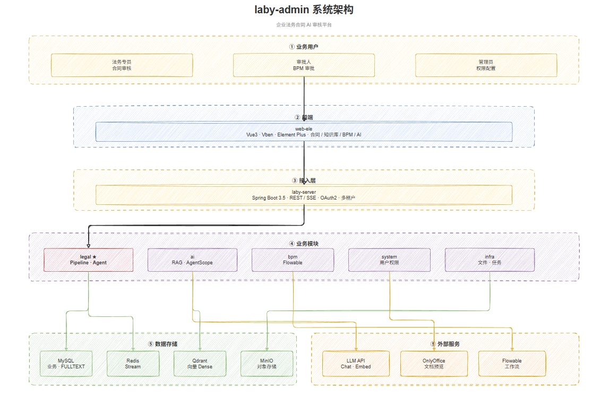
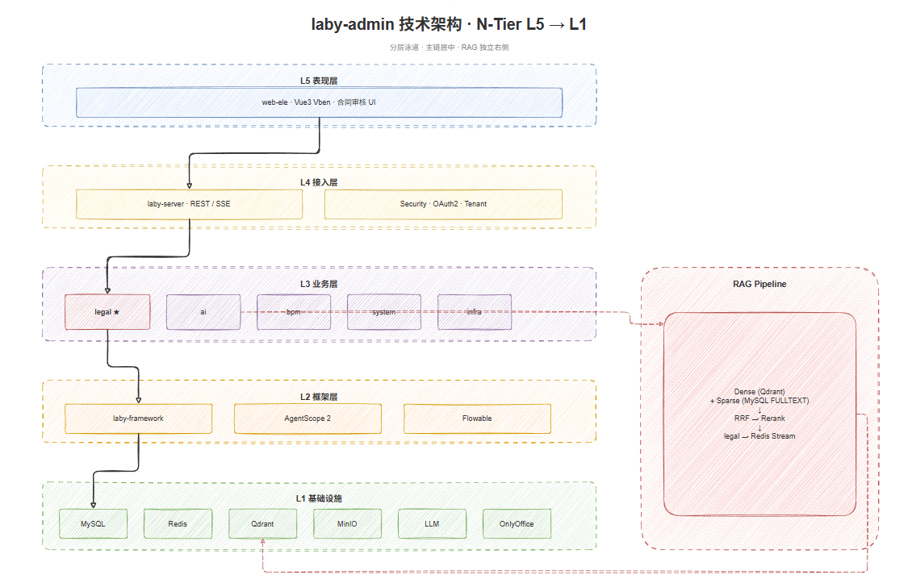

<p align="center">
  <h1 align="center">laby-ai-legal</h1>
  <p align="center">基于 RuoYi-Vue-Pro 的 AI 法务合同智能审核与管理平台</p>
</p>

<p align="center">
  
  
  
  
  
</p>

---

**laby-ai-legal** 在 [ruoyi-vue-pro](https://github.com/YunaiV/ruoyi-vue-pro) 基座上扩展 **法务合同 AI 审核**、**AI 知识库 / RAG**、**AgentScope Agent** 与 **OnlyOffice 在线审阅**，面向企业法务场景提供可运营、可审计、可扩展的垂直能力。

> 上传 Word → 结构化解析 → AI 风险识别 → 人工采纳 / 二轮 → BPM 审批 → 报告导出，全链路开箱可用。

## 架构图

| 系统架构 | 技术架构 |
|:---:|:---:|
|  |  |

更多说明与可编辑源文件见 [docs/delivery/architecture/](docs/delivery/architecture/README.md)。

## 核心能力

### 法务合同（`laby-module-legal`）

| 能力 | 说明 |
|------|------|
| 合同上传与解析 | Word（`.docx`）→ 段落结构化，版本链管理 |
| AI 审核 | JSON 结构化意见 + Markdown 报告，支持二轮审核 |
| 意见处置 | 采纳 / 忽略 / 撤销、人工补充、批量操作 |
| BPM 审批 | Flowable 流程 `legal_contract_review`，应用层 Pipeline + 人工节点 |
| OnlyOffice 审阅 | Document Server 在线预览，插件定位正文段落 |
| 合同 Agent | AgentScope Tool 只读查询 + 写操作 Confirm 门控 |
| Playbook 评测 | 黄金集 CI 门禁（`LegalPlaybookEvalRunnerTest`） |

### AI 平台（`laby-module-ai`）

| 能力 | 说明 |
|------|------|
| AI 对话 | 多模型接入，支持 Tool 绑定与 Agent 模式 |
| 知识库 RAG | `Dense(Qdrant) + Sparse(MySQL FULLTEXT) → RRF → Rerank` |
| PDF / 文档解析 | MinerU / Docling 适配层，结构化入库 |
| AgentScope 2 | `HarnessAgent`、Session（Redis）、Middleware、Tool 扩展 |

### 基础平台（继承 RuoYi）

系统管理、权限、多租户、基础设施、工作流（BPM）、代码生成等，详见 [ruoyi-vue-pro 文档](https://doc.iocoder.cn/quick-start/)。

## 技术栈

| 层级 | 技术 |
|------|------|
| 后端 | Java 17、Spring Boot 3.5、MyBatis Plus、Spring Security、Flowable |
| 前端 | Vue 3、Vben Admin、Element Plus（`laby-ui/laby-ui-admin-vben/apps/web-ele`） |
| AI | AgentScope 2、Qdrant、DashScope / OpenAI 兼容 API |
| 中间件 | MySQL、Redis、RabbitMQ、MinIO、OnlyOffice Document Server |
| 部署 | Docker Compose 统一编排（`script/docker/`） |

## 项目结构

```
laby-ai-legal/
├── laby-server/              # 启动入口（REST API，默认 48080）
├── laby-framework/           # 框架封装与 Starter
├── laby-module-legal/        # 法务合同审核
├── laby-module-ai/           # AI 对话、RAG、AgentScope
├── laby-module-bpm/          # 工作流
├── laby-module-system/       # 系统管理
├── laby-module-infra/        # 基础设施
├── laby-ui/laby-ui-admin-vben/   # 管理端前端（web-ele）
├── sql/mysql/                # 数据库脚本
├── script/docker/            # Docker 统一部署
└── docs/
    ├── delivery/             # 架构设计、系统设计、架构图
    ├── deploy/               # OnlyOffice、生产清单、Nginx SSE
    └── superpowers/          # 需求 Spec / 实施 Plan
```

## 快速开始

### 环境要求

- JDK **17+**
- Maven 3.9+
- Node.js 20+、pnpm 9+（前端）
- Docker & Docker Compose（推荐）

### 1. 克隆仓库

```bash
git clone https://github.com/<your-org>/laby-ai-legal.git
cd laby-ai-legal
```

### 2. 启动中间件

```bash
cd script/docker
docker compose --env-file docker.env up -d
```

包含 MySQL、Redis、Qdrant、RabbitMQ、OnlyOffice、PDF 解析适配层等。详见 [script/docker/Docker-HOWTO.md](script/docker/Docker-HOWTO.md)。

法务审阅页仅需 OnlyOffice 时：

```bash
docker compose --env-file docker.env up -d onlyoffice
```

### 3. 初始化数据库

在 MySQL（默认 `laby-system` / `123456`）中**按顺序**执行：

```
sql/mysql/ruoyi-vue-pro.sql
sql/mysql/quartz.sql          # 可选
sql/mysql/laby-init.sql       # 法务 + AI 知识库增量（可重复执行）
```

### 4. 启动后端

```bash
# 项目根目录
mvn -pl laby-server -am package -DskipTests
# IDEA 运行 laby-server，profile 默认 local（application-local.yaml）
```

后端默认：`http://127.0.0.1:48080`

### 5. 启动前端

```bash
cd laby-ui/laby-ui-admin-vben
pnpm install
pnpm dev
```

前端默认：`http://localhost:5777`（API 代理至 `48080`）

### 6. 登录与法务入口

使用 RuoYi 默认管理员账号登录后，进入 **法务 → 合同管理** 体验上传、AI 审核与审阅工作台。

## 文档

| 文档 | 说明 |
|------|------|
| [交付文档索引](docs/delivery/README.md) | 架构/系统设计、架构图、AgentScope 指南 |
| [架构设计说明书](docs/delivery/2026-06-03-legal-contract-architecture-design.md) | C4、模块、AI/BPM、ADR |
| [系统设计说明书](docs/delivery/2026-06-03-legal-contract-system-design.md) | 时序、状态机、表结构、API |
| [AgentScope 学习指南](docs/delivery/2026-06-13-agentscope-java-learning-guide.md) | 双路径、Tool、Session、链路说明 |
| [法务模块 README](laby-module-legal/README.md) | BPM 初始化、权限、包结构 |
| [OnlyOffice 集成](docs/deploy/onlyoffice-readme.md) | 插件挂载、定位、排障 |
| [生产就绪清单](docs/deploy/production-readiness-checklist.md) | 多实例、SSE、Redis Session |

## 生产部署提示

- Agent Session 生产环境使用 **Redis**（`laby.ai.agentscope.session-store=redis`）
- 审核进度 SSE 经网关时参考 [nginx-admin-api-sse.conf](docs/deploy/nginx-admin-api-sse.conf)
- 自检脚本：`docs/deploy/verify-production-readiness.ps1`

## 致谢

本项目基于以下优秀开源项目构建：

- [ruoyi-vue-pro](https://github.com/YunaiV/ruoyi-vue-pro) — Spring Boot 多模块管理后台脚手架
- [vue-vben-admin](https://github.com/vbenjs/vue-vben-admin) — Vue 3 管理端框架
- [AgentScope](https://github.com/modelscope/agentscope) — Agent 框架
- [OnlyOffice Document Server](https://www.onlyoffice.com/) — 在线文档预览与编辑

## License

[MIT](LICENSE) — 基于 ruoyi-vue-pro，个人与企业可免费使用。
