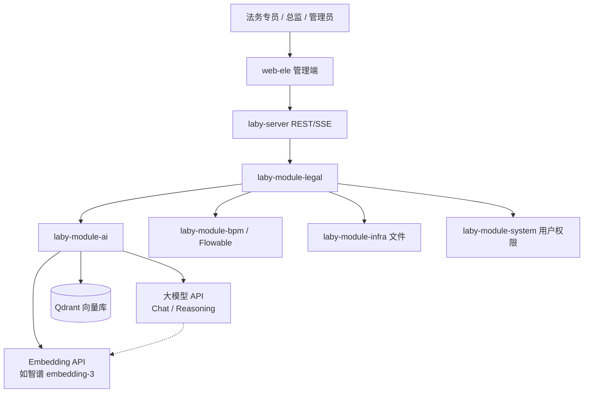
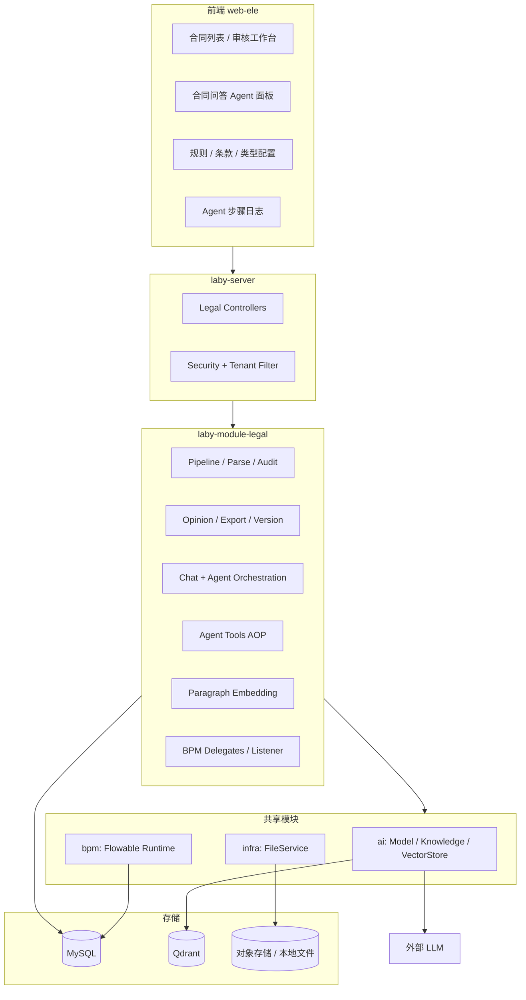
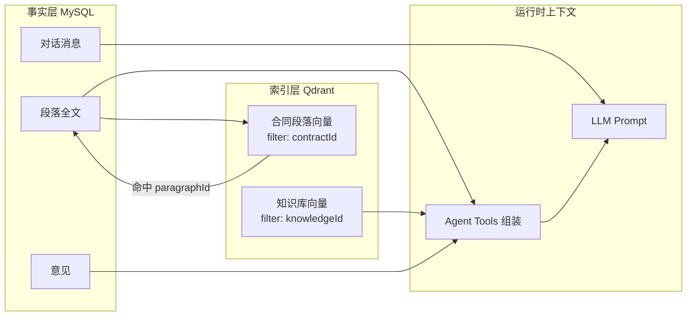
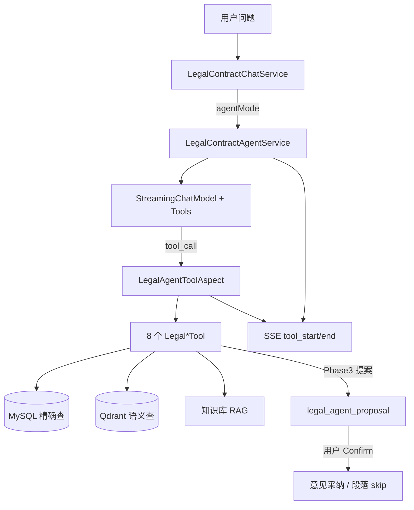
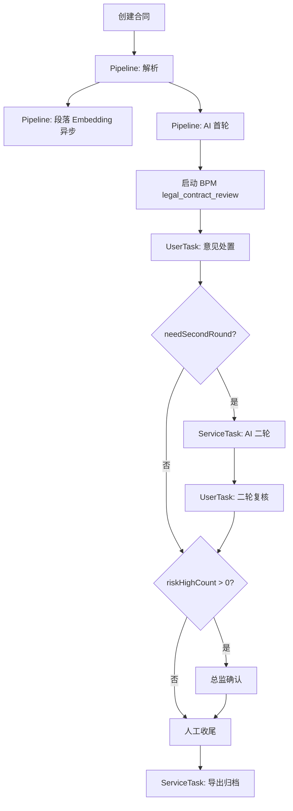
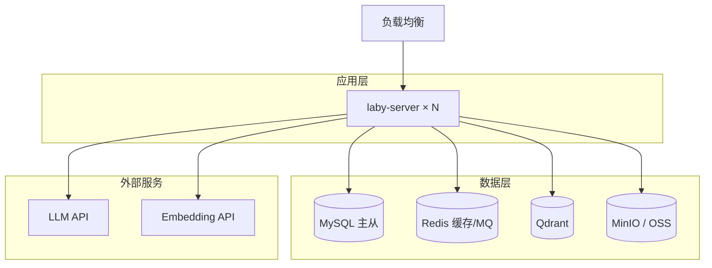

# 法务合同 AI 审核平台 — 架构设计说明书

| 属性 | 值 |
|------|-----|
| **文档编号** | Laby-Legal-ARCH-001 |
| **版本** | v1.0 |
| **日期** | 2026-06-03 |
| **状态** | 可交付 |
| **适用范围** | `laby-module-legal` + 关联 `ai` / `bpm` / `infra` + `web-ele` 法务前端 |
| **关联文档** | [系统设计说明书](./2026-06-03-legal-contract-system-design.md) · [SRS](../superpowers/specs/2026-06-01-legal-contract-review-full-srs.md) · [Agent Spec](../superpowers/specs/2026-06-03-legal-contract-agent-spec.md) |

---

## 目录

1. [背景与建设目标](#1-背景与建设目标)
2. [架构原则与约束](#2-架构原则与约束)
3. [总体架构（C4）](#3-总体架构c4)
4. [模块架构](#4-模块架构)
5. [数据架构](#5-数据架构)
6. [AI 与检索架构](#6-ai-与检索架构)
7. [流程与集成架构](#7-流程与集成架构)
8. [部署架构](#8-部署架构)
9. [安全、租户与权限](#9-安全租户与权限)
10. [非功能架构](#10-非功能架构)
11. [演进路线](#11-演进路线)
12. [架构决策记录（ADR）](#12-架构决策记录adr)

---

## 1. 背景与建设目标

### 1.1 业务背景

法务合同审核具有 **高重复、强专业、长链路** 特征：上传 Word → 结构化解析 → AI 风险识别 → 人工采纳/二轮 → 审批 → 导出。系统需在 **laby-admin** 基座上提供可运营、可审计、可扩展的法务垂直能力。

### 1.2 架构建设目标

| 目标 | 架构层面含义 |
|------|----------------|
| **领域独立** | 法务域独立模块 `laby-module-legal`，不污染 `ai` / `bpm` 通用能力 |
| **可替换 AI** | 通过 `AiModelService` 切换 Chat / Embedding 模型（含智谱 embedding-3） |
| **人机协同** | 应用层自动化 + BPM 人工节点；Agent 只读优先、写操作 Confirm 门控 |
| **数据可追溯** | 结构化事实存 MySQL；语义索引存向量库；文件存 infra |
| **多租户 SaaS** | 租户隔离贯穿 DB、向量 metadata、权限 |

### 1.3 架构范围

**范围内：**

- 合同上传、解析、版本链、AI 审核（最多 2 轮）
- 意见处置、BPM 审批、Word/Markdown 导出
- 合同问答（普通 + Agent）、段落向量检索、知识库 RAG
- 规则/条款/合同类型配置

**范围外（V1 架构不承载）：**

- PDF 解析、WPS/智书在线回写
- 批量合同、跨租户历史案例库
- LangChain/LangGraph 独立编排框架

---

## 2. 架构原则与约束

| # | 原则 | 说明 |
|---|------|------|
| P1 | **单一事实源** | 合同正文、意见、报告、对话均以 MySQL 为准；向量库仅为索引 |
| P2 | **按域分库分责** | 通用知识库 ≠ 合同段落索引；不将当前在审合同段落导入 `ai_knowledge` |
| P3 | **瘦 Prompt + Tool** | Agent 模式不预灌 14k 固定上下文，按需 Tool 查数 |
| P4 | **写操作可审计** | Agent 提案 → 用户 Confirm → 业务 API；禁止 Tool 直接写库 |
| P5 | **异步解耦长任务** | 解析、Embedding、AI 审核、Pipeline 与 HTTP 请求解耦 |
| P6 | **BPM 管人、应用管机** | 解析 + 首轮 AI 在应用 Pipeline；BPM 从「意见处置」起编排人工流 |

---

## 3. 总体架构（C4）

### 3.1 系统上下文（Context）



### 3.2 容器级架构（Container）



### 3.3 核心价值链

```
上传 Word → 解析段落 → [Embedding] → AI 首轮审核 → 意见 + 报告
    → BPM 人工处置 → [可选二轮 AI] → 总监/收尾 → 导出归档
    → 全程可问答（Agent 按需检索段落 / 意见 / 知识库）
```

---

## 4. 模块架构

### 4.1 后端模块依赖

```
laby-module-legal
├── laby-module-system      # 用户、权限、租户
├── laby-module-infra       # 文件上传/下载
├── laby-module-bpm         # Flowable 流程实例 API
├── laby-module-ai          # ChatModel、Embedding、Knowledge、VectorStore
└── flowable-spring-boot-starter-process
```

### 4.2 `laby-module-legal` 逻辑分层

| 包路径 | 职责 |
|--------|------|
| `controller.admin.*` | REST / SSE 入口、权限注解 |
| `service.contract.*` | 合同 CRUD、Pipeline、解析、Chat、Export |
| `service.opinion.*` | 意见采纳/忽略/人工录入 |
| `service.agent.*` | Agent 编排、Tool 注册、步骤日志、提案 |
| `service.embedding.*` | 合同段落向量化与检索 |
| `service.auditrule.*` | 审核规则 + 知识库 RAG 上下文 |
| `service.bpm.*` | BPM 状态同步、Delegate |
| `tool.agent.*` | AgentScope `@Tool` 实现 + Permission Confirm |
| `dal.*` | DO / Mapper |
| `framework.bpm.*` | BPMN 自动部署、Listener |
| `job.*` | 提案过期等定时任务 |

### 4.3 前端模块

| 路径 | 职责 |
|------|------|
| `views/legal/contract/` | 列表、审核工作台、问答面板 |
| `views/legal/agent-log/` | Agent 调用日志 |
| `views/legal/{contract-type,standard-clause,audit-rule}/` | 配置管理 |
| `api/legal/` | API 客户端 |
| `router/routes/modules/legal.ts` | 隐藏路由（review/detail） |

---

## 5. 数据架构

### 5.1 存储职责矩阵

| 数据类型 | 主存储 | 索引/副本 | 说明 |
|----------|--------|-----------|------|
| 合同元数据 | MySQL `legal_contract` | — | 状态、BPM、模型、轮次 |
| 段落全文 | MySQL `legal_contract_paragraph` | Qdrant 向量 | **不进 AI 知识库** |
| 段落向量台账 | MySQL `legal_contract_paragraph_embedding` | Qdrant vector_id | 状态、hash、预览 |
| 审核意见 | MySQL `legal_audit_opinion` | — | 结构化过滤 |
| 审核报告 | MySQL `legal_audit_report` | — | Markdown |
| 版本链 | MySQL `legal_contract_version` | infra 文件 | ORIGINAL / WORKING / ADOPTED |
| 锚点 | MySQL `legal_anchor_*` | — | Word 批注导出 |
| 问答消息 | MySQL `legal_contract_chat_message` | — | 对齐 `ai_chat_message` |
| Agent 日志 | MySQL `legal_agent_step_log` | — | LLM/TOOL 轨迹 |
| Agent 提案 | MySQL `legal_agent_proposal` | — | Confirm 前暂存 |
| 检索审计 | MySQL `legal_retrieval_log` | — | RAG 可追溯 |
| 法务知识 | MySQL `ai_knowledge*` | Qdrant knowledge_segment | 按合同类型绑定 |
| 原始/导出文件 | infra `FileService` | — | docx / zip |

### 5.2 数据流原则



**关键结论：**

- 合同段落 **无需** 也 **不应** 写入 `ai_knowledge` 文档库
- 对话 history **存 MySQL**，不默认向量化
- 向量库是 **检索加速器**，不是业务主库

---

## 6. AI 与检索架构

### 6.1 双 RAG 通道

| 通道 | 数据源 | 触发场景 | 实现 |
|------|--------|----------|------|
| **知识库 RAG** | `ai_knowledge`（合同类型绑定） | 法条/规范/公司指引 | `LegalAuditContextService` → `AiKnowledgeSegmentService` |
| **段落向量 RAG** | 当前合同段落 | 「找与违约相关的条款」 | `LegalContractParagraphEmbeddingService` → Qdrant |

### 6.2 模型与向量库

| 类型 | 配置入口 | 法务模块用法 |
|------|----------|--------------|
| Chat | `legal_contract.model_id` 或默认 CHAT | AI 审核、问答、Agent |
| Embedding | `laby.legal.paragraph-embedding-model-id` 或默认 EMBEDDING | 段落 `embedContractAsync` |
| VectorStore | `AiModelService.getOrCreateVectorStore` | Qdrant；metadata: `contractId`, `paragraphId`, `tenantId` |

### 6.3 Agent 架构



**Tool 分层：**

- **只读 Tool（6）**：meta、paragraphs、opinions、knowledge、report、compare
- **提案 Tool（2）**：adopt opinion、skip paragraph（Confirm 后执行）

---

## 7. 流程与集成架构

### 7.1 端到端流程（实现版）

> 与 BPM 设计文档 v0.2 的差异：**解析 + 首轮 AI 在应用 Pipeline 完成**，BPM 从「意见处置」接入。



### 7.2 BPM 集成点

| 组件 | 类型 | 职责 |
|------|------|------|
| `LegalContractProcessStarter` | 应用 | 异步启动 Pipeline + BPM |
| `LegalAiAuditDelegate` | JavaDelegate | BPM 内 AI 二轮 |
| `LegalExportDelegate` | JavaDelegate | 归档导出 |
| `LegalContractTaskListener` | TaskListener | 任务 → 业务状态同步 |
| `LegalContractStatusListener` | EventListener | 流程终态 → REJECTED/CANCELLED |

### 7.3 关键集成 API

| 外部模块 | API / 组件 | 法务用法 |
|----------|------------|----------|
| BPM | `BpmProcessInstanceApi` | 创建/同步流程变量 |
| AI | `AiModelService` | Chat / Stream / VectorStore |
| AI | `AiKnowledgeSegmentService` | 知识库检索 |
| Infra | `FileService` | 上传、导出、版本文件 |

---

## 8. 部署架构

### 8.1 推荐部署拓扑（生产）



### 8.2 组件版本依赖

| 组件 | 说明 |
|------|------|
| JDK 17+ | 与 laby-admin 基座一致 |
| MySQL 8 | 业务库 |
| Qdrant | `qdrant-client-java` 直连（`AiVectorStoreClient`） |
| Flowable | 内嵌于 laby-module-bpm |
| Redis | 可选，MQ/缓存 |

### 8.3 配置项（架构相关）

| 配置 | 用途 |
|------|------|
| `spring.ai.vectorstore.qdrant.*` | Qdrant 连接 |
| `laby.legal.paragraph-embedding-model-id` | 段落 Embedding 模型（可选，默认 EMBEDDING） |
| AI 模块 `ai_model` 表 | Chat / Embedding 模型注册 |

---

## 9. 安全、租户与权限

### 9.1 多租户

- 业务表继承 `TenantBaseDO`（`tenant_id`）
- 向量 metadata 含 `tenantId`
- Tool 执行经 `LegalAgentToolTenantHelper` 恢复租户上下文

### 9.2 权限模型

| 权限前缀 | 能力 |
|----------|------|
| `legal:contract:query` | 查合同、问答、导出预检 |
| `legal:contract:create` | 创建、上传、重试 Pipeline |
| `legal:contract:update` | 意见处置、段落 skip、提案执行 |
| `legal:contract-type:*` | 合同类型配置 |
| `legal:standard-clause:*` | 标准条款 |
| `legal:audit-rule:*` | 审核规则 |
| `legal:agent-log:query` | Agent 日志 |

### 9.3 数据隔离

- 合同：`legal_contract.user_id` + 租户 + 数据权限
- 问答消息：按 `contract_id + user_id` 隔离
- Agent 提案：绑定合同与用户，Confirm 前不可执行

---

## 10. 非功能架构

| 维度 | 目标 | 架构手段 |
|------|------|----------|
| **可用性** | 单点 AI 失败可重试 | Pipeline FAILED + retry-pipeline |
| **性能** | 大合同解析不阻塞 HTTP | 异步 Pipeline、@Async Embedding |
| **可观测** | Agent 可追溯 | step_log + retrieval_log + SSE 轨迹 |
| **扩展性** | 新 Tool 可插拔 | `@Component` + `LegalAgentToolProvider` |
| **一致性** | 向量与段落同步 | 重解析时 deleteByContractId + 重建 |
| **SSE 稳定性** | 长连接 Agent | 心跳泵 + session 级事件队列 + 流结束释放 |

---

## 11. 演进路线

| 阶段 | 架构增量 | 状态 |
|------|----------|------|
| **Phase 0** | 合同审核主链路 + BPM | ✅ 已实现 |
| **Phase A** | 批注/采纳/导出/版本链 | ✅ 已实现 |
| **Phase B** | 规则/条款/类型 + 知识库 RAG | ✅ 已实现 |
| **Agent P1** | 4 只读 Tool + Agent 模式 | ✅ 已实现 |
| **Agent P2** | +2 Tool + 步骤日志 | ✅ 已实现 |
| **Agent P3** | 提案 Confirm + 段落 Embedding | ✅ 已实现 |
| **Chat DB** | 问答消息持久化 | ✅ 已实现 |
| **Phase 4（规划）** | 意见/报告向量化、普通模式 RAG 化 | 待规划 |
| **Phase 5（规划）** | 历史合同样例库、跨合同检索 | 待规划 |

---

## 12. 架构决策记录（ADR）

| ID | 决策 | 理由 | 状态 |
|----|------|------|------|
| ADR-001 | 法务独立模块 `laby-module-legal` | 域大、表多，避免 bpm 膨胀 | 已采纳 |
| ADR-002 | 解析+首轮 AI 在 Pipeline，非 BPM ServiceTask | 长任务易失败，应用层重试更简单 | 已采纳 |
| ADR-003 | 合同段落向量独立索引，不进 `ai_knowledge` | 隔离 contractId、生命周期不同 | 已采纳 |
| ADR-004 | Agent 写操作走 Proposal + Confirm | 安全、可审计 | 已采纳 |
| ADR-005 | 对话存 MySQL 表，不进向量库 | 对齐 AI 对话；向量化非刚需 | 已采纳 |
| ADR-006 | AgentScope 2 Java Tool + Harness，不引入 LangGraph | 与 laby-module-ai 技术栈一致 | 已采纳 |
| ADR-007 | SSE 按 sessionId 事件队列，非 ThreadLocal | Tool 异步线程与 SSE 线程不一致 | 已采纳 |

---

## 附录 A：SQL 部署顺序

```
ruoyi-vue-pro.sql → bpm-*.sql → ai-*.sql
→ laby-legal-supplement.sql
→ laby-legal-phase-b.sql（可选，已合并 phase-c）
→ laby-legal-phase-c.sql
→ laby-legal-agent-phase1.sql
→ laby-legal-agent-phase2.sql
→ laby-legal-agent-phase3.sql
→ laby-legal-agent-phase3-embedding.sql
→ laby-legal-contract-chat-message.sql
```

## 附录 B：文档修订记录

| 版本 | 日期 | 作者 | 说明 |
|------|------|------|------|
| v1.0 | 2026-06-03 | 架构组 | 首版可交付，基于现网实现整理 |

---

**下一步：** 详见 [系统设计说明书](./2026-06-03-legal-contract-system-design.md)（接口、表结构、状态机、时序）。
