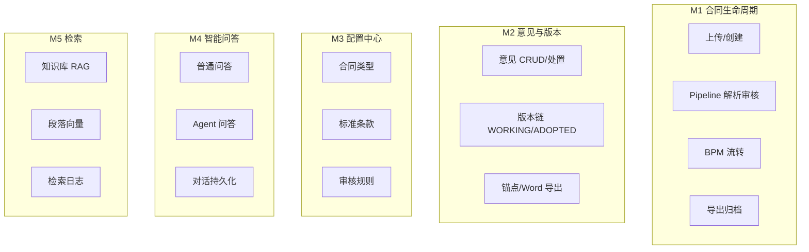
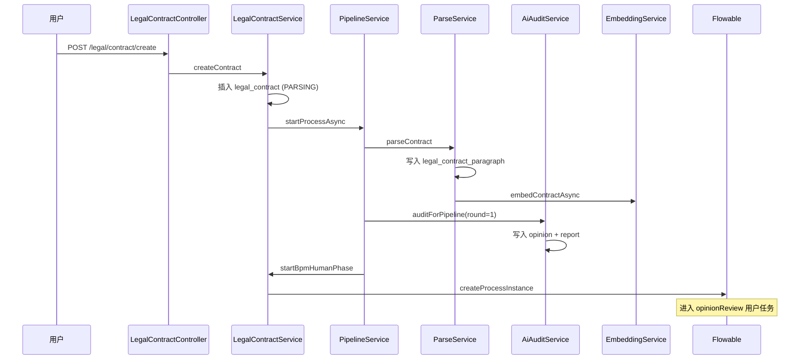
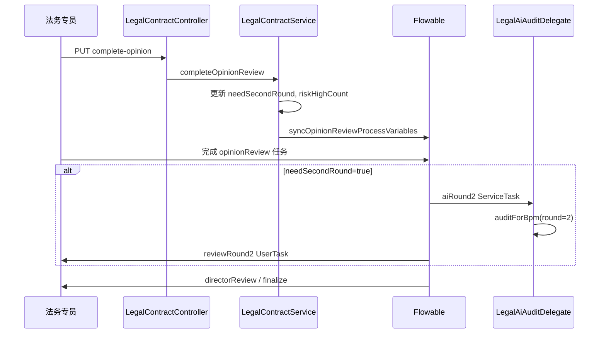
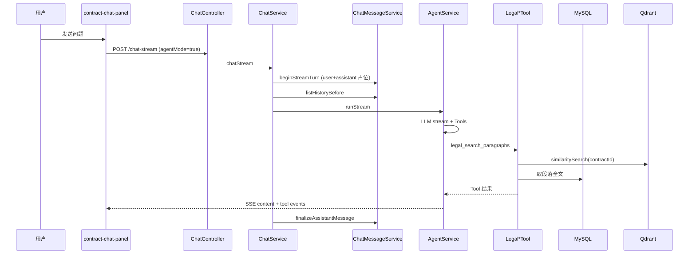
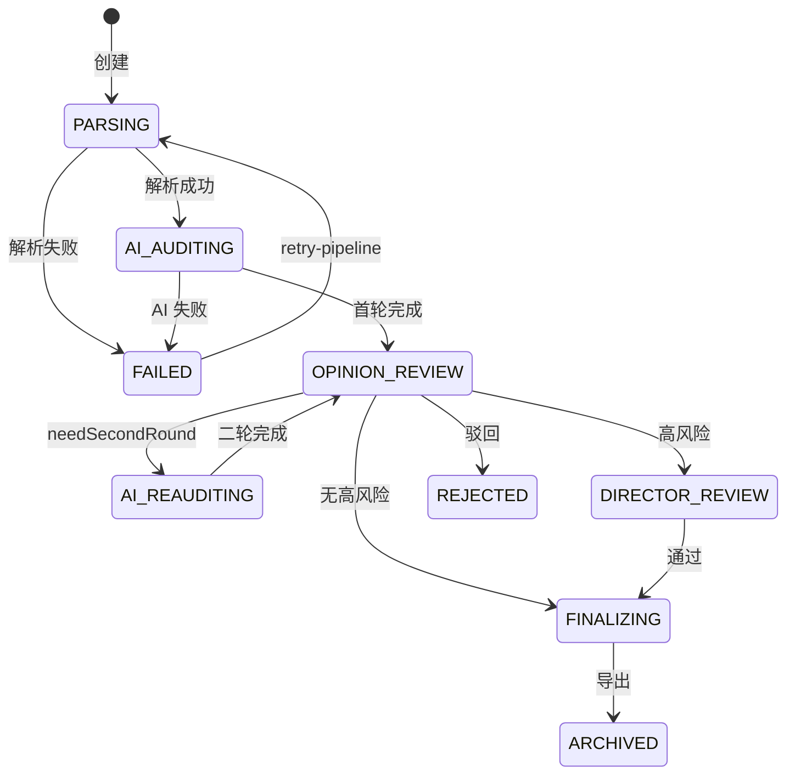
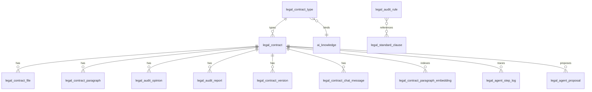
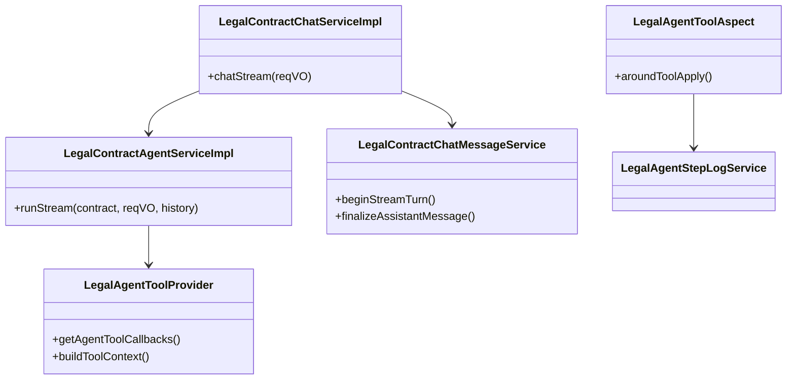

# 法务合同 AI 审核平台 — 系统设计说明书

| 属性 | 值 |
|------|-----|
| **文档编号** | Laby-Legal-SDD-001 |
| **版本** | v1.0 |
| **日期** | 2026-06-03 |
| **状态** | 可交付 |
| **关联文档** | [架构设计说明书](./2026-06-03-legal-contract-architecture-design.md) · [SRS](../superpowers/specs/2026-06-01-legal-contract-review-full-srs.md) · [Agent Spec](../superpowers/specs/2026-06-03-legal-contract-agent-spec.md) |

---

## 目录

1. [系统概述](#1-系统概述)
2. [系统边界与角色](#2-系统边界与角色)
3. [功能模块设计](#3-功能模块设计)
4. [业务流程设计](#4-业务流程设计)
5. [状态机设计](#5-状态机设计)
6. [数据库设计](#6-数据库设计)
7. [接口设计](#7-接口设计)
8. [Agent 子系统设计](#8-agent-子系统设计)
9. [RAG 与向量检索设计](#9-rag-与向量检索设计)
10. [合同问答子系统设计](#10-合同问答子系统设计)
11. [BPM 集成设计](#11-bpm-集成设计)
12. [前端设计](#12-前端设计)
13. [错误码与异常](#13-错误码与异常)
14. [配置与部署清单](#14-配置与部署清单)
15. [验收检查清单](#15-验收检查清单)

---

## 1. 系统概述

### 1.1 系统定位

**法务合同 AI 审核平台** 是 laby-admin 上的垂直业务系统，提供：

1. Word 合同解析与结构化存储
2. LLM 自动审核（最多 2 轮）+ 人工意见闭环
3. Flowable BPM 审批与归档导出
4. 合同问答（普通 / Agent）与语义检索

### 1.2 技术栈

| 层次 | 技术 |
|------|------|
| 后端框架 | Spring Boot 3、MyBatis-Plus |
| 工作流 | Flowable（laby-module-bpm） |
| AI | AgentScope 2 Java、`laby-module-ai`（自研 `core.*` 抽象层） |
| 向量库 | Qdrant（`qdrant-client-java` 直连，`AiVectorStoreClient`） |
| 文档 | Apache POI 5.x |
| 前端 | Vue 3 + Vben + Element Plus |
| 数据库 | MySQL 8 |

### 1.3 代码仓库映射

| 路径 | 说明 |
|------|------|
| `laby-module-legal/` | 法务后端主模块 |
| `laby-ui/.../views/legal/` | 法务前端页面 |
| `sql/mysql/laby-legal*.sql` | 增量 DDL |
| `laby-module-legal/.../legal_contract_review.bpmn20.xml` | BPMN 定义 |

---

## 2. 系统边界与角色

### 2.1 外部系统

| 系统 | 交互 | 协议 |
|------|------|------|
| LLM 服务 | Chat / Stream | HTTPS API |
| Embedding 服务 | 段落/知识向量化 | HTTPS API |
| Qdrant | 向量 CRUD / Search | gRPC/HTTP |
| 对象存储 | 合同文件 | S3/本地 |
| Flowable Engine | 流程实例 | 内嵌 |

### 2.2 角色与菜单

| 角色 | 菜单 | 核心权限 |
|------|------|----------|
| 法务专员 | 6801 我的合同 | `legal:contract:*` |
| 法务管理员 | 规则与条款 | `legal:contract-type:*` 等 |
| 运维/IT | AI 模型配置 | `ai:model:*` |
| 管理员 | Agent 日志 6810 | `legal:agent-log:query` |

---

## 3. 功能模块设计

### 3.1 模块总览



### 3.2 核心 Service 职责

| Service | 类 | 职责 |
|---------|-----|------|
| 合同主服务 | `LegalContractServiceImpl` | CRUD、上传、complete-opinion、BPM 启动 |
| Pipeline | `LegalContractPipelineService` | 解析 → AI 首轮 → 失败重试 |
| 解析 | `LegalContractParseServiceImpl` | Word → 段落；触发 Embedding |
| AI 审核 | `LegalAiAuditServiceImpl` | 批量段落审核、报告生成 |
| 意见 | `LegalAuditOpinionServiceImpl` | 采纳/忽略/撤销/人工 |
| 导出 | `LegalContractExportServiceImpl` | 报告/采纳版/归档 zip |
| 版本 | `LegalContractVersionServiceImpl` | 版本链管理 |
| 问答 | `LegalContractChatServiceImpl` | 普通/Agent 分支、消息持久化 |
| Agent | `LegalContractAgentServiceImpl` | Tool 编排、SSE 流 |
| Embedding | `LegalContractParagraphEmbeddingServiceImpl` | 段落向量化/检索 |
| 审核上下文 | `LegalAuditContextServiceImpl` | 规则 + 知识库 RAG |
| 提案 | `LegalAgentProposalService` | Confirm 门控写操作 |
| BPM 同步 | `LegalContractBpmSyncService` | 任务 ↔ 业务状态 |

---

## 4. 业务流程设计

### 4.1 创建合同与 Pipeline



### 4.2 意见处置与二轮 AI



### 4.3 Agent 问答时序



---

## 5. 状态机设计

### 5.1 合同业务状态 `LegalContractStatusEnum`

| Code | 枚举 | 含义 | 典型入口 |
|------|------|------|----------|
| 0 | DRAFT | 草稿 | 创建瞬间 |
| 10 | PARSING | 解析中 | Pipeline |
| 11 | AI_AUDITING | AI 审核中 | 首轮 AI |
| 15 | FAILED | 处理失败 | Pipeline 异常 |
| 20 | OPINION_REVIEW | 意见处置 | 首轮完成 / BPM 任务 |
| 21 | AI_REAUDITING | 二轮 AI 中 | BPM aiRound2 |
| 30 | DIRECTOR_REVIEW | 总监确认 | 网关 riskHighCount>0 |
| 40 | FINALIZING | 人工收尾 | finalize 任务 |
| 50 | ARCHIVED | 已归档 | exportReport |
| 60 | REJECTED | 已驳回 | BPM 终态 |
| 61 | CANCELLED | 已取消 | BPM 终态 |



### 5.2 意见状态 `LegalOpinionStatusEnum`

| Code | 状态 | 说明 |
|------|------|------|
| 0 | PENDING | 待处置 |
| 1 | ADOPTED | 已采纳 |
| 2 | IGNORED | 已忽略 |

转换：`PENDING → ADOPTED | IGNORED`；`revoke → PENDING`

### 5.3 解析状态 `LegalParseStatusEnum`

`WAITING(0) → RUNNING(1) → SUCCESS(2) | FAILED(3)`

### 5.4 Agent 提案状态

`PENDING → EXECUTED | CANCELLED | EXPIRED`（默认 5 分钟 TTL）

### 5.5 段落 Embedding 状态

`PENDING → SUCCESS | FAILED`

---

## 6. 数据库设计

### 6.1 ER 关系（核心）



### 6.2 表清单

| 表名 | 说明 | 脚本 |
|------|------|------|
| `legal_contract` | 合同主表 | supplement |
| `legal_contract_file` | 附件 | supplement |
| `legal_contract_paragraph` | 段落全文 | supplement |
| `legal_audit_opinion` | 审核意见 | supplement |
| `legal_audit_report` | 审核报告 Markdown | supplement |
| `legal_contract_version` | 版本链 | supplement |
| `legal_anchor_snapshot` | 锚点快照 | supplement |
| `legal_anchor_item` | 锚点项 | supplement |
| `legal_retrieval_log` | RAG 审计 | supplement |
| `legal_contract_type` | 合同类型 | phase-c |
| `legal_standard_clause` | 标准条款 | phase-c |
| `legal_audit_rule` | 审核规则 | phase-c |
| `legal_agent_step_log` | Agent 步骤 | agent-phase2 |
| `legal_agent_proposal` | Agent 提案 | agent-phase3 |
| `legal_contract_paragraph_embedding` | 向量台账 | phase3-embedding |
| `legal_contract_chat_message` | 问答消息 | chat-message |

### 6.3 关键字段说明

**`legal_contract`**

| 字段 | 说明 |
|------|------|
| `status` | 业务状态（见 §5.1） |
| `bpm_status` | 对齐 BpmTaskStatusEnum |
| `process_instance_id` | Flowable 实例 ID |
| `audit_round` | 当前 AI 轮次 1/2 |
| `need_second_round` | BPM 网关变量 |
| `risk_high_count` | 未处理高风险数 |
| `model_id` / `audit_role_id` | AI 模型与角色 |

**`legal_contract_paragraph`**

| 字段 | 说明 |
|------|------|
| `paragraph_id` | 业务 ID，如 `p-69` |
| `text` | 段落正文 |
| `skip_audit` | 是否跳过 AI 审核 |

**`legal_contract_chat_message`**

| 字段 | 说明 |
|------|------|
| `type` | user / assistant |
| `reply_id` | assistant 关联 user |
| `agent_mode` | 是否 Agent 会话 |
| `session_id` | 关联 Agent 步骤日志 |

**`legal_contract_paragraph_embedding`**

| 字段 | 说明 |
|------|------|
| `vector_id` | Qdrant 文档 ID |
| `text_hash` | 变更检测 MD5 |
| `status` | PENDING/SUCCESS/FAILED |

---

## 7. 接口设计

### 7.1 合同主接口 `/legal/contract`

| 方法 | 路径 | 权限 | 说明 |
|------|------|------|------|
| POST | `/create` | create | 创建并启动 Pipeline |
| POST | `/upload` | create | 上传文件 |
| GET | `/get` | query | 合同详情 |
| GET | `/page` | query | 分页列表 |
| POST | `/retry-pipeline` | create | 失败重试 |
| PUT | `/complete-opinion` | update | 完成意见处置 |
| POST | `/export-*` | query/update | 各类导出 |
| GET | `/audit-progress` | query | AI 审核进度 SSE |

### 7.2 问答接口 `/legal/contract`

| 方法 | 路径 | 权限 | 说明 |
|------|------|------|------|
| POST | `/chat` | query | 同步问答 |
| POST | `/chat-stream` | query | SSE 流式问答 |
| GET | `/chat-message/list` | query | 历史消息 |
| DELETE | `/chat-message/delete` | query | 删除消息 |
| DELETE | `/chat-message/delete-from` | query | 重新生成前删除 |
| DELETE | `/chat-message/clear` | query | 清空对话 |
| PUT | `/paragraph/skip-audit` | update | 段落 skip |

**`POST /chat-stream` 请求体**

```json
{
  "contractId": 16,
  "message": "有哪些高风险意见？",
  "answerMode": "STANDARD",
  "agentMode": true,
  "allowProposal": false,
  "sessionId": "uuid"
}
```

> `history` 字段 **已废弃**（后端从 `legal_contract_chat_message` 读取）。

**SSE 响应片段**

```json
{
  "code": 0,
  "data": {
    "content": "增量文本",
    "reasoningContent": "",
    "eventType": "tool_start",
    "toolName": "legal_get_audit_opinions",
    "sessionId": "uuid",
    "userMessageId": 101,
    "assistantMessageId": 102
  }
}
```

### 7.3 Agent 提案 `/legal/contract/agent`

| 方法 | 路径 | 说明 |
|------|------|------|
| POST | `/proposal/execute` | 执行提案 |
| POST | `/proposal/cancel` | 取消提案 |

### 7.4 意见接口 `/legal/opinion`

| 方法 | 路径 | 说明 |
|------|------|------|
| GET | `/list` | 意见列表 |
| PUT | `/adopt` | 采纳 |
| PUT | `/ignore` | 忽略 |
| PUT | `/revoke` | 撤销 |
| POST | `/create-manual` | 人工意见 |

### 7.5 配置接口

| 前缀 | 资源 |
|------|------|
| `/legal/contract-type` | 合同类型 CRUD |
| `/legal/standard-clause` | 标准条款 CRUD |
| `/legal/audit-rule` | 审核规则 CRUD |
| `/legal/agent-step-log` | Agent 日志分页 |

---

## 8. Agent 子系统设计

### 8.1 Tool 注册

`LegalAgentToolProvider` 从 Spring 容器收集 `Legal*Tool` Bean，注入 `ToolContext`：

| Context Key | 说明 |
|-------------|------|
| `CONTRACT_ID` | 当前合同 |
| `TENANT_ID` | 租户 |
| `SESSION_ID` | 问答会话 |
| `READONLY` | 是否只读模式 |
| `ALLOW_PROPOSAL` | 是否允许提案 Tool |

### 8.2 Tool 清单

| Bean | 类型 | 功能 |
|------|------|------|
| `legal_get_contract_meta` | 只读 | 合同元数据 |
| `legal_search_paragraphs` | 只读 | 段落向量/关键词 |
| `legal_get_audit_opinions` | 只读 | 意见过滤 |
| `legal_search_knowledge` | 只读 | 知识库 RAG |
| `legal_get_audit_report` | 只读 | 审核报告 |
| `legal_compare_audit_rounds` | 只读 | 轮次对比 |
| `legal_propose_adopt_opinion` | 提案 | 建议采纳 |
| `legal_propose_skip_paragraph` | 提案 | 建议 skip 段落 |

### 8.3 编排参数

| 参数 | 值 | 说明 |
|------|-----|------|
| `MAX_AGENT_STEPS` | 5 | Tool 调用上限 |
| `AGENT_TIMEOUT_SECONDS` | 90 | 流式超时 |
| 心跳间隔 | 500ms | SSE 保活 + Tool 事件泵 |

### 8.4 AOP 与 SSE

`LegalAgentToolAspect` 环绕每个 Tool：

1. `bindSession(sessionId)` 恢复步骤上下文
2. `pushToolStart` → 执行 Tool → `pushToolEnd`
3. 写 `legal_agent_step_log`
4. `LegalAgentSseEventHolder` 按 sessionId 队列供 SSE 消费

### 8.5 System Prompt

优先读取 `ai_chat_role` id=122「法务合同问答 Agent」；fallback 内置模板。

---

## 9. RAG 与向量检索设计

### 9.1 知识库 RAG（外部参考）

**绑定：** `legal_contract_type.knowledge_id` → `ai_knowledge`

**调用链：**

```
LegalAuditContextService.buildChatKnowledgeContext
  → AiKnowledgeSegmentService.searchKnowledgeSegment
  → Qdrant (collection: knowledge_segment)
```

**使用场景：**

- AI 审核批次补充（规则+知识）
- 普通模式问答 `【知识库参考】`
- Agent Tool `legal_search_knowledge`

### 9.2 段落向量（当前合同）

**触发：** `LegalContractParseServiceImpl` 解析成功后 `embedContractAsync`

**写入：**

1. MySQL `legal_contract_paragraph_embedding` 插入台账
2. Qdrant `vectorStore.add(document)`，metadata: `contractId`, `paragraphId`, `tenantId`

**检索：** `LegalSearchParagraphsTool`

```
searchByVector(contractId, keyword, limit)
  → Qdrant filter contractId
  → 命中 paragraphId
  → MySQL 取 legal_contract_paragraph 全文
  → 降级：关键词匹配
```

### 9.3 检索日志

`legal_retrieval_log.biz_type`：`AUDIT` | `QA`

记录 query、topK、命中 segment 摘要，供合规审计。

### 9.4 设计边界（再次强调）

| 内容 | 存储 | 不存储 |
|------|------|--------|
| 当前合同段落 | MySQL + 合同向量 | ❌ ai_knowledge |
| 法规/指引 | ai_knowledge + 向量 | — |
| 对话消息 | MySQL chat_message | ❌ 向量库 |

---

## 10. 合同问答子系统设计

### 10.1 模式对比

| 维度 | 普通模式 | Agent 模式 |
|------|----------|------------|
| 开关 | `agentMode=false` | `agentMode=true` |
| 上下文 | 固定注入 ~14k（段落+意见+报告） | 瘦 Prompt + Tool |
| 段落检索 | 截断前 40 段 | 向量 + Tool |
| 知识库 | 自动 RAG top5 | Tool 按需 |
| Tool 轨迹 | 无 | SSE 展示 |
| 写操作 | 无 | 提案 + Confirm |

### 10.2 消息持久化

| 步骤 | 行为 |
|------|------|
| 流开始 | `beginStreamTurn` 写 user + assistant 占位 |
| 流结束 | `finalizeAssistantMessage` 更新正文 |
| 失败无内容 | 删除 assistant 占位 |
| 历史加载 | `listHistoryBefore` 最多 8 轮，过滤失败文案 |

### 10.3 前端组件

`contract-chat-panel.vue`：

- 加载 `GET /chat-message/list`
- SSE `sendContractChatStream`
- Agent 开关 / 提案开关
- Tool 轨迹、提案 Confirm UI
- 用户上滑暂停自动滚底

---

## 11. BPM 集成设计

### 11.1 流程定义

- **Key：** `legal_contract_review`
- **文件：** `legal_contract_review.bpmn20.xml`
- **BusinessKey：** `legal_contract.id`

### 11.2 节点与实现映射

| BPMN 节点 | 实现 |
|-----------|------|
| opinionReview | UserTask → 跳转 review.vue |
| aiRound2 | `LegalAiAuditDelegate` |
| reviewRound2 | UserTask |
| directorReview | UserTask（网关 riskHighCount） |
| finalize | UserTask |
| exportReport | `LegalExportDelegate` |

### 11.3 流程变量

| 变量 | 来源 |
|------|------|
| `contractId` | 创建时 |
| `needSecondRound` | complete-opinion |
| `riskHighCount` | complete-opinion |
| `feedbackSummary` | complete-opinion |

### 11.4 状态同步

`LegalContractTaskListener` + `LegalContractBpmSyncService`：Flowable 任务创建/完成 → 更新 `legal_contract.status` 与 `current_task_key`。

---

## 12. 前端设计

### 12.1 页面清单

| 路由/菜单 | 组件 | 功能 |
|-----------|------|------|
| `/legal/contract` | `contract/index.vue` | 合同列表 |
| `/legal/contract/review` | `review.vue` | 审核工作台 |
| 嵌入 panel | `contract-chat-panel.vue` | 问答 |
| `/legal/agent-log` | `agent-log/index.vue` | Agent 日志 |
| `/legal/rule/*` | 配置页 | 类型/条款/规则 |

### 12.2 审核工作台核心区域

- 段落树/正文预览
- 意见列表（按风险筛选）
- 报告 Markdown 预览
- 采纳/导出操作
- 合同问答侧栏

---

## 13. 错误码与异常

法务模块使用 `1-050-000-xxx` 段（`ErrorCodeConstants`）：

| 码 | 常量 | 说明 |
|----|------|------|
| 1_050_000_000 | CONTRACT_NOT_EXISTS | 合同不存在 |
| 1_050_000_016 | CONTRACT_CHAT_CONTEXT_EMPTY | 无法问答（未解析） |
| 1_050_000_027 | CONTRACT_CHAT_MESSAGE_NOT_EXISTS | 消息不存在 |
| … | … | 见源码 |

Agent 流式错误通过 SSE `eventType=error` 返回，不抛 HTTP 500。

---

## 14. 配置与部署清单

### 14.1 SQL 执行顺序

见架构文档附录 A。

### 14.2 必配项

| 项 | 检查 |
|----|------|
| BPMN 部署 | 启动后存在 `legal_contract_review` |
| AI Chat 模型 | `ai_model` type=1 |
| AI Embedding | type=2（如智谱 embedding-3） |
| Qdrant | `spring.ai.vectorstore.qdrant` 可连 |
| 法务 Agent 角色 | `ai_chat_role` id=122 |
| ai_tool 22–29 | Tool 注册 |
| 菜单 6800–6811 | 角色授权 |

### 14.3 可选配置

```yaml
laby:
  legal:
    paragraph-embedding-model-id: <智谱 embedding-3 的 ai_model.id>
```

---

## 15. 验收检查清单

### 15.1 主链路

- [ ] 上传 docx → 解析成功 → `legal_contract_paragraph` 有数据
- [ ] 首轮 AI 完成 → 意见 + `legal_audit_report` 落库
- [ ] BPM 待办可见 → 意见处置 → 网关正确
- [ ] 二轮 AI（可选）→ 意见增量
- [ ] 导出报告/采纳版/归档 zip

### 15.2 向量与 RAG

- [ ] 解析后 `legal_contract_paragraph_embedding.status=SUCCESS`
- [ ] Qdrant 可按 contractId 检索
- [ ] Agent 问段落语义问题 → `legal_search_paragraphs` 命中
- [ ] 知识库问题 → `legal_search_knowledge` 有结果

### 15.3 Agent 与问答

- [ ] Agent 模式 Tool 轨迹 SSE 可见
- [ ] 连续多轮问答无流式异常
- [ ] 刷新页面历史消息从 DB 恢复
- [ ] 提案 Confirm 后才写库
- [ ] Agent 步骤日志可查

### 15.4 非功能

- [ ] 多租户：A 租户不可见 B 租户合同
- [ ] FAILED 合同可 retry-pipeline
- [ ] 向量失败时段落 Tool 降级关键词

---

## 附录 A：类图（Agent 核心）



## 附录 B：文档修订记录

| 版本 | 日期 | 说明 |
|------|------|------|
| v1.0 | 2026-06-03 | 首版可交付 |

---

**配套文档：** [架构设计说明书](./2026-06-03-legal-contract-architecture-design.md)
