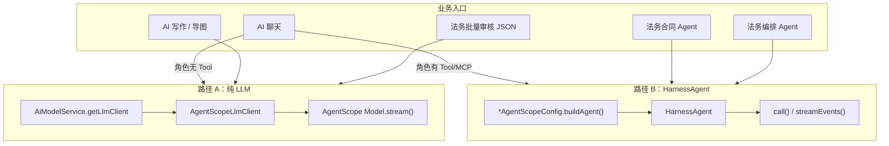

# AgentScope 2 Java 在本项目中的落地与学习指南

| 属性 | 值 |
|------|-----|
| 编号 | Laby-AI-AGENTSCOPE-GUIDE-001 |
| 日期 | 2026-06-13 |
| 适用读者 | 刚接触 laby-admin AI / 法务 Agent 的开发者 |
| 依赖版本 | `io.agentscope:agentscope-harness:2.0.0-RC1` |
| 关联 Spec | [agentscope 原位重构 Spec](../superpowers/specs/2026-06-05-laby-module-ai-agentscope-inplace-refactor-spec.md) |

---

## 0. 怎么用这份文档

建议按下面顺序阅读，每读完一节在 IDE 里打开对应文件对照：

| 阶段 | 章节 | 目标 |
|------|------|------|
| 第 1 天 | §1～§3 | 知道 AgentScope 是什么、项目为什么这样接 |
| 第 2 天 | §4～§6 | 搞清「纯 LLM」和「HarnessAgent」两条路 |
| 第 3 天 | §7～§9 | 会跟 Tool / Middleware / Session 代码 |
| 第 4 天 | §10～§12 | 跟完法务 Agent 和 AI 聊天完整链路 |
| 第 5 天 | §13～§16 | 配置、排错、与官网文档对照 |

---

## 1. 先建立心智模型

### 1.1 AgentScope 2 Java 是什么

AgentScope Java 2.0 分两层：

```
┌─────────────────────────────────────────────────────────┐
│  agentscope-harness（HarnessAgent）                       │
│  长运行 Agent 平台：Session、Middleware、Tool、权限、压缩  │
└───────────────────────────┬─────────────────────────────┘
                            │ 基于
┌───────────────────────────▼─────────────────────────────┐
│  agentscope-core（ReActAgent / Model / Msg / Event）     │
│  核心循环：推理 → 调 Tool → 再推理 → 输出                  │
└─────────────────────────────────────────────────────────┘
```

- **Model**：只负责「发消息给大模型、收回复」（可流式）。
- **HarnessAgent**：在 Model 之上包 ReAct 循环，并注入 Tool、Middleware、Session 等。

官网 Quickstart 通常直接写 `HarnessAgent.builder()...call()`。  
**本项目不是抄 Quickstart**，而是：

1. 用 **自有接口** `AiLlmClient` 屏蔽 AgentScope 类型（业务层尽量不 import `io.agentscope`）。
2. **按需** 使用 Harness：只有「需要 Tool 循环」的场景才建 `HarnessAgent`。
3. **RAG、向量库、租户、MySQL 对话历史** 仍是 Ruoyi 自研，不走 Harness 内置 RAG。

### 1.2 和 Spring AI 的关系（迁移结论）

| 项目 | 状态 |
|------|------|
| `org.springframework.ai.*` | **已从 Java 源码移除**（2026-06 原位重构） |
| LLM 运行时 | **100% AgentScope Model** |
| 向量库 | Qdrant 直连 + 自研 `AiVectorStoreClient`（非 Spring AI VectorStore） |
| 文档解析 | Apache Tika 直连（非 spring-ai-tika） |

YAML 里仍可能出现 `spring.ai.dashscope.api-key` 等键名——那是 **DashScope Rerank / 兼容配置**，不是 Spring AI 框架依赖。

---

## 2. 项目里的两条运行路径（最重要）

几乎所有「AI 怎么调模型」的问题，都可以归到下面两条路：



### 2.1 路径 A：纯 LLM（无 ReAct 循环）

**何时走这条路**

- AI 聊天角色 **没有** 绑定 Tool / MCP
- AI 写作、思维导图
- 法务 **批量审核 Pipeline**（一次 prompt → 一次 JSON，不是 Agent 多步）

**调用链**

```
Controller
  → XxxServiceImpl
    → AiModelService.getLlmClient(modelId)
      → AgentScopeLlmClient
        → AgentScopeModelFactory.buildChatModel(...)
          → DashScopeChatModel / OpenAIChatModel / ...
        → model.stream(messages, ..., GenerateOptions)
```

**关键代码**

- 接口：`laby-module-ai/.../core/llm/AiLlmClient.java`
- 实现：`laby-module-ai/.../framework/agentscope/model/AgentScopeLlmClient.java`
- 工厂：`AgentScopeModelFactory.java`
- 获取客户端：`AiModelServiceImpl.getLlmClient()`

**特点**

- 历史消息、知识库 `<Reference>`、联网 `<WebSearch>` 在 **业务层** 拼进 `AiLlmRequest`，再转成 AgentScope `Msg`。
- **不会** 创建 `HarnessAgent`，也 **不会** 自动调 Tool。

### 2.2 路径 B：HarnessAgent（ReAct + Tool）

**何时走这条路**

- AI 聊天角色绑定了 Tool 或 MCP
- 法务合同 Agent（8+ Tool）
- 法务编排 Agent（`legal_orchestration_*` Tool）
- 审核 Orchestrator 试点（可选）

**调用链**

```
Controller
  → XxxServiceImpl
    → LegalAgentScopeConfig / AiChatAgentScopeConfig.buildAgent(...)
      → HarnessAgent.builder()
           .model(...)
           .toolkit(...)
           .middlewares(...)
           .session(...)
           .sessionKey(...)
           .build()
    → agent.call(msgs, runtimeContext)  或  agent.streamEvents(...)
```

**关键代码**

- AI 聊天构建器：`AiChatAgentScopeConfig.java`
- 法务 Agent 构建器：`LegalAgentScopeConfig.java`
- AI 聊天分流：`AiChatMessageServiceImpl`（`roleHasTools()` 判断）
- 法务流式：`LegalContractAgentServiceImpl.runStream()`

**特点**

- System Prompt 通过 `.sysPrompt(...)` 交给 Harness（AI 聊天会从 conversation 取 systemMessage）。
- 对话历史仍主要来自 **MySQL**（`buildAiLlmRequest`），转成 `List<Msg>` 传给 Agent；Harness Session 负责 **Agent 内部状态**（Tool 状态、压缩摘要等），不是唯一历史源。
- 流式输出走 `streamEvents()` → 映射为业务 SSE 事件。

---

## 3. 分层架构（从外到内）

```
┌──────────────────────────────────────────────────────────────┐
│  laby-ui（Vue）— SSE / REST，协议与 Spring AI 时代基本兼容      │
└────────────────────────────┬─────────────────────────────────┘
                             │
┌────────────────────────────▼─────────────────────────────────┐
│  Controller（薄）— AiChatMessageController / LegalContract*   │
└────────────────────────────┬─────────────────────────────────┘
                             │
┌────────────────────────────▼─────────────────────────────────┐
│  业务 Service                                                 │
│  AiChatMessageServiceImpl / LegalContractAgentServiceImpl /   │
│  LegalAiAuditPipelineService / AiWriteServiceImpl ...         │
└────────────────────────────┬─────────────────────────────────┘
                             │
         ┌───────────────────┴───────────────────┐
         │                                       │
┌────────▼────────┐                   ┌──────────▼──────────┐
│  core 抽象层     │                   │  framework/agentscope │
│  AiLlmClient    │                   │  Model / Session /    │
│  AiEmbedding*   │                   │  Harness 构建 / MCP   │
│  AiVectorStore* │                   │  Middleware           │
└────────┬────────┘                   └──────────┬──────────┘
         │                                       │
         └───────────────────┬───────────────────┘
                             │
┌────────────────────────────▼─────────────────────────────────┐
│  io.agentscope（Maven 依赖 agentscope-harness:2.0.0-RC1）     │
└────────────────────────────┬─────────────────────────────────┘
                             │
┌────────────────────────────▼─────────────────────────────────┐
│  外部：各平台 LLM API / Qdrant / Redis / MySQL               │
└──────────────────────────────────────────────────────────────┘
```

**设计原则（Spec G3）**：业务 Service **优先** 依赖 `com.laby.module.ai.core.*`，而不是直接依赖 `io.agentscope.*`。  
法务模块里直接 import AgentScope 的地方较多，因为 Agent、Middleware、Tool 与业务强耦合。

---

## 4. 核心抽象：AiLlmClient 与消息模型

### 4.1 AiLlmClient

```java
public interface AiLlmClient {
    String call(AiLlmRequest request);
    Flux<AiLlmStreamEvent> stream(AiLlmRequest request);
}
```

- **call**：同步，返回完整文本。
- **stream**：流式，产出 `CONTENT` / `REASONING` / `ERROR` / `DONE` 事件（项目自定义，不是 AgentScope 原生 Event）。

### 4.2 AgentScopeLlmClient 做了什么

1. 把 `AiLlmRequest.messages` 转成 AgentScope `List<Msg>`（`AiMessageConverter`）。
2. 用 `AgentScopeModelFactory` 按 `ai_model` + `ai_api_key` 构造 `Model`。
3. 调用 `model.stream(..., GenerateOptions.stream=true/false)`。
4. 把 `TextBlock` / `ThinkingBlock` chunk 转成 `AiLlmStreamEvent`。

**注意**：这是 **单次模型调用**，没有 Tool 循环。

### 4.3 消息转换 AiMessageConverter

| AiMessage 角色 | AgentScope 类型 |
|----------------|-----------------|
| SYSTEM | SystemMessage |
| USER | UserMessage |
| ASSISTANT | AssistantMessage |
| TOOL | UserMessage（带 `[tool:name]` 前缀） |

走 HarnessAgent 时，AI 聊天会 **过滤掉 SYSTEM**（system 已交给 `.sysPrompt()`）：

```java
// AiChatMessageServiceImpl.convertAiMessagesToAgentScopeMsgs
messages.stream().filter(m -> m.getRole() != SYSTEM) ...
```

---

## 5. 模型层：AgentScopeModelFactory

### 5.1 数据来源

所有模型配置来自管理后台表：

- `ai_model`：model 名、temperature、maxTokens、platform…
- `ai_api_key`：apiKey、baseUrl、platform

`AgentScopeModelFactory.from(model, apiKey)` → `AgentScopeModelConfig` → `buildChatModel(...)`。

### 5.2 与官网的最大差异

| 官网 | 本项目 |
|------|--------|
| `.model("dashscope:qwen-plus")` | `.model(AgentScopeModelFactory.buildChatModel(...))` |
| 读环境变量 `DASHSCOPE_API_KEY` | 读 DB `ai_api_key.api_key` |
| ModelRegistry 字符串解析 | 按 `AiPlatformEnum` switch 到具体 Model 类 |

支持的平台在 `AgentScopeModelFactory` 的 switch 中，例如：

- 通义：`DashScopeChatModel`
- OpenAI 兼容：`OpenAIChatModel` + 各 Formatter（DeepSeek、GLM…）
- Gemini、Anthropic 等

### 5.3 其他 Client（同样走 AgentScope 底层）

| 接口 | 实现位置 |
|------|----------|
| `AiEmbeddingClient` | `AgentScopeEmbeddingClientFactory` / `HttpAiEmbeddingClient` |
| `AiVectorStoreClient` | `QdrantVectorStoreClient` |
| `AiImageClient` | `AgentScopeImageClientFactory` / `HttpAiImageClient` |

向量与 RAG **不经过 HarnessAgent**，是独立服务链。

---

## 6. HarnessAgent 构建详解

### 6.1 AI 聊天：AiChatAgentScopeConfig

```java
HarnessAgent.builder()
    .name("ai-chat-agent")
    .sysPrompt(...)
    .model(AgentScopeModelFactory.buildChatModel(...))
    .toolkit(toolkit)                    // 角色绑定的 Tool + MCP
    .middlewares([Trace, Compaction, ...])
    .toolExecutionContext(...)           // 可选：编排场景注入上下文
    .session(session)                    // Redis / Workspace / Memory
    .sessionKey(sessionKey)              // as:chat:{conversationId}
    .disableSubagents()
    .disableDynamicSkills()
    .workspace(workspacePath/chat/{id})
    .maxIters(defaultMaxSteps)           // 通过 AgentScopeHarnessBuilderSupport
    .compaction(CompactionConfig...)     // token 超阈值压缩
    .build();
```

默认 Middleware：

1. `AiChatTraceMiddleware` — 日志
2. `AiChatCompactionSummaryMiddleware` — 长对话压缩（可配置是否落库）

### 6.2 法务合同 Agent：LegalAgentScopeConfig

在 AI 聊天基础上增加：

| 配置项 | 含义 |
|--------|------|
| `.permissionContext(...)` | 只读/提案模式 Tool 权限（HITL） |
| `.enablePendingToolRecovery(true)` | 用户确认后可恢复 pending Tool |
| `.disableFilesystemTools()` | 禁用 Harness 内置文件 Tool |
| `.disableShellTool()` | 禁用 Shell |
| `.skillsEnabled(true)` | SkillPack 场景启用动态 Skill |
| 法务 Middleware 链 | 租户、Tool 上下文、Trace、SSE、Compaction |

Tool 列表由 `LegalAgentToolProvider` 按「只读 / 提案 / SkillPack」动态组装。

### 6.3 公共选项 AgentScopeHarnessBuilderSupport

```yaml
# application.yaml → laby.ai.agentscope
default-max-steps: 12              # → maxIters
compaction-token-threshold: 120000  # → CompactionConfig.triggerTokens
model-max-retries: 2               # → Model ExecutionConfig
```

---

## 7. Session 持久化

### 7.1 AgentScopeSessionFactory

配置 `laby.ai.agentscope.session-store`：

| 值 | 实现 | 适用 |
|----|------|------|
| `redis`（默认） | `RedisBackedJsonSession` | 多实例部署、会话可恢复 |
| `workspace` | `WorkspaceSession` | 单机、落盘 |
| `memory` | `InMemorySession` | 本地调试 |

SessionKey 规则（`AgentScopeSessionKeyBuilder`）：

- AI 聊天：`as:chat:{conversationId}`
- 法务合同：`as:legal:{contractId}:{sessionId}`

### 7.2 Session 与 MySQL 历史的关系

| 存储 | 内容 |
|------|------|
| MySQL `ai_chat_message` / 法务聊天表 | 用户可见的完整对话、知识引用、附件 |
| AgentScope Session | Agent 内部状态、压缩后的摘要、Tool pending 等 |

**不要混淆**：删 MySQL 消息不会自动清 Redis Session；反之亦然。

---

## 8. Tool 体系

### 8.1 定义方式（与官网一致）

使用 AgentScope 注解，Spring Bean 注册：

```java
@Component("legal_search_knowledge")
public class LegalSearchKnowledgeTool {

    @Tool(name = "legal_search_knowledge", description = "...", readOnly = true)
    public Response searchKnowledge(
            @ToolParam(name = "query") String query,
            @ToolParam(name = "topK", required = false) Integer topK,
            LegalAgentToolRuntimeContext toolContext) {  // 业务上下文注入
        ...
    }
}
```

**要点**

- Bean 名 = Tool 注册名（AI 聊天角色在后台配置 Tool 时引用 Bean name）。
- 最后一个参数可以是 `LegalAgentToolRuntimeContext` 等，通过 `ToolExecutionContext` 注入。

### 8.2 AI 聊天 Tool 注册：AiChatToolRegistry

```
角色 toolIds → AiToolDO.name → Spring Bean → toolkit.registerTool(bean)
角色 mcpClientNames → AgentScopeMcpToolRegistrar → MCP Tool 注册
```

### 8.3 法务 Tool 注册：LegalAgentToolProvider

| 类别 | Bean 名示例 |
|------|-------------|
| 只读 | `legal_search_knowledge`, `legal_search_paragraphs`, `legal_get_audit_opinions`… |
| 写/提案 | `legal_propose_adopt_opinion`, `legal_adopt_opinion`, `legal_batch_adopt_pending_opinions`… |
| 编排 | `legal_orchestration_*`（在 AI 聊天角色里绑定，走 `LegalOrchestrationAiChatHarnessSupport`） |

### 8.4 Tool 上下文注入

法务 Agent 构建时：

```java
ToolExecutionContext.builder()
    .register(LegalAgentToolRuntimeContext.from(...))
    .build();
RuntimeContext.builder()
    .sessionId(sessionId)
    .userId(...)
    .toolExecutionContext(toolExecutionContext)
    .build();
```

Tool 方法里可直接拿 `toolContext.getContractId()` 等，无需从 LLM 参数里传 contractId（更安全）。

---

## 9. Middleware 体系

Middleware 是 **拦截 Agent 生命周期** 的扩展点，类似 Web 过滤器。

| Middleware | 模块 | 作用 |
|------------|------|------|
| `AiChatTraceMiddleware` | ai | 聊天 Trace 日志 |
| `AiChatCompactionSummaryMiddleware` | ai | 压缩摘要落库（可选） |
| `LegalAgentToolContextMiddleware` | legal | Tool 线程租户/合同上下文 |
| `LegalTenantMiddleware` | legal | 租户透传 |
| `LegalAgentTraceMiddleware` | legal | Tool 步骤写 `legal_agent_step_log` |
| `LegalAgentSseMiddleware` | legal | Tool 过程 SSE 推送 |
| `LegalContractCompactionSummaryMiddleware` | legal | 合同 Agent 压缩摘要 |
| `LegalOrchestrationToolContextMiddleware` | legal | 编排 Tool 上下文 |

**示例**：`LegalAgentTraceMiddleware.onActing()` 在 Tool 执行前后记日志、限制最大 Tool 次数、拦截问答 Agent 误调审核写 Tool。

继承：`extends MiddlewareBase`，重写 `onActing` / `onReasoning` 等钩子。

---

## 10. 完整链路 A：AI 聊天（带知识库）

以 `AiChatMessageServiceImpl.sendChatMessageStream` 为例：

```
1. 校验 conversation、model
2. recallKnowledgeForChat()        ← 自研 Universal RAG，非 AgentScope RAG
3. NoAnswerGuard.evaluate()        ← 分数低则固定文案，不调 LLM
4. 插入 user / assistant 消息到 MySQL
5. buildAiLlmRequest()
     - 历史消息（MySQL）
     - 知识库 → KNOWLEDGE_USER_MESSAGE_TEMPLATE + <Reference>...</Reference>
     - 联网 → WEB_SEARCH_USER_MESSAGE_TEMPLATE
6. 分支：
     roleHasTools? 
       是 → buildChatHarnessAgent → streamEvents → 映射 SSE
       否 → llmClient.stream(request)
7. 更新 assistant 消息 content / reasoning / segments
```

**知识库 Prompt 模板**（业务层，非 AgentScope）：

```
使用 <Reference></Reference> 标记中的内容作为本次对话的参考:

<Reference>...</Reference>

回答要求：
- 避免提及你是从 <Reference> 获取的知识
- 若参考内容不足以回答，请明确说「根据知识库内容无法确定」
```

**roleHasTools 判断**：

```java
chatRole.getToolIds() 非空 或 chatRole.getMcpClientNames() 非空
```

---

## 11. 完整链路 B：法务合同 Agent

以 `LegalContractAgentServiceImpl.runStream` 为例：

```
1. session 锁 / 待确认检查（HITL）
2. resolveModel + apiKey + sysPrompt + SkillPack
3. legalAgentToolProvider.buildAgentRuntimeContext()
4. legalAgentScopeConfig.buildAgent() → HarnessAgent
5. runtimeRegistry.register(sessionId, agent, ...)  // 支持 confirm/resume
6. buildAgentMessages(reqVO) → List<Msg>
7. agent.streamEvents(messages, runtimeContext)
     → mapAgentEventToSse → 前端 SSE（正文 / Tool / 提案确认）
8. 并行：heartbeat + drainSseEvents（Tool 侧推送）
9. 结束 cleanupRuntimeIfIdle（非 awaiting confirm 时释放）
```

**HITL（Human-in-the-Loop）**

- `PermissionContextState`：提案 Tool 在 explore 模式 DENY，提案模式 ALLOW。
- `RequireUserConfirmEvent` → `LegalContractAgentRebuildService` / `ResumeService` 处理用户确认后继续。

---

## 12. 完整链路 C：法务批量审核（纯 LLM）

`LegalAiAuditPipelineService.runLlmAuditBatches`：

- **不用 HarnessAgent**
- 用 `AiLlmClient.call()` 分批送段落 + 审核 Prompt
- 解析返回 JSON → 写入 `legal_audit_opinion`

这是 **Batch Completion**，不是 ReAct Agent。官网若展示 Agent 审核，本项目刻意用更简单、可控的单轮 JSON 模式。

---

## 13. RAG 与 AgentScope 的边界

| 能力 | 实现 |
|------|------|
| 文档解析 / 分块 | 自研 `HierarchicalKnowledgeChunker`、MinerU/Docling 可选 |
| Embedding | `AiEmbeddingClient` → AgentScope/HTTP Embedding |
| 向量存储 | `QdrantVectorStoreClient` |
| 检索 | `AiKnowledgeRetrievalService`（Dense + Sparse + RRF + Rerank） |
| 聊天注入 | 业务层 `<Reference>` 模板 |
| Agent Tool 查知识库 | `LegalSearchKnowledgeTool` 调法务 `auditContextService` |

**结论**：RAG 是 **laby 自研管道**；AgentScope 只负责「拿到文本后怎么推理、是否调 Tool」。

---

## 14. 流式事件映射

### 14.1 纯 LLM 流

`AgentScopeLlmClient`：`ChatResponse` chunk → `AiLlmStreamEvent`（CONTENT / REASONING / DONE）

### 14.2 HarnessAgent 流

`agent.streamEvents()` → `AgentEvent`：

| AgentEvent | 业务映射 |
|------------|----------|
| `TEXT_BLOCK_DELTA` | AI 聊天 CONTENT / 法务 SSE 正文 |
| `THINKING_BLOCK_DELTA` | REASONING |
| Tool 相关 Event | 法务 Middleware + SSE Holder |
| `RequireUserConfirmEvent` | 法务提案确认 UI |

AI 聊天只映射 TEXT / THINKING；法务映射更全。

---

## 15. 配置参考

### 15.1 application.yaml（`laby.ai.agentscope`）

```yaml
laby:
  ai:
    agentscope:
      workspace-path: ${java.io.tmpdir}/laby-agentscope
      session-store: redis          # redis | workspace | memory
      session-key-prefix: "as:"
      session-ttl-hours: 24
      default-max-steps: 12         # Agent 最大 ReAct 步数
      model-max-retries: 2
      compaction-token-threshold: 120000
      history-token-budget: 32000   # 纯 LLM 路径注入历史的 token 预算
      compaction-summary-persist: true
      audit-subagent-pilot: false   # 审核 orchestrator 子 Agent 试点
```

### 15.2 Maven 依赖

```xml
<!-- laby-dependencies/pom.xml -->
<agentscope.version>2.0.0-RC1</agentscope.version>
<dependency>
    <groupId>io.agentscope</groupId>
    <artifactId>agentscope-harness</artifactId>
    <version>${agentscope.version}</version>
</dependency>
```

引用模块：`laby-module-ai`、`laby-module-legal`。

---

## 16. 与官网文档对照表

| 官网 Quickstart 写法 | 本项目对应 | 说明 |
|---------------------|------------|------|
| `HarnessAgent.builder().model("dashscope:qwen-plus")` | `AgentScopeModelFactory.buildChatModel(...)` | DB 驱动多平台 |
| `new UserMessage("hi")` | `buildAgentMessages` / `AiMessageConverter` | 多轮 + Reference |
| `RuntimeContext.builder().sessionId().userId()` | 同上 + `ToolExecutionContext` | 法务加 contractId |
| `.workspace()` + `AGENTS.md` | `.workspace()` + 自定义 sysPrompt / SkillPack | 人格在 DB/法务配置 |
| `.filesystem(DockerFilesystemSpec)` | `.disableFilesystemTools()` | 后台系统不需要沙箱 |
| `.subagent(...)` | `.disableSubagents()`（合同 Agent） | 审核 orchestrator 可试点 |
| Harness 内置 RAG | 自研 `AiKnowledgeRetrievalService` | 表格/RRF 等已深度定制 |
| `agent.call(msg, ctx)` | `agent.call(msgs, ctx)` / `streamEvents` | 批量 Msg + 流式 |

**语法不一致是架构选择**，不是集成错误。

---

## 17. 推荐学习路径（按文件）

### 17.1 第 1 周：只读代码

| 顺序 | 文件 | 学什么 |
|------|------|--------|
| 1 | `core/llm/AiLlmClient.java` | 项目对 LLM 的统一抽象 |
| 2 | `AgentScopeLlmClient.java` | Model.stream 怎么包一层 |
| 3 | `AgentScopeModelFactory.java` | 多平台 Model 怎么建 |
| 4 | `AiModelServiceImpl.getLlmClient()` | 客户端从哪来 |
| 5 | `AiChatMessageServiceImpl` 220～332 行 | 双路径分流 |
| 6 | `AiChatAgentScopeConfig.java` | Harness 最小构建 |

### 17.2 第 2 周：Agent / Tool

| 顺序 | 文件 | 学什么 |
|------|------|--------|
| 1 | `LegalSearchKnowledgeTool.java` | @Tool 写法 |
| 2 | `LegalAgentToolProvider.java` | Toolkit + RuntimeContext |
| 3 | `LegalAgentScopeConfig.java` | 法务 Harness 全配置 |
| 4 | `LegalAgentTraceMiddleware.java` | Middleware 拦截 Tool |
| 5 | `LegalContractAgentServiceImpl.java` | 流式 + HITL |
| 6 | `LegalAgentPermissionContextFactory.java` | Permission 规则 |

### 17.3 第 3 周：扩展与调试

| 顺序 | 文件 | 学什么 |
|------|------|--------|
| 1 | `AgentScopeSessionFactory.java` | Session 策略 |
| 2 | `AiChatToolRegistry.java` | 角色 Tool 注册 |
| 3 | `LegalOrchestrationAiChatHarnessSupport.java` | AI 聊天扩展点 |
| 4 | `AiKnowledgeRetrievalServiceImpl.java` | RAG 与 Agent 分离 |
| 5 | `LegalAiAuditPipelineService.java` | 纯 LLM 批处理 |

### 17.4 动手实验建议

1. **实验 1**：创建一个无 Tool 的聊天角色 → 断点 `llmClient.stream`，确认不走 Harness。
2. **实验 2**：给角色绑 `PersonServiceImpl` 等 demo Tool → 断点 `buildChatHarnessAgent`。
3. **实验 3**：法务合同页发消息 → 断点 `LegalAgentTraceMiddleware.onActing`，看 Tool 名。
4. **实验 4**：改 `session-store: memory`，观察 Session 不落 Redis 的行为。

---

## 18. 常见问题 FAQ

### Q1：为什么我写的代码和官网完全不一样？

因为项目用了 **适配层 + 双路径**。请先判断你的功能是「单次 LLM」还是「Agent Tool 循环」，再选 §2 对应路径读代码。

### Q2：AI 聊天历史存在哪？

**用户可见历史**：MySQL。  
**Agent 内部状态**：Redis Session（默认）。Compaction 摘要可能额外写入 `ai_chat_message`（type=summary，看配置）。

### Q3：知识库召回是 AgentScope 做的吗？

不是。召回在 `recallKnowledgeForChat` → `AiKnowledgeRetrievalService`；AgentScope 只看到拼进 Prompt 的 `<Reference>` 文本。

### Q4：什么时候必须用 HarnessAgent？

当模型需要 **多步调用 Tool**（查段落、采纳意见、编排建合同等）。单次 JSON 审核、写作、导图 **不需要**。

### Q5：如何查看 AgentScope 源码（如 `OpenAIChatModel`）？

运行时用的是 Maven 依赖 jar 里的类。可在 IDE 中「跳转到声明」或解压 `agentscope-*` 依赖查看，**不要在仓库根目录放 `io/` 源码副本**。

### Q6：Rerank 和 AgentScope 什么关系？

Rerank 在 **自研 RAG 链**里（DashScope HTTP），与 HarnessAgent 无关。配置在 `laby.ai.knowledge-retrieval.rerank` 和 `spring.ai.model.rerank`（键名遗留，非 Spring AI 框架）。

### Q7：如何新增一个 AI 聊天 Tool？

1. 写 `@Component("my_tool")` + `@Tool` 方法。  
2. 在管理后台「AI 工具」注册 Bean 名。  
3. 聊天角色绑定该 Tool。  
4. 确认角色有 Tool → 自动走 HarnessAgent。

### Q8：如何新增法务 Agent Tool？

1. 在 `laby-module-legal/.../tool/agent/` 写 Tool 类。  
2. 把 Bean 名加入 `LegalAgentToolProvider.READONLY_TOOL_NAMES` 或 `WRITE_TOOL_NAMES`。  
3. 如需权限，更新 `LegalAgentPermissionContextFactory`。

---

## 19. Harness 能力使用清单

| AgentScope 2 能力 | 本项目 |
|-------------------|--------|
| Model / 流式 / 多平台 Formatter | ✅ 全面 |
| HarnessAgent + ReAct | ✅ Tool 场景 |
| @Tool / Toolkit | ✅ |
| Middleware | ✅ 多条业务 Middleware |
| Session / SessionKey | ✅ Redis 默认 |
| CompactionConfig | ✅ 可配置阈值 |
| Permission / HITL | ✅ 法务提案 |
| streamEvents / AgentEvent | ✅ SSE |
| MCP Tool | ✅ AiChatToolRegistry |
| Subagent | ⚠️ 审核试点，合同 Agent 关闭 |
| Docker 沙箱 / Shell / Filesystem | ❌ 故意关闭 |
| ModelRegistry 字符串模型 | ❌ 用 DB 工厂 |
| Harness 内置 RAG | ❌ 自研 RAG |

---

## 20. 附录：目录索引

### laby-module-ai/framework/agentscope/

| 目录/文件 | 职责 |
|-----------|------|
| `config/AgentScopeProperties.java` | 配置绑定 |
| `config/AgentScopeHarnessBuilderSupport.java` | maxIters / compaction 公共项 |
| `model/AgentScopeModelFactory.java` | 多平台 Model |
| `model/AgentScopeLlmClient.java` | AiLlmClient 实现 |
| `model/AiMessageConverter.java` | 消息转换 |
| `chat/AiChatAgentScopeConfig.java` | 聊天 Harness 构建 |
| `chat/AiChatToolRegistry.java` | Tool + MCP 注册 |
| `session/AgentScopeSessionFactory.java` | Session 策略 |
| `session/RedisBackedJsonSession.java` | Redis Session |
| `session/AgentScopeSessionKeyBuilder.java` | SessionKey 规则 |
| `rag/QdrantVectorStoreClient.java` | 向量库 |
| `mcp/AgentScopeMcpToolRegistrar.java` | MCP |
| `chat/middleware/*` | 聊天 Middleware |

### laby-module-legal/framework/agentscope/

| 文件 | 职责 |
|------|------|
| `LegalAgentScopeConfig.java` | 合同 Agent Harness |
| `LegalAuditOrchestratorAgentScopeConfig.java` | 审核编排 Harness |
| `LegalOrchestrationAiChatHarnessSupport.java` | AI 聊天编排扩展 |
| `middleware/*` | 法务 Middleware 链 |
| `permission/LegalAgentPermissionContextFactory.java` | Tool 权限 |
| `skill/LegalSkillPackSkillWriter.java` | SkillPack 写 workspace |

### 业务入口（建议断点）

| 类 | 场景 |
|----|------|
| `AiChatMessageServiceImpl` | 管理后台 AI 聊天 |
| `LegalContractAgentServiceImpl` | 合同 Agent SSE |
| `LegalAiOrchestratorImpl` | 法务编排 Agent |
| `LegalAiAuditPipelineService` | 批量审核纯 LLM |
| `AiWriteServiceImpl` / `AiMindMapServiceImpl` | 写作/导图纯 LLM |

### 外部参考

- [AgentScope Java 2 Quickstart](https://java.agentscope.io/v2/en/docs/quickstart.html)
- [Harness Memory / Compaction](https://java.agentscope.io/v2/en/docs/harness/memory.html)
- [Subagent 文档](https://java.agentscope.io/v2/en/docs/harness/subagent.html)
- 本项目 Spec：[2026-06-05-laby-module-ai-agentscope-inplace-refactor-spec.md](../superpowers/specs/2026-06-05-laby-module-ai-agentscope-inplace-refactor-spec.md)

---

## 21. 一张总图（可打印）

```
                    ┌─────────────────────────────────┐
                    │         用户 / 前端 SSE          │
                    └─────────────────┬───────────────┘
                                      │
          ┌───────────────────────────┼───────────────────────────┐
          │                           │                           │
   ┌──────▼──────┐            ┌───────▼───────┐           ┌───────▼───────┐
   │  AI 聊天     │            │ 法务合同 Agent │           │ 批量审核/写作  │
   │  + RAG      │            │  + Tool + HITL │           │  单次 LLM     │
   └──────┬──────┘            └───────┬───────┘           └───────┬───────┘
          │                           │                           │
          │ 无Tool                    │ 有Tool                    │ 无Tool
          ▼                           ▼                           ▼
   ┌─────────────┐            ┌─────────────────┐         ┌─────────────┐
   │ AiLlmClient │            │  HarnessAgent   │         │ AiLlmClient │
   │    .stream  │            │ streamEvents()  │         │    .call    │
   └──────┬──────┘            └────────┬────────┘         └──────┬──────┘
          │                           │                           │
          └───────────────────────────┼───────────────────────────┘
                                      │
                            ┌─────────▼─────────┐
                            │ AgentScope Model  │
                            │ (DashScope/OpenAI)│
                            └─────────┬─────────┘
                                      │
                            ┌─────────▼─────────┐
                            │   各平台 LLM API   │
                            └───────────────────┘

   RAG 侧路（所有聊天场景）：
   用户问题 → AiKnowledgeRetrievalService → Qdrant → <Reference> 注入 Prompt
```

---

*文档维护：AI 模块重大架构变更时请同步更新 §2、§13、§16。*
