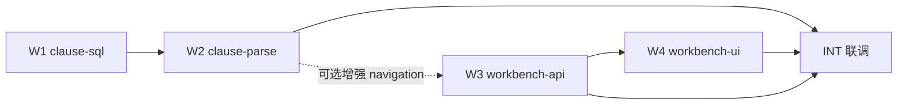

# 平台演进 Wave 1 — 多窗口并行编排（E1 + E2）

> **For agentic workers:** 每个窗口在 **独立 Cursor 窗口 / git worktree** 中执行，**禁止**跨窗口改同一文件。  
> **主 Spec:** [2026-06-04-legal-contract-platform-evolution-spec.md](../specs/2026-06-04-legal-contract-platform-evolution-spec.md)  
> **子计划:** [E1 Workbench](./2026-06-04-legal-workbench-plan.md) · [E2 ClauseUnit](./2026-06-04-legal-clause-unit-plan.md)

**Goal:** 4 个 Agent 窗口并行，约 **2～3 周** 交付 M1（工作台）+ E2 基础（Clause 表 + 解析 + 左栏树）。

**Architecture:** E1 前端与 E2 后端 **弱耦合** — 通过 `get-workbench` 的 `navigation.mode` 约定对接；E2 未完成时 E1 用 `PARAGRAPH` 模式先上线。

**Tech Stack:** Spring Boot, MyBatis, POI, Vue3, Element Plus, Vben

---

## 1. 窗口一览（开干就用这张表）

| 窗口 | 代号 | 负责 Epic | 主要产出 | 禁止触碰 |
|------|------|-----------|----------|----------|
| **W1** | `clause-sql` | E2-A | SQL + DO + Mapper + 菜单占位 | 前端、`review.vue` |
| **W2** | `clause-parse` | E2-B | StructureParser + Parse 集成 + 单测 | Controller VO、前端 |
| **W3** | `workbench-api` | E1-B | `get-workbench` API + Service 聚合 | `review.vue`、Parser |
| **W4** | `workbench-ui` | E1-F | 三栏组件 + `review.vue` 重构 | Java 后端（除 API 类型） |

**集成窗口（主会话 INT）：** W1→W2 顺序可在同窗口；**W3 与 W4 可并行**；**W2 与 W3 可并行**；最终 INT 合并联调。

---

## 2. 依赖与并行矩阵



| 关系 | 说明 |
|------|------|
| W1 → W2 | **硬依赖**：W2 需要表与 DO |
| W3 ∥ W2 | **可并行**：W3 v1 仅 PARAGRAPH 树，不读 clause 表 |
| W4 → W3 | **软依赖**：W4 可先 mock API，W3 完成后换真实接口 |
| W2 → W3 | **增强**：W2 完成后 W3 增加 `CLAUSE` 分支（INT 任务） |

---

## 3. 跨窗口接口契约（必须遵守）

### 3.1 `GET /legal/contract/get-workbench?contractId=` 响应

```typescript
interface LegalContractWorkbenchResp {
  contract: LegalContractRespVO;
  navigation: {
    mode: 'PARAGRAPH' | 'CLAUSE';
    nodes: Array<{
      id: string;           // paragraphId 或 clauseId
      label: string;
      level: number;
      paragraphIds: string[];
      children?: /* same */;
    }>;
  };
  paragraphs: Array<{
    paragraphId: string;
    sort: number;
    text: string;
    skipAudit?: boolean;
  }>;
  opinions: LegalAuditOpinionRespVO[];
  reportSummary: {
    hasReport: boolean;
    riskHighCount: number;
    previewMarkdown?: string;
  };
}
```

### 3.2 W3 v1 行为（W2 未完成时）

- `navigation.mode = 'PARAGRAPH'`
- `nodes` = 每条段落一个叶子节点 `{ id: paragraphId, label: '段落 n', level: 0, paragraphIds: [paragraphId] }`

### 3.3 W2 完成后 INT 增强 W3

- 若 `legal_contract_clause` 有数据 → `mode = 'CLAUSE'`，nodes 为 clause 树
- 否则降级 PARAGRAPH（兼容旧合同）

### 3.4 文件所有权（避免 merge 冲突）

| 路径 | 唯一 owner |
|------|------------|
| `sql/mysql/laby-legal-evol-e2-clause.sql` | W1 |
| `.../dal/dataobject/clause/*` | W1 |
| `.../dal/mysql/clause/*` | W1 |
| `.../service/contract/util/LegalContractStructureParser.java` | W2 |
| `.../service/contract/util/LegalClauseBuilder.java` | W2 |
| `LegalContractParseServiceImpl.java` | W2 |
| `LegalContractWordParser.java` | W2（仅扩展调用，不大改段落 ID 逻辑） |
| `.../controller/.../LegalContractWorkbench*.java` | W3 |
| `LegalContractWorkbenchService*.java` | W3 |
| `LegalContractController.java` | W3（仅 **追加** get-workbench 方法） |
| `views/legal/contract/review.vue` | W4 |
| `views/legal/contract/workbench/*` | W4 |
| `api/legal/contract/index.ts` | W4（追加 getWorkbench） |

---

## 4. 各窗口启动 Prompt（复制到对应 Cursor 窗口）

### W1 — clause-sql

```text
你负责 Wave1-W1。只读并执行：
docs/superpowers/plans/2026-06-04-legal-clause-unit-plan.md 中的 Task W1。
禁止修改 Parser、Controller、review.vue。
完成后运行 mvn compile -pl laby-module-legal -am -DskipTests，提交信息前缀 [wave1-w1]。
```

### W2 — clause-parse

```text
你负责 Wave1-W2。等 W1 的 SQL+DO 合并后，执行：
docs/superpowers/plans/2026-06-04-legal-clause-unit-plan.md 中的 Task W2。
禁止修改 Workbench API 与前端。
paragraphId 生成规则必须与 LegalContractWordParser 一致。
完成后跑 LegalClauseBuilderTest + compile，提交前缀 [wave1-w2]。
```

### W3 — workbench-api

```text
你负责 Wave1-W3。执行：
docs/superpowers/plans/2026-06-04-legal-workbench-plan.md 中的 Task W3。
v1 仅实现 PARAGRAPH navigation；预留 CLAUSE 分支 TODO。
禁止修改 review.vue。
完成后 compile，提交前缀 [wave1-w3]。
```

### W4 — workbench-ui

```text
你负责 Wave1-W4。执行：
docs/superpowers/plans/2026-06-04-legal-workbench-plan.md 中的 Task W4。
可先对接 list-paragraph + getOpinionList，W3 合并后切 get-workbench。
禁止修改 Java。提交前缀 [wave1-w4]。
```

### INT — 主会话集成

```text
合并 wave1-w1..w4 分支。执行本文件 §5 集成清单。
W2 完成后增强 W3 CLAUSE 分支；跑通 review 页三栏联动。
```

---

## 5. 集成清单（INT）

- [ ] `sql/mysql/laby-legal-evol-e2-clause.sql` 已在目标库执行
- [ ] 上传新 docx → `legal_contract_clause` 有数据
- [ ] 重解析旧合同 → paragraphId 不变（回归）
- [ ] `get-workbench` 有/无 clause 两种 mode 均 200
- [ ] `review.vue` 三栏：点意见 → 段落高亮
- [ ] BPM 嵌入 `review.vue?id=` 无 JS 报错
- [ ] `mvn compile -pl laby-module-legal,laby-server -am -DskipTests` SUCCESS
- [ ] 前端 `pnpm exec eslint` 变更文件无 error（或项目等价命令）

---

## 6. Git 分支建议

```bash
# 主分支拉 wave1
git checkout -b feat/legal-wave1-evolution

# 各窗口 worktree（推荐）
git worktree add ../laby-admin-w1 feat/legal-wave1-w1
git worktree add ../laby-admin-w2 feat/legal-wave1-w2
git worktree add ../laby-admin-w3 feat/legal-wave1-w3
git worktree add ../laby-admin-w4 feat/legal-wave1-w4
```

合并顺序：**W1 → W2 → W3 → W4**（W3/W4 若冲突优先保留各自 owner 文件）。

---

## 7. Wave 2 预览（本编排不执行）

| 窗口 | Epic | 内容 |
|------|------|------|
| W5 | E3 | Playbook SQL + DeterministicEngine |
| W6 | E3 | Playbook 管理端 simulate |
| W7 | E4 | Orchestrator 骨架 |
| W8 | E7 | Eval 3 样本 |

Wave 2 编排文档待 Wave 1 INT 通过后编写。

---

## 8. 时间盒

| 月历 | 窗口 |
|------|------|
| 第 1 周 | W1+W2 并行 W3；W4 用 mock |
| 第 2 周 | W4 接 API；INT  daily |
| 第 3 周 | INT 修复 + UAT + 文档更新 |

---

**状态：** Ready to dispatch 🚀
