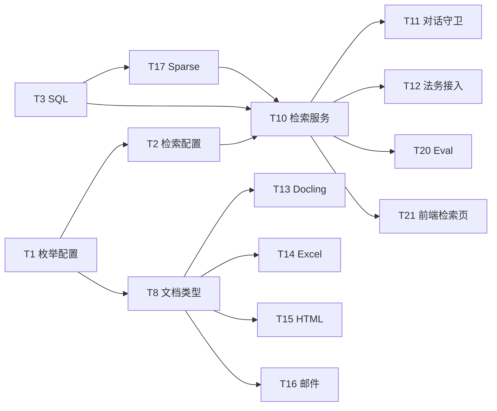

# 知识库全文档类型 RAG 召回率提升 — Implementation Plan

> **For agentic workers:** REQUIRED SUB-SKILL: Use superpowers:subagent-driven-development（推荐并行子任务）或 superpowers:executing-plans 按 Task 勾选实施。  
> **无优先级约束：** 下列 Task 1~28 可按依赖关系并行推进，不强制 R0→R1→R2→R3 顺序；仅标注 **依赖** 的任务需先完成上游。

**Goal:** 在现有 PDF 结构化 RAG（Phase 0/1）之上，提升 **全扩展名** 文档入库质量与检索召回率（Hybrid + Multi-Query + Rerank + 无引用守卫 + 全类型解析分片）。

**Architecture:** 入库 `DocumentTypeChunkRouter` 按扩展名选 Parser+Chunker；检索统一经 `AiKnowledgeRetrievalService`（Dense+Sparse+RRF→Rerank→回填→守卫）；对话与法务审核共用同一检索入口。

**Tech Stack:** Java 17, Spring Boot, Qdrant, MySQL FULLTEXT, DashScope Embedding/Rerank, MinerU/Docling HTTP 适配层, FastAPI, Jsoup, Apache POI / Docling

**Spec:** [`docs/superpowers/specs/2026-06-11-ai-knowledge-universal-rag-recall-spec.md`](../specs/2026-06-11-ai-knowledge-universal-rag-recall-spec.md)

---

## 依赖关系简图（仅供参考，非执行顺序）



---

## Task 1: 新增枚举与常量

**Files:**
- Create: `laby-module-ai/src/main/java/com/laby/module/ai/enums/knowledge/AiKnowledgeDocumentTypeEnum.java`
- Create: `laby-module-ai/src/main/java/com/laby/module/ai/enums/knowledge/AiKnowledgeRecallPathEnum.java`
- Create: `laby-module-ai/src/main/java/com/laby/module/ai/enums/knowledge/AiQueryIntentEnum.java`
- Create: `laby-module-ai/src/main/java/com/laby/module/ai/enums/knowledge/AiRagNoAnswerPolicyEnum.java`
- Modify: `laby-module-ai/src/main/java/com/laby/module/ai/enums/knowledge/AiKnowledgeSegmentBlockTypeEnum.java`（新增 `code`）
- Modify: `laby-module-ai/src/main/java/com/laby/module/ai/core/rag/AiVectorStoreMetadataKeys.java`
- Modify: `laby-module-ai/src/main/java/com/laby/module/ai/enums/ErrorCodeConstants.java`

- [ ] **Step 1:** 四个新枚举：`code` + `name` + `valueOfCode(String)`
- [ ] **Step 2:** `AiKnowledgeSegmentBlockTypeEnum` 增加 `CODE("code")` 块类型
- [ ] **Step 3:** Metadata 键：`documentType`, `emailSubject`, `sheetName`, `slideIndex`
- [ ] **Step 4:** 错误码 `1_040_009_110` ~ `1_040_009_113`
- [ ] **Step 5:** 单测 `AiKnowledgeDocumentTypeEnumTest`：扩展名 → type 映射

---

## Task 2: 检索配置 `KnowledgeRetrievalProperties`

**Files:**
- Create: `laby-module-ai/src/main/java/com/laby/module/ai/framework/knowledge/retrieval/KnowledgeRetrievalProperties.java`
- Create: `laby-module-ai/src/main/java/com/laby/module/ai/framework/knowledge/retrieval/KnowledgeRetrievalAutoConfiguration.java`
- Modify: `laby-server/src/main/resources/application.yaml`
- Modify: `laby-server/src/main/resources/application-local.yaml`

- [ ] **Step 1:** 按 Spec §5.2 实现嵌套配置（hybrid / multi-query / rerank / block-route / diagnostics）
- [ ] **Step 2:** `@EnableConfigurationProperties` 注册
- [ ] **Step 3:** 默认：`default-top-k=8`, `default-similarity-threshold=0.60`, `retrieval-factor=4`, `rerank.enabled=true`
- [ ] **Step 4:** 单测：配置绑定与默认值

---

## Task 3: SQL 迁移（全文档 + 全文检索）

**Files:**
- Create: `sql/mysql/laby-ai-knowledge-universal-recall.sql`

- [ ] **Step 1:** `ai_knowledge_document.document_type` varchar(32) COMMENT '文档类型 code'
- [ ] **Step 2:** `ai_knowledge_segment.sparse_text` text COMMENT '全文检索纯文本'
- [ ] **Step 3:** `ai_knowledge_segment.source_locator` varchar(256) COMMENT '定位符'
- [ ] **Step 4:** FULLTEXT `ft_knowledge_segment_content(content)` + `ft_knowledge_segment_embed(embed_text)`（幂等检查）
- [ ] **Step 5:** 可选 `ai_chat_message.recall_diagnostics` json COMMENT '召回诊断'
- [ ] **Step 6:** 存量建议：`UPDATE ai_knowledge SET similarity_threshold=0.60 WHERE similarity_threshold > 0.85;`
- [ ] **Step 7:** 手动在目标库执行并 `SHOW INDEX FROM ai_knowledge_segment`

---

## Task 4: DO / Mapper 扩展

**Files:**
- Modify: `laby-module-ai/.../dal/dataobject/knowledge/AiKnowledgeDocumentDO.java`
- Modify: `laby-module-ai/.../dal/dataobject/knowledge/AiKnowledgeSegmentDO.java`
- Modify: `laby-module-ai/.../dal/dataobject/chat/AiChatMessageDO.java`（可选 diagnostics）
- Modify: `laby-module-ai/.../dal/mysql/knowledge/AiKnowledgeSegmentMapper.java`
- Create: `laby-module-ai/.../dal/mysql/knowledge/AiKnowledgeSegmentMapper.xml`（若用 XML 写 FULLTEXT）

- [ ] **Step 1:** DO 字段与枚举 Javadoc
- [ ] **Step 2:** `selectListBySparseSearch(knowledgeId, query, limit)` 返回 id + sparse_score
- [ ] **Step 3:** 入库时写入 `sparse_text`（`SparseTextNormalizer.stripMarkdown(embedText)`）

---

## Task 5: 知识库默认值与校验（R0-1）

**Files:**
- Modify: `laby-module-ai/.../service/knowledge/AiKnowledgeServiceImpl.java`
- Modify: `laby-module-ai/.../controller/admin/knowledge/vo/knowledge/AiKnowledgeSaveReqVO.java`
- Modify: `laby-ui/.../views/ai/knowledge/knowledge/data.ts`

- [ ] **Step 1:** 创建知识库时默认 `topK=8`, `similarityThreshold=0.60`
- [ ] **Step 2:** `@Max(0.85)` 校验 similarityThreshold
- [ ] **Step 3:** 前端表单 `defaultValue: 0.6`, `topK: 8`；>0.85 时 `ElMessage.warning`
- [ ] **Step 4:** 单测：创建 VO 校验拒绝 0.95

---

## Task 6: 修复批量上传结构化入库（R0-4）

**Files:**
- Modify: `laby-module-ai/.../service/knowledge/AiKnowledgeDocumentServiceImpl.java#createKnowledgeDocumentList`

- [ ] **Step 1:** 将 `readUrl` + `createKnowledgeSegmentBySplitContentAsync` 改为逐文档：
  ```java
  AiStructuredDocumentParseResult r = parseDocumentUrl(url);
  // insert document with parseEngine/parseQuality/documentType
  createKnowledgeSegmentByParseResultAsync(id, r);
  ```
- [ ] **Step 2:** `splitContent` 预览 API 仍走 parse（已用 readUrl）
- [ ] **Step 3:** 单测：mock parse 结果含 elements → 断言走 structured chunk

---

## Task 7: `SparseTextNormalizer` 工具

**Files:**
- Create: `laby-module-ai/.../framework/knowledge/retrieval/SparseTextNormalizer.java`
- Test: `laby-module-ai/src/test/java/.../SparseTextNormalizerTest.java`

- [ ] **Step 1:** 去 Markdown 符号、表格 `|`，保留中英数字
- [ ] **Step 2:** 写入 segment 时同步填充 `sparse_text`
- [ ] **Step 3:** 单测：`| John | Doe | 99 |` → 可检索 `John Doe 99`

---

## Task 8: `DocumentTypeResolver` + 入库写 `document_type`（R1-1）

**Files:**
- Create: `laby-module-ai/.../framework/document/DocumentTypeResolver.java`
- Modify: `AiKnowledgeDocumentServiceImpl.java`

- [ ] **Step 1:** 扩展名 + parse engine 推断 `AiKnowledgeDocumentTypeEnum`
- [ ] **Step 2:** 创建/重新入库时写入 `document_type`
- [ ] **Step 3:** 单测：`.docx→word`, `.xlsx→spreadsheet`, `.eml→email`

---

## Task 9: `DocumentParseProperties` 扩展 route-overrides

**Files:**
- Modify: `DocumentParseProperties.java`
- Modify: `DocumentParseRouter.java`

- [ ] **Step 1:** `Map<String,String> routeOverrides` 扩展名覆盖引擎
- [ ] **Step 2:** Router 先查 overrides 再 AUTO 逻辑
- [ ] **Step 3:** 单测：override `html→html` 客户端

---

## Task 10: Docling 适配层 Docker + Client（R1-2）

**Files:**
- Create: `script/document-parse/laby-docling-adapter/Dockerfile`
- Create: `script/document-parse/laby-docling-adapter/main.py`
- Create: `script/document-parse/laby-docling-adapter/requirements.txt`
- Modify: `script/docker/docker-compose.yml`（服务 `docling-adapter:8001`）
- Modify: `HttpDoclingDocumentParseClient.java`（对齐归一化 JSON 协议）

- [ ] **Step 1:** FastAPI `/health` + `/api/v1/parse` 返回 Spec §6 归一化 JSON
- [ ] **Step 2:** Docker compose 与 `application-local.yaml` `docling.enabled=true`
- [ ] **Step 3:** 集成测试：上传 sample.docx → `parse_quality=high`

---

## Task 11: `HtmlStructuredDocumentParseClient`（R1-3）

**Files:**
- Create: `laby-module-ai/.../framework/document/HtmlStructuredDocumentParseClient.java`
- Modify: `DocumentParseRouter.java`
- Modify: `laby-dependencies/pom.xml`（Jsoup 若未引入）

- [ ] **Step 1:** Jsoup 解析 h1-h6 / table / p → `elements[]`
- [ ] **Step 2:** `quality=standard`, `engine` 新增或复用 `TIKA`+tag 区分
- [ ] **Step 3:** 单测：classpath `eval/sample.html` 含 table 元素

---

## Task 12: `SpreadsheetDocumentParseClient` + `SpreadsheetTableChunker`（R1-4）

**Files:**
- Create: `laby-module-ai/.../framework/document/SpreadsheetDocumentParseClient.java`
- Create: `laby-module-ai/.../service/knowledge/splitter/SpreadsheetTableChunker.java`
- Create: `laby-module-ai/.../service/knowledge/splitter/MarkdownTableChunkSupport.java`（复用或扩展 sheet 行）
- Test: `SpreadsheetTableChunkerTest.java`

- [ ] **Step 1:** POI 读 xlsx/xls：每 sheet → table element
- [ ] **Step 2:** CSV 直接解析 header + rows
- [ ] **Step 3:** Chunker 输出 `table_whole` + `table_row` + `table_summary`；`source_locator=Sheet1:Row5`
- [ ] **Step 4:** metadata `sheetName` 写入 Qdrant
- [ ] **Step 5:** 单测：3 行 sheet → 1 whole + 3 row + 1 summary

---

## Task 13: `EmailDocumentParseClient`（R1-5）

**Files:**
- Create: `laby-module-ai/.../framework/document/EmailDocumentParseClient.java`
- Test: `EmailDocumentParseClientTest.java`

- [ ] **Step 1:** Jakarta Mail 解析 eml；msg 用 optional 库或转 eml
- [ ] **Step 2:** elements：subject/from/body；metadata `emailSubject`
- [ ] **Step 3:** `DocumentTypeChunkRouter` 邮件走 `email_thread` 策略（parent=整封，child=正文段）
- [ ] **Step 4:** embed_text 前缀 `[Subject] xxx [From] xxx`

---

## Task 14: `EpubDocumentParseClient` + PPT slide 路径（R1-6）

**Files:**
- Create: `laby-module-ai/.../framework/document/EpubDocumentParseClient.java`
- Modify: `HierarchicalKnowledgeChunker.java`（slideIndex / chapter parent）

- [ ] **Step 1:** EPUB 按 spine 章节 → HTML 元素管线
- [ ] **Step 2:** PPT 解析结果 `page` 作 `slideIndex` metadata
- [ ] **Step 3:** `heading_path = Slide 3: 标题`

---

## Task 15: `DocumentTypeChunkRouter`（R1-6）

**Files:**
- Create: `laby-module-ai/.../framework/document/DocumentTypeChunkRouter.java`
- Modify: `AiKnowledgeSegmentServiceImpl#createKnowledgeSegmentByParseResult`

- [ ] **Step 1:** 矩阵路由（Spec §4）：spreadsheet→SpreadsheetTableChunker；markdown QA→MarkdownQaSplitter；有 elements→Hierarchical；否则 Semantic
- [ ] **Step 2:** 单测：各 documentType mock ParseResult → 断言 chunker 类型

---

## Task 16: MD/TXT 增强（R1-7）

**Files:**
- Modify: `MarkdownQaSplitter.java`
- Modify: `SemanticTextSplitter.java`
- Create: `MarkdownCodeBlockSupport.java`（可选）

- [ ] **Step 1:** fenced code 块 → `block_type=code` 独立 chunk
- [ ] **Step 2:** MDX 去 JSX 标签再解析
- [ ] **Step 3:** TXT 双换行段落策略明确化

---

## Task 17: `SparseRetrievalEngine`（R2-1）

**Files:**
- Create: `laby-module-ai/.../framework/knowledge/retrieval/SparseRetrievalEngine.java`
- Test: `SparseRetrievalEngineTest.java`（@MybatisTest 或 mock Mapper）

- [ ] **Step 1:** 调用 Mapper FULLTEXT 查询
- [ ] **Step 2:** 失败捕获 → 空列表 + 日志（错误码 110 降级）
- [ ] **Step 3:** 单测：插入 segment 含「John Doe」→ sparse 可命中

---

## Task 18: `RrfFusion` + `HybridRetrievalEngine`（R2-1）

**Files:**
- Create: `laby-module-ai/.../framework/knowledge/retrieval/RrfFusion.java`
- Create: `laby-module-ai/.../framework/knowledge/retrieval/HybridRetrievalEngine.java`
- Test: `RrfFusionTest.java`

- [ ] **Step 1:** RRF k=60，dense/sparse 权重可配置
- [ ] **Step 2:** segmentId 去重保留最高分
- [ ] **Step 3:** 单测：两路各 5 条，融合排序稳定

---

## Task 19: `QueryIntentClassifier` + `BlockTypeRouteBoost`（R2-3）

**Files:**
- Create: `laby-module-ai/.../framework/knowledge/retrieval/QueryIntentClassifier.java`
- Create: `laby-module-ai/.../framework/knowledge/retrieval/BlockTypeRouteBoost.java`
- Test: `QueryIntentClassifierTest.java`

- [ ] **Step 1:** 规则实现 Spec §7.3
- [ ] **Step 2:** TABLE_CELL 时 Qdrant filter `block_type in (table_row, table_whole)` 可选
- [ ] **Step 3:** 分数 × boost 系数

---

## Task 20: `QueryExpansionService`（R2-2）

**Files:**
- Create: `laby-module-ai/.../framework/knowledge/retrieval/QueryExpansionService.java`
- Create: `laby-module-ai/src/main/resources/knowledge/query-expansion-dict.yml`
- Test: `QueryExpansionServiceTest.java`

- [ ] **Step 1:** 规则模式：原问 + 中英变体 + 表格后缀
- [ ] **Step 2:** 词典 200 词（利润↔profit, 年龄↔age…）
- [ ] **Step 3:** 最多 `max-variants=3`
- [ ] **Step 4:** LLM 模式 stub（R3-5 再实现）

---

## Task 21: `AiKnowledgeRetrievalService` 统一入口（R2 核心）

**Files:**
- Create: `laby-module-ai/.../framework/knowledge/retrieval/AiKnowledgeRetrievalService.java`
- Create: `laby-module-ai/.../framework/knowledge/retrieval/AiKnowledgeRetrievalServiceImpl.java`
- Create: `laby-module-ai/.../framework/knowledge/retrieval/bo/AiKnowledgeRetrievalRequest.java`
- Create: `laby-module-ai/.../framework/knowledge/retrieval/bo/RecallDiagnostics.java`
- Modify: `AiKnowledgeSegmentServiceImpl#searchKnowledgeSegment`

- [ ] **Step 1:** 流程：Intent → MultiQuery → 并行 Dense/Sparse → RRF → Rerank → Threshold → Enrich
- [ ] **Step 2:** `retrieval-factor` 宽召回；Rerank 用 `embed_text`
- [ ] **Step 3:** `RecallDiagnosticsCollector` 记录 paths/scores/latency
- [ ] **Step 4:** 原 `searchKnowledgeSegment` 委托，签名不变
- [ ] **Step 5:** 单测：mock Qdrant+Mapper+Rerank 端到端

---

## Task 22: `NoAnswerGuard` + 对话接入（R0-3）

**Files:**
- Create: `laby-module-ai/.../framework/knowledge/retrieval/NoAnswerGuard.java`
- Modify: `AiChatMessageServiceImpl.java`

- [ ] **Step 1:** `minAnswerScore` + `AiRagNoAnswerPolicyEnum`
- [ ] **Step 2:** STRICT：segments 空或 top score 不足 → 固定回复，**不调用 LLM**
- [ ] **Step 3:** 更新 `KNOWLEDGE_USER_MESSAGE_TEMPLATE` 第三条
- [ ] **Step 4:** 流式与非流式均覆盖
- [ ] **Step 5:** 单测：空 segments → 不调用 llmClient

---

## Task 23: 法务 RAG 接入统一检索（R2-4）

**Files:**
- Modify: `laby-module-legal/.../LegalAuditContextServiceImpl.java`

- [ ] **Step 1:** `searchKnowledgeSegment` 改注入 `AiKnowledgeRetrievalService` 或保持 SegmentService（已委托）
- [ ] **Step 2:** 合同审核场景 `enableMultiQuery=true`, `enableHybrid=true`
- [ ] **Step 3:** 回归法务相关单测

---

## Task 24: 检索 Parent/Table 回填增强（Spec §7.6）

**Files:**
- Modify: `AiKnowledgeSegmentSearchContextSupport.java`

- [ ] **Step 1:** TABLE_CELL 命中 row 未命中 whole → 补 whole
- [ ] **Step 2:** spreadsheet row 回填 sheet header 行
- [ ] **Step 3:** 单测覆盖

---

## Task 25: 召回诊断日志（R0-5）

**Files:**
- Modify: `AiKnowledgeRetrievalServiceImpl.java`
- Modify: `AiChatMessageServiceImpl.java`（可选写 `recall_diagnostics`）

- [ ] **Step 1:** INFO 日志：`knowledgeId, query, intent, denseHits, sparseHits, rerankTop, latencyMs`
- [ ] **Step 2:** `diagnostics.enabled` 关闭时不打

---

## Task 26: RAG Eval 黄金集 + Runner（R1/R2/R3）

**Files:**
- Create: `laby-module-ai/src/test/resources/eval/rag-cases-word.json`
- Create: `laby-module-ai/src/test/resources/eval/rag-cases-excel.json`
- Create: `laby-module-ai/src/test/resources/eval/rag-cases-html-email.json`
- Create: `laby-module-ai/src/test/resources/eval/rag-cases-markdown.json`
- Create: `laby-module-ai/src/test/resources/eval/rag-cases-fuzzy-query.json`
- Modify: `laby-module-ai/.../service/eval/AiRagEvalRunner.java`
- Create: `laby-module-ai/src/test/resources/eval/samples/`（小型 docx/xlsx/html/eml）

- [ ] **Step 1:** 按 Spec §11.2 case 结构扩展 Runner
- [ ] **Step 2:** 指标：Recall@5、MRR、Faithfulness、EmptyRecallRate
- [ ] **Step 3:** `runUniversalRecallDataset()` 聚合报告
- [ ] **Step 4:** 基线 JSON 记录首次通过率（CI 对比）

---

## Task 27: 向量健康巡检增强（R3-2）

**Files:**
- Modify: `laby-module-ai/.../framework/agentscope/rag/` 下 health 相关类（或现有 health job）

- [ ] **Step 1:** 检测：`vector_id` 空、`sparse_text` 空、`block_type` 空（结构化文档）
- [ ] **Step 2:** auto-repair：补向量、补 sparse_text
- [ ] **Step 3:** 单测 mock repair 一条

---

## Task 28: 管理端 UX

**Files:**
- Modify: `laby-ui/.../views/ai/knowledge/knowledge/data.ts`
- Modify: `laby-ui/.../views/ai/knowledge/knowledge/retrieval/index.vue`
- Modify: `laby-ui/.../views/ai/knowledge/document/data.ts`（列：document_type, parse_engine）
- Modify: `laby-ui/.../views/ai/chat/index/modules/message/list.vue`（未命中徽章）
- Modify: `laby-ui/.../views/ai/knowledge/document/utils/ingest.ts`（已完成可重新入库，已做）

- [ ] **Step 1:** 检索测试页展示：intent、variants、denseScore、sparseScore、rrfScore、rerankScore
- [ ] **Step 2:** 文档列表加 `parse_engine` / `document_type` 列
- [ ] **Step 3:** 对话 assistant 无 segments 时显示「未命中知识库」
- [ ] **Step 4:** 空状态提问指南文案（Spec §19）

---

## Task 29: Docker Compose 统一（Docling + 文档）

**Files:**
- Modify: `script/docker/docker-compose.yml`
- Modify: `script/docker/docker.env`
- Modify: `script/docker/Docker-HOWTO.md`

- [ ] **Step 1:** 增加 `docling-adapter` 服务端口 8001
- [ ] **Step 2:** `PARSE_DOCLING_URL` 环境变量
- [ ] **Step 3:** 更新 HOWTO 中文说明

---

## Task 30: VLM 图片描述（R3-4，可选）

**Files:**
- Create: `laby-module-ai/.../framework/document/ImageDescriptionClient.java`
- Modify: `HierarchicalKnowledgeChunker.java`

- [ ] **Step 1:** DashScope 多模态 API 封装
- [ ] **Step 2:** `block_type=image` 的 embed_text = caption + VLM 描述
- [ ] **Step 3:** 配置开关 `laby.ai.document-parse.image-vlm.enabled`

---

## Task 31: Multi-Query LLM 模式（R3-5，可选）

**Files:**
- Create: `laby-module-ai/.../framework/knowledge/retrieval/LlmQueryExpansionClient.java`

- [ ] **Step 1:** 2s 超时，失败降级规则模式（错误码 111）
- [ ] **Step 2:** 配置 `multi-query.mode=llm` + `llm-model-id`

---

## Task 32: CI Eval 门禁（R3-1）

**Files:**
- Modify: `laby-module-ai/pom.xml` 或根 `pom.xml` surefire 配置
- Create: `.github/workflows/rag-eval.yml`（若用 GitHub Actions）

- [ ] **Step 1:** `mvn -pl laby-module-ai test -Dtest=AiRagEvalRunnerTest` 纳入 CI
- [ ] **Step 2:** Recall@5 不得低于 `baseline.json` - 2%

---

## 验证命令（每个 Task 完成后可跑）

```bash
# 单模块测试
mvn -q -pl laby-module-ai -am test

# 指定检索相关测试
mvn -q -pl laby-module-ai test -Dtest="*Retrieval*,*Rrf*,*QueryIntent*,*Sparse*,*RagEval*"

# 编译
mvn -q -pl laby-server -am package -DskipTests
```

---

## 总验收清单（全部 Task 完成后勾选）

- [ ] 全扩展名上传入库成功，`document_type` 正确
- [ ] PDF/DOCX/XLSX 结构化 `block_type` 非空率 ≥ 90%
- [ ] Hybrid + Multi-Query + Rerank 开启，模糊问法 Eval Recall@5 ≥ 70%
- [ ] STRICT 模式零引用不编造
- [ ] 法务审核 RAG 引用率不降
- [ ] `mvn -pl laby-module-ai -am test` 全绿
- [ ] SQL `laby-ai-knowledge-universal-recall.sql` 已在目标库执行

---

## 并行建议（无优先级，仅依赖）

| 可并行组 | Tasks |
|----------|-------|
| 基础 | 1, 2, 3, 4, 5, 7 |
| 入库解析 | 8, 9, 10, 11, 12, 13, 14, 15, 16, 29 |
| 检索核心 | 17, 18, 19, 20 → **21**（依赖 17-20, 2, 3） |
| 对话/产品 | 6, 22, 25, 28（22 依赖 21） |
| 质量 | 23, 24, 26, 27, 32 |
| 可选 | 30, 31 |

---

**Spec 状态更新：** 评审通过后可将 Spec 状态改为「Plan 已生成 — 实施中」。
