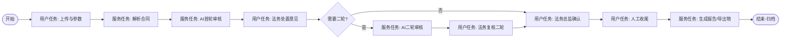

# 法务合同审核工具 — BPM 集成设计（v0.2）

> 基于 laby-admin 精简架构：`system` + `infra` + `bpm` + `ai` + 新建 `legal`；前端 `web-ele`。  
> 流程方案：**B — 关键节点接入 Flowable BPM**（对齐 OA 请假集成模式）。

---

## 1. 流程定义

**流程 Key**：`legal_contract_review`  
**业务主键**：`legal_contract.id` → `businessKey`

### 1.1 BPMN 节点（推荐）



| 节点 | 类型 | 办理人 | 说明 |
|------|------|--------|------|
| 上传与参数 | UserTask | 发起人 | 上传 doc/docx、立场/强度/类型/模型 |
| 解析合同 | ServiceTask | — | `LegalContractParseDelegate` |
| AI首轮审核 | ServiceTask | — | `LegalAiAuditDelegate(round=1)`，可异步+回调 |
| 法务处置意见 | UserTask | 发起人/法务 | 采纳/忽略/补充意见；表单跳转审核工作台 |
| 需要二轮? | ExclusiveGateway | — | 变量 `needSecondRound` |
| AI二轮审核 | ServiceTask | — | `LegalAiAuditDelegate(round=2)`，携带 feedback |
| 法务复核二轮 | UserTask | 发起人/法务 | 查看二轮结果 |
| 法务总监确认 | UserTask | 角色 `legal_director` | 审批通过/驳回 |
| 人工收尾 | UserTask | 发起人/法务 | 手工调整剩余条款 |
| 生成报告 | ServiceTask | — | `LegalExportDelegate` |

**驳回**：总监节点可驳回到「法务处置意见」或「上传与参数」（流程变量 `rejectTarget`）。

### 1.2 流程变量

| 变量 | 类型 | 说明 |
|------|------|------|
| `contractId` | Long | 合同实例 ID |
| `auditRound` | Integer | 当前 AI 轮次 1/2 |
| `needSecondRound` | Boolean | 是否进入二轮 |
| `partyRole` | String | 甲/乙/其他 |
| `auditLevel` | String | 审核强度 |
| `contractTypeId` | Long | 合同类型 |
| `modelId` | Long | 大模型 ID |
| `riskHighCount` | Integer | 供网关/总监参考 |
| `rejectTarget` | String | 驳回目标节点 |

---

## 2. 模块职责

### 2.1 新建 `laby-module-legal`

- 合同、解析、意见、批注、报告、规则等领域表与服务
- **依赖**：`laby-module-bpm`（`BpmProcessInstanceApi`）、`laby-module-ai`、`laby-module-system`、`laby-module-infra`
- **不**把法务表放在 `bpm` 模块（OA 请假在 bpm 仅为示例；法务域更大，独立模块更清晰）

### 2.2 BPM 集成（对齐 OA 请假）

参考：`BpmOALeaveServiceImpl` + `BpmOALeaveStatusListener`

```java
// LegalContractServiceImpl
public static final String PROCESS_KEY = "legal_contract_review";

// 创建合同后发起流程
processInstanceApi.createProcessInstance(userId,
    new BpmProcessInstanceCreateReqDTO()
        .setProcessDefinitionKey(PROCESS_KEY)
        .setBusinessKey(String.valueOf(contract.getId()))
        .setVariables(vars));

contractMapper.updateById(contract.setProcessInstanceId(processInstanceId));
```

```java
// LegalContractStatusListener extends BpmProcessInstanceStatusEventListener
@Override
protected String getProcessDefinitionKey() {
    return LegalContractServiceImpl.PROCESS_KEY;
}
@Override
protected void onEvent(BpmProcessInstanceStatusEvent event) {
    legalContractService.updateStatus(Long.parseLong(event.getBusinessKey()), event.getStatus());
}
```

### 2.3 ServiceTask 委托类（放在 `legal` 模块）

| 类名 | 职责 |
|------|------|
| `LegalContractParseDelegate` | 调用解析服务，更新 `parse_status` |
| `LegalAiAuditDelegate` | 读 `auditRound`，调 AI 编排；长任务可改 **异步 Job + 信号** 唤醒流程 |
| `LegalExportDelegate` | 生成 Markdown/Word，更新 `legal_audit_report` |

注册方式：Flowable `delegateExpression` 或 BPM 设计器「触发器」配置（与现有 `BpmTriggerTaskDelegate` 一致）。

### 2.4 AI 与 BPM 边界

- **BPM 管**：谁在什么节点、流程是否可继续、审批记录
- **AI 管**：模型调用、RAG、流式输出、提示词
- **Legal 编排**：把段落+规则+反馈组装 Prompt，写回 `legal_audit_opinion` / `legal_audit_report`

长耗时 AI 任务建议：

1. ServiceTask 内提交异步任务，流程使用 **ReceiveTask** 或 Flowable **async + 外部完成**；
2. AI 完成后 `runtimeService.trigger(executionId)` 继续流程。

---

## 3. 业务状态双轨

| `legal_contract.status`（业务） | 与 BPM 关系 |
|----------------------------------|-------------|
| `DRAFT` | 未发起或已保存草稿 |
| `PARSING` | 解析 ServiceTask 执行中 |
| `AI_AUDITING` | AI ServiceTask 执行中 |
| `OPINION_REVIEW` | 用户任务「法务处置意见」 |
| `AI_REAUDITING` | 二轮 AI |
| `DIRECTOR_REVIEW` | 总监用户任务 |
| `FINALIZING` | 人工收尾 |
| `ARCHIVED` | 流程结束 + 已导出 |
| `REJECTED` | 流程驳回/取消 |

用户任务 **create/complete** 时通过 TaskListener 或前端完成任务 API 同步更新业务状态。

---

## 4. 前端（web-ele）

### 4.1 自定义表单（BPM 模型元数据）

| 配置项 | 路径 |
|--------|------|
| 提交表单 | `/legal/contract/create` |
| 查看/审批表单 | `/legal/contract/review`（审核工作台，含文档+意见+推理） |
| 详情 | `/legal/contract/detail` |

与 OA 请假相同，在 **流程模型 → 表单配置** 填写 Vue 路由；`router/routes/modules/legal.ts` 注册。

### 4.2 页面与待办

- **我的合同**：业务列表 + 流程状态
- **审核工作台**：从待办 `taskId` 进入，完成任务时调用 `PUT /bpm/task/approve` + 业务接口保存意见
- **流程时间线**：复用 `bpm/processInstance/detail` 展示节点轨迹（需求：合同审核状态时间线）

### 4.3 菜单结构

```
法务合同
├── 合同列表 / 新建
├── 审核工作台（隐藏菜单，路由进入）
规则与知识库 / 我的设置
工作流（复用 bpm）
├── 我的待办 / 我的已办 / 流程实例
```

---

## 5. 权限与角色

| 角色 | BPM 节点 |
|------|----------|
| `legal_user` | 上传、处置意见、收尾 |
| `legal_director` | 总监确认 |
| `legal_admin` | 规则/知识库/全量审计 |
| `it_admin` | 系统/模型配置 |

数据隔离：`legal_contract.creator` + 部门数据权限；总监可按部门查看。

---

## 6. 数据库补充（BPM 相关字段）

`legal_contract` 表增加：

- `process_instance_id` VARCHAR(64)
- `bpm_status` INT — 对齐 `BpmTaskStatusEnum`
- `current_task_key` VARCHAR — 当前节点 definitionKey，便于列表展示

---

## 7. 分阶段实施（BPM 版）

| 阶段 | 内容 |
|------|------|
| **Sprint 1** | `legal` 模块骨架 + 表 + 上传解析 + 发起流程（仅到 AI1→UR1） |
| **Sprint 2** | AI 流式审核 + 意见处置 + 二轮网关 + AI2 |
| **Sprint 3** | 总监审批 + 收尾 + 导出 ServiceTask + StatusListener |
| **Sprint 4** | 问答、规则库 RAG、飞书 SSO、操作审计 |

---

## 8. 二轮 AI 触发规则（推荐，已采纳）

原则：**二轮是「增强路径」不是默认路径**；是否走二轮由「未解决问题是否值得再跑一遍模型」决定，而不是由审批层级机械决定。

### 8.1 进入二轮 AI（`needSecondRound = true`）— 满足任一即可

| 触发方式 | 条件 | 说明 |
|----------|------|------|
| **法务主动申请** | 在「法务处置意见」节点点击「提交二轮 AI」且 **必填** `feedbackSummary`（≥20 字） | 主路径，对应需求里 1～2 轮人工反馈 |
| **系统建议 + 人工确认** | 存在 **未处置的高风险意见 ≥1**，或 **已采纳率 &lt; 30%** 时，界面默认勾选「建议二轮」，法务可取消 | 降低漏跑二轮的概率，但不强制 |
| **总监驳回至处置** | 总监驳回目标 = `OPINION_REVIEW` 且驳回原因分类 = `AI_INCOMPLETE` / `NEED_REAUDIT` | 自动带 `needSecondRound=true`，并预填总监意见到 `feedbackSummary` |

### 8.2 不进入二轮 — 直接往后走

| 场景 | 下一节点 |
|------|----------|
| 法务点击「完成意见处置，进入下一环节」且无法务主动申请二轮 | → **法务总监确认**（见 8.3） |
| 二轮 AI 已完成且法务在「复核二轮」点击通过 | → 总监确认 |

### 8.3 总监确认 — 按风险分流（推荐）

在「完成意见处置」网关后增加 **风险分流**，避免低风险合同也卡总监：

| 条件 | 下一节点 |
|------|----------|
| `riskHighCount = 0` 且合同类型 ∈ 配置的「免总监类型」 | 跳过总监 → **人工收尾** |
| 其他 | → **法务总监确认** |

免总监类型、高风险阈值放在 `legal_contract_type` / 系统参数，上线后可调。

### 8.4 总监驳回 — 三种目标（流程变量 `rejectTarget`）

| 驳回目标 | 适用情况 |
|----------|----------|
| `OPINION_REVIEW` | AI 漏审、意见需重处置；若原因=需再审 → 触发 8.1 第三条 |
| `UPLOAD` | 传错文件、需换版合同 |
| `END`（取消流程） | 合同不再评审 |

**不推荐**：总监驳回一律进二轮 AI（很多驳回是换文件或人工已够，不必再烧 token）。

### 8.5 轮次上限

- 生产环境 **最多 2 轮 AI**（`auditRound ∈ {1,2}`），防止死循环。
- 二轮后若仍不满意：仅允许 **人工新增/编辑意见 + 收尾**，不再自动第三轮 AI（可在 V2 做「特批三轮」）。

---

## 9. 已确认决策

- [x] 流程方案：**B — Flowable BPM**
- [x] 业务模块：**独立 `laby-module-legal`**
- [x] 集成模式：**OA 请假同款**（`businessKey` + `BpmProcessInstanceStatusEventListener`）
- [x] 二轮规则：**法务主动为主 + 系统建议 + 总监「AI 不完整」驳回；默认最多 2 轮 AI**
- [x] 总监节点：**高风险必审，低风险可配置跳过**

---

## 10. 下一步

1. 在 BPM 设计器落地 `legal_contract_review` 模型（含网关表达式）  
2. 输出 `legal_*` DDL 与 API 清单  
3. 拆 Sprint 并开始 `laby-module-legal` 脚手架
