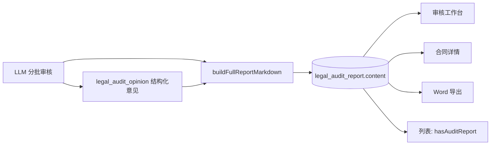

# 法务合同 AI 审核工具 — 产品需求规格说明书（SRS）

> **版本**：v1.1  
> **日期**：2026-06-01  
> **基座**：laby-admin（`system` + `infra` + `bpm` + `ai` + `legal`），前端 `web-ele`  
> **上游 PRD（1:1 原文备份）**：[legal-contract-review-prd-1to1.md](../requirements/2026-06-01-legal-contract-review-prd-1to1.md)  
> **关联文档**：[BPM 集成设计 v0.2](./2026-06-01-legal-contract-review-bpm-design.md) · [六章报告实现计划](../plans/2026-06-01-legal-contract-six-chapter-report.md)  
> **说明**：本文档由 PRD 推导，补充技术约束、接口与 **当前实现状态**；需求原文以 PRD 为准，本文不做需求删减。

---

## 目录

1. [背景与目标](#1-背景与目标)
2. [范围与约束](#2-范围与约束)
3. [已确认产品决策](#3-已确认产品决策)
4. [角色与权限](#4-角色与权限)
5. [功能分布总览](#5-功能分布总览)
6. [业务功能详细需求](#6-业务功能详细需求)
7. [合同审核报告（核心交付物）](#7-合同审核报告核心交付物)
8. [系统功能详细需求](#8-系统功能详细需求)
9. [个人功能详细需求](#9-个人功能详细需求)
10. [业务流程（BPM）](#10-业务流程bpm)
11. [数据模型与接口](#11-数据模型与接口)
12. [页面与交互](#12-页面与交互)
13. [非功能需求](#13-非功能需求)
14. [实现状态矩阵](#14-实现状态矩阵)
15. [分阶段实施计划](#15-分阶段实施计划)
16. [验收标准](#16-验收标准)

---

## 1. 背景与目标

### 1.1 背景

法务合同审核工作量大、重复性高。本产品通过 **LLM + 规则/知识库 + 人工反馈闭环**，将法务从「逐字审阅」转为「判效 → 提要求 → 看再审结果 → 手工收尾」，目标达到人工审核约 **70%～80%** 的效果。

### 1.2 产品目标

| 目标 | 说明 |
|------|------|
| 单份合同端到端审核 | 上传 → 解析 → AI 审 → 人工处置（可二轮）→ 审批 → 导出 |
| 结构化 AI 输出 | 风险点、意见卡片、**完整审核报告（Markdown/Word）** |
| 可运营 | 提示词、模型、规则、知识库可在后台配置，少改代码 |
| 可审计 | 谁在何时做了什么，总监可查全量 |
| 可集成 | 飞书 SSO、组织架构同步（规划） |

### 1.3 成功指标（建议）

- AI 首轮完成后，**100%** 合同实例应持久化 `legal_audit_report`（即使零风险也有「无意见」报告）
- 审核工作台、合同详情、列表三处 **报告/意见可见性一致**
- 单份 doc/docx ≤30MB，解析成功率 ≥95%（格式正常文件）
- 二轮 AI 占比可控（默认不自动全量二轮）

---

## 2. 范围与约束

### 2.1 V1 范围内

- 单份合同处理（可多文件共上下文，**不做批量**）
- 格式：**doc / docx**（**不支持 pdf**，与结论表一致）
- 报告：**Markdown 持久化 + Word 导出**；**不回写智书**，用户手工上传/复制（已接受）
- 最多 **2 轮 AI**；之后仅人工补充
- 默认模型：**ts-pri**（私有化）；亦支持后台配置 DeepSeek 等
- BPM 关键节点：上传、意见处置、总监、收尾、导出

### 2.2 V1 范围外 / 待定

| 项 | 状态 |
|----|------|
| PDF 解析 | 不做 |
| 智书/WPS 在线批注回写 | V1 不做完整 WPS 修订；Word 批注导出规划 |
| 合同类型智能识别 | **待定**（需知识库样本） |
| 合同多轮 **交互式** 问答 | **需设计**（V1 可先做只读/单轮） |
| 飞书 SSO | Sprint 4 |
| 脱敏后再喂 LLM | 可选，对接现有脱敏工具 |

---

## 3. 已确认产品决策

| # | 疑问 | 结论 |
|---|------|------|
| 1 | 单份还是批量 | **单份**；单合同可多文件共享上下文 |
| 2 | 报告写回智书 | **接受**手工复制/重新上传 |
| 3 | 知识库优先 | **接受**：识别到合同类型时 RAG 优先，通用知识补充 |
| 4 | 上传参数 | 我方立场、审核强度、合同类型、是否可编辑、模型/提示词角色 |
| 5 | 合同类型智能识别 | **待定** |
| 6 | 文件格式 | **doc/docx**；pdf 不支持 |
| 7 | 多轮问答 | **需设计** |
| 8 | 报告格式 | **必须保留**；示例：`20260508_1708_v1_desensitized.md` |
| 9 | 默认模型 | **ts-pri** |

---

## 4. 角色与权限

| 角色 | 典型用户 | 能力 |
|------|----------|------|
| `legal_user` | 法务专员 | 上传、审核工作台、意见处置、导出、看自己的合同 |
| `legal_director` | 法务总监 | 总监节点审批、全量操作日志（规划） |
| `legal_admin` | 法务管理员 | 标准条款库、全局审核规则 |
| `it_admin` | IT | 模型、提示词、系统配置、监控 |
| `intern` | 实习生 | 只读或受限菜单（规划） |

**数据隔离**：用户 A 不可见用户 B 的合同（`legal_contract.user_id` + 租户 + 部门数据权限）。  
**认证**：飞书 SSO（规划）；当前 laby-admin 账号体系。

---

## 5. 功能分布总览

> 来源：《功能分布汇总》— 共 **74** 功能点。

| 一级模块 | 二级模块 | 功能点数 | 说明 |
|----------|----------|----------|------|
| **业务功能** | 1 合同上传与解析 | 7 | 上传、解析、段落定位 |
| | 2 LLM 自动审核 | 6 | 风险识别、推理展示 |
| | 3 LLM 审核意见 | 10 | 卡片、处置、补充 |
| | 4 LLM 自动批注 | 7 | Word 批注回写 |
| | 5 LLM 问答 | 6 | 合同/条款问答 |
| | 6 合同导出 | 3 | docx、报告 Word |
| **系统功能** | 7 标准条款库与审核规则 | 4 | 全局规则 CRUD |
| | 8 历史记录与操作审计 | 5 | 列表、时间线、日志 |
| | 9 用户权限与数据安全 | 12 | SSO、隔离、脱敏 |
| | 10 系统管理 | 14 | 提示词、模型、监控 |
| **个人功能** | 11 我的设置 | 6 | 个性规则、模型偏好 |

---

## 6. 业务功能详细需求

### 6.1 合同上传与解析（1.1）

| 三级功能 | 说明 | 优先级 | 当前状态 |
|----------|------|--------|----------|
| 单文件拖拽/选择上传 | doc、docx；进度条 | P0 | ✅ 已实现（单文件、30MB 限制） |
| 上传合规校验 | 类型、大小 | P0 | ✅ |
| 合同正文+表格解析 | 完整解析，签章位置不丢 | P0 | ⚠️ 基础 POI 段落解析，表格/页眉页脚待增强 |
| 保留原格式信息 | 供批注精准定位 | P0 | ⚠️ 仅存段落文本+path，无完整 OOXML 坐标 |
| 跳转/高亮指定段落 | 意见卡片 → 正文 | P0 | ✅ 审核工作台段落面板 + 高亮 |
| WPS 兼容预览/修订 | 系统内预览批注 | P2 | ❌ 未做 |
| PDF 支持 | — | — | ❌ 明确不做 |

**上传参数（创建页）**

| 字段 | 必填 | 说明 |
|------|------|------|
| 合同标题 | 是 | |
| 合同文件 | 是 | 主文件 |
| 我方立场 | 是 | 甲/乙/其他 |
| 审核强度 | 是 | standard / strict / relaxed |
| 审核提示词角色 | 是 | `ai_chat_role`，分类=法务合同 |
| 二轮提示词角色 | 否 | 默认可与首轮相同 |
| AI 模型 | 是 | 可与角色绑定模型联动 |
| 合同类型 | 否 | 待定智能识别；手动选择规划 |
| 是否可编辑 | 是 | 收尾阶段是否允许改条款 |

---

### 6.2 LLM 自动审核（1.2.1）

| 三级功能 | 说明 | 优先级 | 当前状态 |
|----------|------|--------|----------|
| 按条款分类识别 | 保密/违约/知产/价款等 | P0 | ⚠️ AI 输出 `clauseType`，无固定枚举校验 |
| 风险等级标注 | HIGH/MEDIUM/LOW | P0 | ✅ |
| 风险位置定位 | 段落/句级 | P0 | ⚠️ 段落级 `paragraphId` |
| 推理过程实时显示 | 流式 reasoning | P1 | ❌ 当前非流式 |
| 逐条可落地修订建议 | content + suggestion | P0 | ✅ 意见字段 |
| 引用参考条款样本 | 对比标准条款 | P1 | ❌ 待 RAG |

**AI 编排（技术）**

- 流水线：**解析 → 首轮 AI → 成功后再 BPM 人工节点**（`LegalContractPipelineService`）
- 长合同：**分批**调用（每批 N 段），合并意见后 **生成报告**
- 失败：**status=处理失败(15)**，`feedbackSummary` 存原因；支持重试
- 提示词：**AI 模块 → 聊天角色**（分类「法务合同」），支持 AI 润色生成 systemMessage
- 租户：**异步任务必须在正确 tenantId 下写库**（已修复 executeIgnore 问题）

---

### 6.3 LLM 审核意见（1.2.2）

| 三级功能 | 说明 | 优先级 | 当前状态 |
|----------|------|--------|----------|
| 意见列表卡片 | 独立卡片，互不干扰 | P0 | ✅ `opinion-card.vue` |
| 跳转原文 | 点击定位段落 | P0 | ✅ |
| 按风险等级排序/筛选 | HIGH/MEDIUM/LOW | P0 | ✅ 审核工作台筛选 |
| 逐条采纳 | | P0 | ✅ API + UI |
| 逐条忽略 | | P0 | ✅ |
| 撤销 | 采纳/忽略后撤回 | P1 | ⚠️ 待确认是否已实现 revoke |
| 批量采纳/忽略 | | P1 | ✅ batch API |
| 手动新增意见 | 法务补漏 | P0 | ✅ |
| 编辑已有意见 | 改 AI 措辞 | P1 | ✅ updateManual |
| 标记「此处不需审核」 | 下份同类合同跳过 | P2 | ❌ |

**展示位置（必须一致）**

| 页面 | 意见列表 | 审核报告 |
|------|----------|----------|
| 审核工作台 `review.vue` | ✅ | ✅（需有内容或明确空态） |
| 合同详情 `detail.vue` | ✅ | ✅ |
| 我的合同列表 | 条数摘要 | 是否已生成标签 |

---

### 6.4 LLM 自动批注（1.2.3）

| 三级功能 | 说明 | 优先级 | 当前状态 |
|----------|------|--------|----------|
| 采纳意见写回 Word 批注 | 一键，红色批注 | P1 | ❌ README 标注为后续 |
| 批注精准定位原文段 | | P1 | ❌ |
| 批注作者/时间/类型 | | P2 | ❌ |
| 风险等级颜色 | | P2 | ❌ |
| 批注分类标签 | 建议/提醒/警告 | P2 | ❌ |
| Word 内继续编辑/删除批注 | | P2 | ❌ |

---

### 6.5 LLM 问答（1.2.4）

| 三级功能 | 说明 | 优先级 | 当前状态 |
|----------|------|--------|----------|
| 合同原文问答 | 基于当前合同 | P1 | ❌ 需设计 |
| 审核条款问答 | | P1 | ❌ |
| 回答模式 | 简短/标准/详细 | P1 | ❌ |
| Markdown 渲染 | | P1 | ✅ 组件可复用 |
| 内置提示词规则库 | 常见问答模板 | P2 | ❌ |
| 提示词 CRUD/版本 | | P2 | ⚠️ 聊天角色可 CRUD；无版本/回滚 |

---

### 6.6 合同导出（1.3）

| 三级功能 | 说明 | 优先级 | 当前状态 |
|----------|------|--------|----------|
| 导出含批注/格式 docx | 原合同+批注 | P1 | ❌ |
| 导出意见汇总+风险评估 Word | **审核报告** | P0 | ⚠️ 简单 Markdown→docx，非完整六章结构 |
| 导出符合原文件格式 | | P2 | ❌ |

---

## 7. 合同审核报告（核心交付物）

> 来源：**最后一张样例图** — 完整《合同审核报告》结构。  
> V1 **必须**按此结构生成 Markdown 并持久化；Word 导出应对齐同结构。

### 7.1 报告元数据（页眉）

| 字段 | 示例 | 来源 |
|------|------|------|
| 报告标题 | 合同审核报告 | 固定 |
| 合同名称 | | `legal_contract.title` |
| 文件名 | `xxx.docx` | 主附件 |
| 审核轮次 | 第 1/2 轮 | `audit_round` |
| 我方立场 | 甲方 | `party_role` |
| 审核强度 | 标准/严格/宽松 | `audit_level` |
| 生成时间 | ISO 时间 | `legal_audit_report.create_time` |
| 模型/提示词 | deepseek-chat / 角色名 | 快照可选 |
| 脱敏标识 | desensitized | 若启用脱敏 |

### 7.2 正文结构（六章）

#### 第一章 合同摘要

| 小节 | 内容要求 | AI 生成 |
|------|----------|---------|
| 1.1 合同背景与目的 | 叙述性摘要 | 是 |
| 1.2 主要条款摘要 | 权利义务概要 | 是 |
| 1.3 金额与支付 | 价款、账期、方式 | 是 |
| 1.4 关键时间节点 | 生效、到期、交付节点 | 是 |

#### 第二章 风险提示

按 **高 / 中 / 低** 分级叙述，每条包含：

- **风险描述**（为何有风险）
- **建议措施**（怎么改）

> 可与 `legal_audit_opinion` 聚合；高风险优先。

#### 第三章 风险分级（表格）

| 列 | 说明 |
|----|------|
| 风险项 | 标题 |
| 风险描述 | |
| 风险等级 | HIGH/MEDIUM/LOW |
| 状态 | 待处置/已采纳/已忽略 |
| 建议 | |

#### 第四章 条款与合规性检查

| 小节 | 内容 |
|------|------|
| 4.1 法律合规 | |
| 4.2 行业规范 | |
| 4.3 条款自洽性 | |

**合规检查表**

| 检查项 | 检查内容 | 结果 | 备注/建议 |
|--------|----------|------|-----------|

结果枚举：`通过` / `不通过` / `警告`

#### 第五章 单项扣分动作（表格）

> 与 PRD 样例图一致（非「条款修订建议」独立章节）。

| 列 | 说明 |
|----|------|
| 扣分项 | 具体违规或缺失项 |
| 描述 | 扣分原因 |
| 分值 | 数值扣分，如 -5、-10 |
| 对应条款 | 原合同章节或 paragraphId |

#### 第六章 后续 Review 与跟进

- 编号行动清单（谈判、澄清定义、补条款、核实资质等）
- 二轮审核说明（若 round=2，引用 `feedbackSummary`）

### 7.3 报告与意见关系

**规则**

1. **每次 AI 轮次结束**必须 upsert 一条 `legal_audit_report`（`audit_round` 维度）
2. 即使 **0 条意见**，报告仍生成（第六章说明「未发现需提示风险」）
3. 报告缺失但意见存在时，允许 **按意见重建**（`rebuildAuditReportIfMissing`）
4. 当前 `buildReportMarkdown` 仅为简易摘要 — **需升级为第七章完整结构**（P0 差距）

### 7.4 当前实现 vs 目标（报告）

| 项 | 当前 | 目标 |
|----|------|------|
| 章节 | 标题+意见摘要列表 | 六章完整结构 |
| 表格 | 无 | 第三、四、五章含 Markdown 表格 |
| 摘要/合规/结论 | 无 | 第一、四、六章 |
| 持久化 | ✅ `legal_audit_report` | ✅ |
| 前端展示 | MarkdownView | ✅ + 目录锚点/折叠（P1） |
| Word | 简单转换 | 与 Markdown 结构一致 |

---

## 8. 系统功能详细需求

### 8.1 标准条款库与审核规则（3.1）

| 功能 | 说明 | Owner | 状态 |
|------|------|-------|------|
| 标准条款样本维护 | 法务合规部维护，全员共享 | 法务合规部 | ❌ 表未建 |
| 全局审核规则 CRUD | 标准条款+自增规则 | 企业效能部 | ❌ |
| 全局条款分类 | 按 BG/通用 | 企业效能部 | ❌ |
| 全局规则开关 | 管理员控制审核引擎用哪些规则 | 企业效能部 | ❌ |

**与 AI 集成**：规则/条款 → `ai_knowledge` RAG → 注入 user prompt 或 system 补充。

---

### 8.2 历史记录与操作审计（3.2）

| 功能 | 说明 | 状态 |
|------|------|------|
| 我的历史列表 | 一键找回本人审过的合同 | ⚠️ 「我的合同」列表 |
| 按时间/状态/类型筛选 | | ⚠️ 部分 |
| **合同审核状态时间线** | 上传到归档全链路 | ❌ 可复用 BPM 流程图 |
| 关键操作日志 | 谁、何时、改了什么 | ⚠️ 框架操作日志，未做法务语义 |
| 管理员全量日志查询 | 总监视角 | ❌ |

---

### 8.3 用户、权限与数据安全（3.3）

| 功能 | 说明 | 状态 |
|------|------|------|
| 飞书 SSO | 公司账号 | ❌ |
| 登录态/会话过期 | | ✅ laby 通用 |
| 多角色 | 实习/法务/总监/IT | ⚠️ 菜单权限，未细分 legal 角色 |
| 角色与权限点绑定 | | ✅ system 模块 |
| 合同按用户隔离 | | ✅ user_id |
| 按角色功能隔离 | | ✅ |
| 组织/部门同步 | 部门管理员 | ❌ |
| 合同内容本地/私有化 | 不上公网 | 部署依赖 |
| API Key 加密存储 | | ✅ ai 模块 |
| 喂 LLM 前脱敏 | 可选 | ❌ |

---

### 8.4 系统管理（3.4）

| 功能 | 说明 | 状态 |
|------|------|------|
| **审核提示词在线编辑** | 不调代码、不重启 | ✅ AI→聊天角色；法务入口 `/legal/contract/prompt-settings` |
| 提示词历史版本 | 可追溯 | ❌ |
| 提示词一键回滚 | | ❌ |
| 多供应商/模型配置 | | ✅ AI 模型+密钥 |
| 模型切换/兜底 | 主模型失败换备用 | ❌ |
| 成本与额度监控 | | ❌ |
| 菜单/布局可配置 | | ✅ system 菜单 |
| 业务字典 | 风险等级、合同类型 | ⚠️ 部分硬编码 |
| 健康检查/LLM 连通性 | | ❌ |
| 全量操作日志/异常告警 | | ❌ |

---

## 9. 个人功能详细需求

### 9.1 我的设置

| 功能 | 说明 | 状态 |
|------|------|------|
| 用户自定义规则 | 优先级 | ❌ |
| 用户条款分类 | 私有标签 | ❌ |
| 规则启用/禁用 | | ❌ |
| 默认模型/温度/超时 | 个人偏好 | ❌ |
| LLM API Key | 统一用管理员私有模型 | ✅ 后台配置 |
| 界面偏好 | 菜单顺序等 | ❌ |

---

## 10. 业务流程（BPM）

**流程 Key**：`legal_contract_review`  
**businessKey**：`legal_contract.id`

### 10.1 节点（目标 vs 当前）

| 节点 | 类型 | 当前实现 |
|------|------|----------|
| 上传与参数 | 创建 API + 可选 UserTask | ✅ 创建页；BPM 从意见处置开始 |
| 解析 + AI | 应用层 Pipeline（非 BPM ServiceTask） | ✅ 异步 Pipeline |
| 法务处置意见 | UserTask | ✅ opinionReview |
| 二轮网关 | ExclusiveGateway | ⚠️ 变量有，网关待完整测 |
| AI 二轮 | Pipeline / Delegate | ⚠️ 代码有，流程待接 |
| 总监确认 | UserTask | ✅ directorReview |
| 人工收尾 | UserTask | ✅ finalize |
| 导出归档 | ServiceTask | ✅ legalExportDelegate |

### 10.2 二轮 AI 规则

见 [BPM 设计文档 §8](./2026-06-01-legal-contract-review-bpm-design.md#8-二轮-ai-触发规则推荐已采纳)。

### 10.3 业务状态

| status | 名称 | 说明 |
|--------|------|------|
| 0 | 草稿 | |
| 10 | 解析中 | |
| 11 | AI 审核中 | |
| **15** | **处理失败** | 流水线失败，可重试 |
| 20 | 意见处置 | 可看待办 |
| 21 | AI 二轮审核中 | |
| 30 | 总监确认 | |
| 40 | 人工收尾 | |
| 50 | 已归档 | |
| 60/61 | 驳回/取消 | |

---

## 11. 数据模型与接口

### 11.1 核心表

| 表 | 用途 |
|----|------|
| `legal_contract` | 合同实例；含 model_id、audit_role_id、reaudit_role_id、process_instance_id、status |
| `legal_contract_file` | 附件 |
| `legal_contract_paragraph` | 解析段落 |
| `legal_audit_opinion` | AI/人工意见 |
| `legal_audit_report` | **审核报告 Markdown** |
| `ai_chat_role` | 提示词（分类=法务合同） |

### 11.2 关键 API

| 方法 | 路径 | 说明 |
|------|------|------|
| POST | `/legal/contract/create` | 创建并异步 Pipeline |
| GET | `/legal/contract/page` | 列表（含 hasAuditReport、auditOpinionCount） |
| GET | `/legal/contract/get` | 详情 |
| GET | `/legal/contract/audit-report` | 报告 Markdown |
| GET | `/legal/opinion/list-by-contract` | 意见列表 |
| GET | `/legal/contract/list-paragraph` | 段落 |
| PUT | `/legal/opinion/adopt|ignore|...` | 意见处置 |
| POST | `/legal/contract/export-report` | Word 报告 |
| POST | `/legal/contract/retry-pipeline` | 失败重试 |
| GET | `/ai/chat-role/page` | 提示词角色 |
| POST | `/ai/chat-role/polish` | AI 润色提示词 |

---

## 12. 页面与交互

| 路由/页面 | 功能 |
|-----------|------|
| `/legal/contract/list` | 我的合同：状态、AI 意见数、报告是否已生成、重试 |
| `/legal/contract/create` | 上传+参数+选提示词角色+模型 |
| `/legal/contract/review` | **审核工作台**：段落+意见卡片+**完整报告**+BPM 办理 |
| `/legal/contract/detail` | **只读详情**：合同信息+**报告**+意见 |
| `/legal/contract/prompt-settings` | 跳转聊天角色（法务合同分类） |
| `/ai/console/chat-role` | AI 模块原生入口 |
| BPM 待办详情 | 嵌入 review 表单 |

**UX 原则**

- 报告区 **始终占位**；无内容时显示原因（失败/处理中/未跑 AI），禁止空白
- 列表与详情 **同一套摘要字段**（hasAuditReport、auditOpinionCount）
- 从意见卡片 **一键跳转** 对应段落

---

## 13. 非功能需求

| 类别 | 要求 |
|------|------|
| 性能 | 创建 API <3s（异步 Pipeline）；单批 AI 超时 5min |
| 可用性 | Pipeline 失败可重试；租户数据不错乱 |
| 安全 | 租户隔离、权限注解、文件下载走鉴权 |
| 可维护 | 提示词在 AI 模块；Legal 只编排 |
| 可观测 | 日志 contractId/round/batch；后续 MQ/监控 |

---

## 14. 实现状态矩阵

| 模块 | 完成度 | 关键缺口 |
|------|--------|----------|
| 上传解析 | 70% | 表格/格式、PDF 不做 |
| AI 审核 | 65% | 流式推理、RAG、**完整六章报告** |
| 审核意见 | 85% | 撤销、不需审核标记 |
| 自动批注 | 0% | 全未做 |
| 问答 | 0% | 需设计 |
| 导出 | 40% | 完整报告 Word、带批注 docx |
| 规则库 | 0% | |
| 历史审计 | 30% | 时间线、语义日志 |
| 系统管理 | 50% | 提示词版本/回滚、监控 |
| BPM | 75% | 二轮全链路、网关 |
| 前端三页 | 70% | **报告结构对齐样例** |

---

## 15. 分阶段实施计划

### Phase A — 核心闭环（当前冲刺）

1. ✅ 租户修复 + 报告/意见列表展示 + 失败重试  
2. **P0：升级 `buildReportMarkdown` → 完整六章报告**（见 §7）  
3. **P0：详情/审核/列表 报告一致性验收**  
4. 提示词角色 + 创建页选择 + AI 润色  

### Phase B — 体验增强

1. AI 流式 + reasoning 展示  
2. 意见撤销、不需审核标记  
3. 列表筛选、审核状态时间线（BPM）  
4. Word 导出对齐六章模板  

### Phase C — 规则与 RAG

1. 标准条款库 + 全局规则  
2. 合同类型 + 知识库优先  
3. 引用标准条款进意见/报告第五章  

### Phase D — 批注、问答、企业集成

1. Word 批注回写  
2. 合同问答（多轮设计落地）  
3. 飞书 SSO、组织同步、脱敏  
4. 提示词版本/回滚、成本监控  

---

## 16. 验收标准

### 16.1 报告（P0）

- [ ] AI 成功后，`legal_audit_report.content` 含 **§7.2 六章**（至少各章有标题与内容；第三、五章含表格）
- [ ] 审核工作台、合同详情 **均可见** 完整 Markdown 渲染
- [ ] 列表显示「AI 报告：已生成」且与库内记录一致
- [ ] 0 条意见时仍有报告，第六章说明「未发现需提示风险」
- [ ] 导出 Word 可下载且章节与 Markdown 一致

### 16.2 意见（P0）

- [ ] 卡片展示风险等级、标题、内容、建议、段落定位
- [ ] 采纳/忽略/批量/手工新增可用
- [ ] 点击卡片跳转段落高亮

### 16.3 流水线（P0）

- [ ] 创建后异步完成解析+AI，不阻塞 HTTP
- [ ] 失败 status=15，列表可重试
- [ ] 意见/报告 tenant_id 与合同一致

### 16.4 提示词（P0）

- [ ] AI→聊天角色 维护「法务合同」分类
- [ ] 创建页可选角色；管理入口可用
- [ ] AI 润色生成 systemMessage

---

## 附录 A：功能点待核对清单索引

| 章节 | 对应本文 |
|------|----------|
| 1.1 合同上传与解析 | §6.1 |
| 1.2.1 自动审核 | §6.2 |
| 1.2.2 审核意见 | §6.3 |
| 1.2.3 自动批注 | §6.4 |
| 1.2.4 问答 | §6.5 |
| 1.3 合同导出 | §6.6 |
| 2.x 我的设置 | §9 |
| 3.1 全局审核规则 | §8.1 |
| 3.2 历史与审计 | §8.2 |
| 3.3 权限安全 | §8.3 |
| 3.4 系统管理 | §8.4 |

---

## 附录 B：与现有代码映射

| 需求 | 代码位置 |
|------|----------|
| Pipeline | `LegalContractPipelineService`, `LegalContractProcessStarter` |
| AI 审核 | `LegalAiAuditServiceImpl`（**待改报告生成**） |
| 报告查询 | `LegalContractController.getAuditReport` |
| 意见 | `LegalAuditOpinionController`, `review.vue` |
| 提示词 | `ai_chat_role`, `LegalContractAuditRoleService` |
| 导出 | `LegalContractExportServiceImpl` |
| BPM | `legal_contract_review.bpmn20.xml`, `LegalExportDelegate` |

---

**文档维护**：功能变更时请同步更新 §14 矩阵与 §16 验收项。
