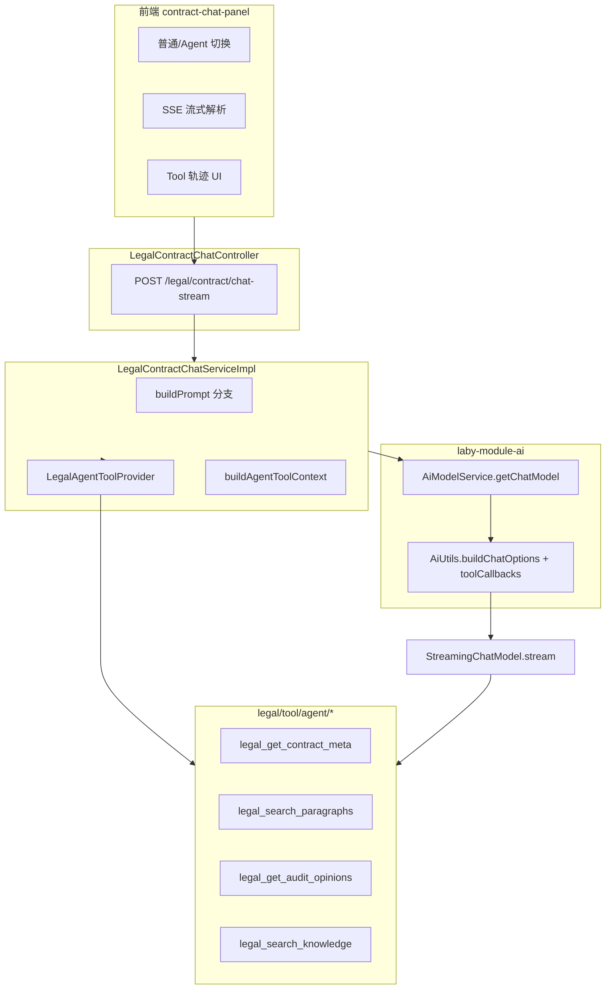

# 法务合同 Agent 功能规格说明书（Spec）

| 属性 | 值 |
|------|-----|
| 版本 | v1.0 |
| 日期 | 2026-06-03 |
| 状态 | Approved for Phase 1 implementation |
| 模块 | `laby-module-legal` + `laby-ui` + `sql/mysql` |
| 依赖 | Spring AI 1.1.5、`laby-module-ai` Tool/MCP 体系 |

---

## 1. 背景与目标

### 1.1 背景

当前合同问答（`LegalContractChatServiceImpl`）采用 **固定上下文注入**：每次请求将最多 40 段段落、30 条意见、4000 字报告拼入 Prompt（约 14k 字符）。存在：

- 用户问具体段落时，相关内容可能不在截断范围内
- Token 成本高、延迟大
- 无法按问题动态检索知识库/意见/段落
- 不具备 Agent「按需查数、多步推理」能力

### 1.2 目标

分三阶段建设 **法务合同只读 → 可观测 → 写操作提案** Agent 能力：

| 阶段 | 目标 | 周期 |
|------|------|------|
| **Phase 1** | 只读 Agent MVP：4 Tool + Agent 模式 + Tool 轨迹 | ~1 周 |
| **Phase 2** | +2 Tool、步骤日志、瘦 Prompt、管理端查询 | 1～2 周 |
| **Phase 3** | 写操作提案 + Confirm、编排层、段落向量索引 | 按需 |

### 1.3 非目标

- Phase 1 **不包含**：自动采纳意见、自动改合同、自动导出文件
- **不替换** `LegalAiAuditServiceImpl` 批量审核流水线
- **不引入** LangChain/LangGraph 新主框架
- **不改造** AI 通用对话模块（`AiChatMessageServiceImpl`）的业务边界

---

## 2. 术语

| 术语 | 说明 |
|------|------|
| Agent 模式 | `agentMode=true`，启用 Spring AI Tool Calling，Prompt 不塞大段固定上下文 |
| 普通模式 | `agentMode=false`，保持现有 `buildContractContext` 行为 |
| Tool | Spring AI `@Component("bean_name")` + `BiFunction<Request, ToolContext, Response>` |
| ToolContext | 含 `LOGIN_USER`、`TENANT_ID`、`CONTRACT_ID`、`READONLY` |
| Tool 轨迹 | SSE 推送的 `tool_start` / `tool_end` 事件，供前端展示 |
| 提案（Proposal） | Phase 3：Agent 返回操作建议，用户 Confirm 后才调写 API |

---

## 3. 总体架构



### 3.1 模块边界

| 层 | 职责 |
|----|------|
| `legal/tool/agent/` | Tool 实现（只读/提案），不含 HTTP |
| `legal/service/agent/` | Tool 注册、步骤日志、Phase 3 编排 |
| `legal/service/contract/LegalContractChatServiceImpl` | 问答入口，Agent/普通分支 |
| `laby-module-ai` | 模型、ToolCallbackResolver、AiChatRole |
| 前端 `contract-chat-panel.vue` | 模式切换、轨迹、SSE 扩展 |

---

## 4. Phase 1 详细需求

### 4.1 功能需求

#### FR-P1-01 Agent 模式开关

- 请求 VO 增加 `agentMode: Boolean`（默认 `false`）
- 前端提供 Switch：`普通模式` / `Agent 模式`
- Agent 模式请求携带 `agentMode: true`

#### FR-P1-02 四个只读 Tool

| Bean 名 | 功能 | 参数（LLM 可见） | contractId 来源 |
|---------|------|------------------|-------------------|
| `legal_get_contract_meta` | 合同元数据 | 无 | ToolContext |
| `legal_search_paragraphs` | 搜段落 | keyword, paragraphId, limit | ToolContext |
| `legal_get_audit_opinions` | 查意见 | auditRound, riskLevel, paragraphId, status, limit | ToolContext |
| `legal_search_knowledge` | 知识库 RAG | query, topK | ToolContext |

**安全：**

- `contractId` **禁止**作为 LLM 可填参数
- 每个 Tool 入口：`validateContractExists(contractId)` + 租户校验
- Phase 1 `READONLY=true`，Tool 内不得调用写 Mapper

#### FR-P1-03 Prompt 策略

**普通模式（不变）：**

```
System: buildSystemPrompt + buildContractContext + buildChatKnowledgeContext + history + user
```

**Agent 模式：**

```
System: AGENT_SYSTEM_PROMPT + answerMode.instruction
（不含 buildContractContext、不含预检索 knowledge）
history + user
ChatOptions: toolCallbacks + toolContext
```

`AGENT_SYSTEM_PROMPT` 内容要点：

1. 仅根据工具返回数据回答，禁止编造
2. 优先 search_paragraphs / get_audit_opinions
3. 需要法规依据时 search_knowledge
4. Markdown 输出，引用 p-xx 与意见标题

#### FR-P1-04 SSE 事件扩展

`LegalContractChatRespVO` 扩展：

```java
private String eventType;    // null|content|tool_start|tool_end|error
private String toolName;
private String toolSummary;
private String sessionId;    // 可选，Phase 2 必填
```

推送规则：

| 时机 | eventType | 字段 |
|------|-----------|------|
| 首包心跳 | null（空 content） | 保持现有 |
| Tool 开始 | tool_start | toolName |
| Tool 结束 | tool_end | toolName, toolSummary |
| 正文增量 | null 或 content | content |
| 推理增量 | null | reasoningContent |
| 业务异常 | error | content=msg |

**Tool 事件实现策略（Phase 1）：**

- 使用 AOP 或 `LegalAgentToolAspect` 环绕所有 `legal_*` Tool 的 `apply` 方法
- Aspect 将事件写入 `ThreadLocal<LegalAgentSseEventPublisher>`，由 `chatStream` 在 tool 执行间隙 `Flux.merge` 推送
- 若 Spring AI 内置 loop 无法插桩，降级：Tool 执行完成后批量推 `tool_end`（Phase 1 可接受）

#### FR-P1-05 后台配置

**ai_tool 表**（4 条，见 SQL 脚本）：

| name | description | status |
|------|-------------|--------|
| legal_get_contract_meta | 获取当前合同元数据概览 | 0 启用 |
| legal_search_paragraphs | 按关键词或段落编号搜索合同段落 | 0 启用 |
| legal_get_audit_opinions | 查询 AI/人工审核意见 | 0 启用 |
| legal_search_knowledge | 检索法务知识库片段 | 0 启用 |

**ai_chat_role 表**（1 条）：

| 字段 | 值 |
|------|-----|
| name | 法务合同问答 Agent |
| category | 法务合同 |
| system_message | `LegalAiChatRoleConstants.DEFAULT_SYSTEM_MESSAGE_QA_AGENT` |
| tool_ids | 上述 4 个 tool id（JSON 数组） |
| status | 0 启用 |

> Phase 1 运行时 Tool 列表由 `LegalAgentToolProvider` 代码控制；角色主要用于运营可编辑 System Prompt。

#### FR-P1-06 前端

- Agent 模式 Switch（localStorage 记忆：`legal-contract-chat-agent-mode`）
- Tool 轨迹区域（assistant 消息上方，可折叠）
- SSE 解析 `eventType` / `toolName` / `toolSummary`
- 普通模式 UI/行为 **零回归**

### 4.2 Tool 接口规格

#### 4.2.1 legal_get_contract_meta

**Response 字段：**

```json
{
  "contractId": 1001,
  "title": "采购合同",
  "status": 30,
  "auditRound": 2,
  "contractTypeId": 1,
  "riskHighCount": 3,
  "partyRole": "A",
  "auditLevel": "STANDARD",
  "parseStatus": 2
}
```

#### 4.2.2 legal_search_paragraphs

**Request：**

| 字段 | 类型 | 必填 | 默认 | 说明 |
|------|------|------|------|------|
| keyword | String | 否 | - | 模糊匹配 text/path |
| paragraphId | String | 否 | - | 精确匹配 p-xx |
| limit | Integer | 否 | 5 | 最大 10 |

**Response.items[]：**

| 字段 | 说明 |
|------|------|
| paragraphId | 段落编号 |
| path | 章节路径 |
| sort | 排序 |
| text | 截断 800 字 |
| skipAudit | 是否跳过审核 |

#### 4.2.3 legal_get_audit_opinions

**Request：**

| 字段 | 类型 | 默认 |
|------|------|------|
| auditRound | Integer | 合同当前轮次 |
| riskLevel | String | - |
| paragraphId | String | - |
| status | Integer | - |
| limit | Integer | 10（最大 20） |

**Response.items[]：**

| 字段 | 说明 |
|------|------|
| id | 意见 id |
| title | 标题 |
| riskLevel | HIGH/MEDIUM/LOW |
| content | 截断 200 |
| suggestion | 截断 200 |
| paragraphId | 关联段落 |
| status | 0/1/2 |
| auditRound | 轮次 |

#### 4.2.4 legal_search_knowledge

**Request：**

| 字段 | 类型 | 默认 |
|------|------|------|
| query | String | 必填，max 500 |
| topK | Integer | 5 |

**Response：** 复用 `LegalAuditContextResult.KnowledgeRef` 结构

### 4.3 API 变更

#### POST `/legal/contract/chat-stream`

**Request 增字段：**

```json
{
  "contractId": 1001,
  "message": "违约责任有哪些？",
  "answerMode": "STANDARD",
  "agentMode": true,
  "sessionId": "uuid-optional-phase2",
  "history": []
}
```

**Response SSE data（CommonResult）：**

```json
{
  "code": 0,
  "data": {
    "content": "",
    "reasoningContent": "",
    "eventType": "tool_start",
    "toolName": "legal_search_paragraphs",
    "toolSummary": null
  }
}
```

### 4.4 常量与类

**`LegalAgentToolContext`：**

```java
public static final String CONTRACT_ID = "CONTRACT_ID";
public static final String READONLY = "READONLY";
public static final String SESSION_ID = "SESSION_ID";
```

**`LegalAiChatRoleConstants` 新增：**

```java
String ROLE_NAME_QA_AGENT = "法务合同问答 Agent";
String DEFAULT_SYSTEM_MESSAGE_QA_AGENT = "...";
```

**`LegalAgentToolProvider`：**

```java
List<ToolCallback> getReadOnlyToolCallbacks();
Map<String, Object> buildToolContext(Long contractId, String sessionId);
```

### 4.5 验收标准（Phase 1）

| ID | 场景 | 预期 |
|----|------|------|
| AC-P1-01 | agentMode=false | 与改版前行为一致 |
| AC-P1-02 | 「合同什么状态？」 | 调 meta，回答正确 |
| AC-P1-03 | 「违约责任？」 | 调 search_paragraphs |
| AC-P1-04 | 「高风险意见？」 | 调 get_audit_opinions |
| AC-P1-05 | 「法规依据？」 | 调 search_knowledge |
| AC-P1-06 | Agent 模式 UI | 可见 tool 轨迹 |
| AC-P1-07 | 越权 | 他租户 contractId 失败 |
| AC-P1-08 | 编译 | `mvn compile -pl laby-module-legal -am` SUCCESS |

---

## 5. Phase 2 详细需求

### 5.1 新增 Tool

| Bean | 功能 |
|------|------|
| `legal_get_audit_report` | 按轮次取报告 Markdown，支持 summaryOnly |
| `legal_compare_audit_rounds` | 一轮 vs 二轮结构化 diff |

### 5.2 Agent 步骤日志

**表：`legal_agent_step_log`**

```sql
CREATE TABLE IF NOT EXISTS `legal_agent_step_log` (
    `id` BIGINT NOT NULL AUTO_INCREMENT,
    `tenant_id` BIGINT NOT NULL,
    `contract_id` BIGINT NOT NULL,
    `user_id` BIGINT NOT NULL,
    `session_id` VARCHAR(64) NOT NULL,
    `step_index` INT NOT NULL,
    `step_type` VARCHAR(32) NOT NULL COMMENT 'LLM|TOOL|ERROR',
    `tool_name` VARCHAR(64) NULL,
    `tool_input_json` TEXT NULL,
    `tool_output_summary` VARCHAR(512) NULL,
    `latency_ms` INT NULL,
    `creator` VARCHAR(64) NULL DEFAULT '',
    `create_time` DATETIME NOT NULL DEFAULT CURRENT_TIMESTAMP,
    `deleted` BIT(1) NOT NULL DEFAULT b'0',
    PRIMARY KEY (`id`),
    KEY `idx_legal_agent_log_contract` (`contract_id`, `create_time`),
    KEY `idx_legal_agent_log_session` (`session_id`)
) ENGINE=InnoDB DEFAULT CHARSET=utf8mb4 COMMENT='法务 Agent 步骤日志';
```

**管理端：** 分页查询 + 按 sessionId 查看步骤链

### 5.3 瘦 Prompt

Agent 模式 **彻底移除** `buildContractContext` 与预检索 knowledge；通过 A/B 对比 token 与准确率。

### 5.4 验收标准（Phase 2）

| ID | 场景 | 预期 |
|----|------|------|
| AC-P2-01 | 跨轮对比 | compare tool 返回结构化 diff |
| AC-P2-02 | 读报告 | get_report 正确 |
| AC-P2-03 | 日志 | 每次 Agent 问答有 step 链 |
| AC-P2-04 | sessionId | 前后端一致传递 |

---

## 6. Phase 3 详细需求

### 6.1 LegalContractAgentService 编排层

```java
public interface LegalContractAgentService {
    Flux<CommonResult<LegalContractAgentEventVO>> runStream(LegalContractAgentReqVO req);
    void executeProposal(LegalContractProposalExecuteReqVO req);
}
```

- `maxSteps = 5`
- `timeout = 90s`
- 读写 Tool 分离：`READONLY=false` 时注册 `legal_propose_*`

### 6.2 提案 Tool

| Bean | 行为 |
|------|------|
| `legal_propose_adopt_opinion` | 生成 proposalId，不写库 |
| `legal_propose_skip_paragraph` | 同上 |

**Redis 存储 proposal：** TTL 5min，Confirm 后调 `adoptOpinion` / `updateParagraphSkipAudit`

### 6.3 段落向量索引（可选）

- 表：`legal_contract_paragraph_embedding`
- 解析成功后异步 embedding
- `legal_search_paragraphs` 优先向量检索，降级关键词

### 6.4 验收标准（Phase 3）

| ID | 场景 | 预期 |
|----|------|------|
| AC-P3-01 | 提议采纳 | 仅 proposal，不改库 |
| AC-P3-02 | Confirm | 调现有 API 成功 |
| AC-P3-03 | Cancel | 无副作用 |
| AC-P3-04 | maxSteps | 超限 graceful 结束 |

---

## 7. 安全与合规

| 项 | 要求 |
|----|------|
| 租户隔离 | 所有 Tool 内 `TenantUtils.execute` |
| contractId | 仅 ToolContext，LLM 不可指定 |
| 权限 | 沿用 `legal:contract:query` |
| 日志脱敏 | tool_input/output 截断，不含全文合同 |
| 写操作 | Phase 3 必须 Confirm |
| 审计 | Phase 2 步骤日志 + Phase 3 proposal 执行日志 |

---

## 8. 并行实施窗口（Phase 1）

| 窗口 | 范围 | 独占文件 |
|------|------|----------|
| **W1** | Tool 基础设施 + 4 Tool | `legal/tool/agent/**`, `LegalAgentToolContext.java`, `LegalAgentToolAspect.java` |
| **W2** | Chat 服务集成 | `LegalContractChatServiceImpl`, `LegalAgentToolProvider`, VO 类 |
| **W3** | 前端 | `contract-chat-panel.vue`, `api/legal/contract/index.ts` |
| **W4** | SQL + 常量 + 菜单 | `sql/mysql/laby-legal-agent-phase1.sql`, `LegalAiChatRoleConstants.java` |

**集成顺序：** W1 + W4 → W2 → W3 → 联调编译

---

## 9. 风险与降级

| 风险 | 降级 |
|------|------|
| 模型不支持 function calling | 前端隐藏 Agent 开关或自动 fallback 普通模式 |
| Tool 事件无法插桩 | 仅展示 tool_end 汇总 |
| 延迟过高 | 限制 limit、减少 maxSteps（Phase 2） |
| Tool 幻觉调用 | System Prompt 约束 + 空结果明确说明 |

---

## 10. 参考文件

| 文件 | 说明 |
|------|------|
| `LegalContractChatServiceImpl.java` | 现有问答 |
| `AiChatMessageServiceImpl.java` | Tool 挂载参考 |
| `UserProfileQueryToolFunction.java` | Tool 实现参考 |
| `LegalAuditContextServiceImpl.java` | knowledge RAG |
| `contract-chat-panel.vue` | 前端流式 |

---

## 11. 修订记录

| 版本 | 日期 | 说明 |
|------|------|------|
| v1.0 | 2026-06-03 | 初始版本，含 Phase 1～3 |
