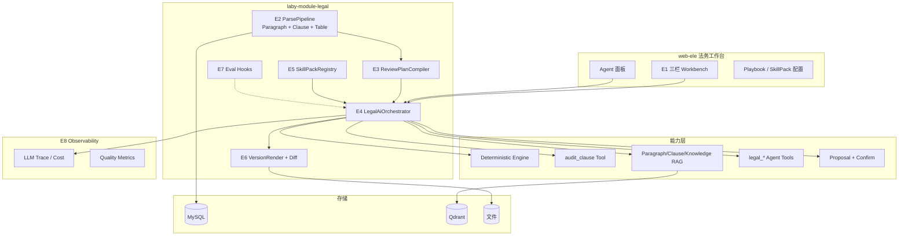
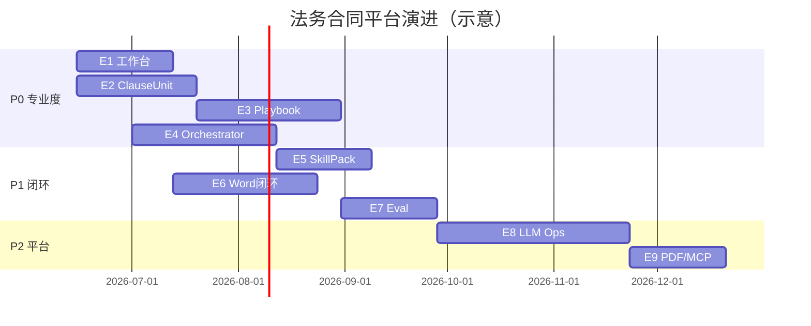
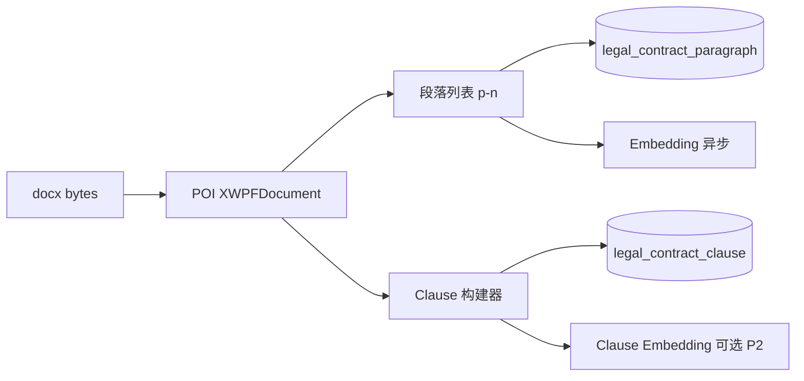
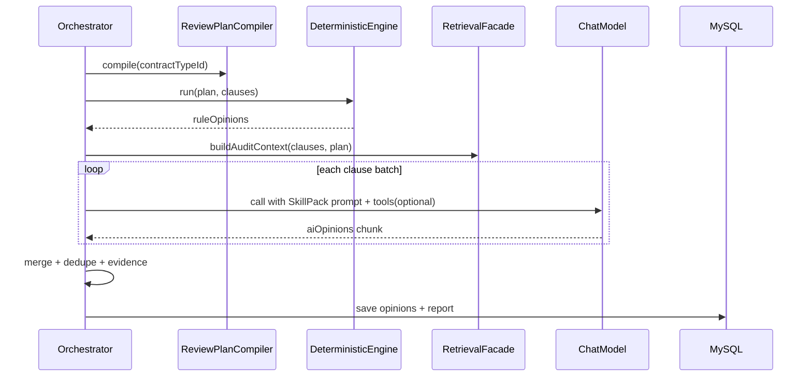

# 法务合同 AI 平台演进总体规划 Spec

| 属性 | 值 |
|------|-----|
| 文档编号 | Laby-Legal-EVOL-001 |
| 版本 | v1.0 |
| 日期 | 2026-06-04 |
| 状态 | **Draft — 待评审** |
| 模块 | `laby-module-legal` + `laby-module-ai` + `laby-ui/web-ele` + `sql/mysql` + `eval/` |
| 战略叙事 | **可审计的企业合同 AI 工作台**（Playbook 为刃、Agent 为增程） |
| 上游文档 | [SRS v1.1](./2026-06-01-legal-contract-review-full-srs.md) · [架构设计](../delivery/2026-06-03-legal-contract-architecture-design.md) · [Agent Spec](./2026-06-03-legal-contract-agent-spec.md) · [批注/导出设计](./2026-06-02-legal-contract-annotate-adopt-export-design.md) |

---

## 目录

1. [执行摘要](#1-执行摘要)
2. [现状与差距](#2-现状与差距)
3. [目标与非目标](#3-目标与非目标)
4. [术语表](#4-术语表)
5. [总体架构演进](#5-总体架构演进)
6. [阶段路线图](#6-阶段路线图)
7. [Epic E1：法务审阅工作台](#7-epic-e1法务审阅工作台)
8. [Epic E2：ClauseUnit 结构解析](#8-epic-e2clauseunit-结构解析)
9. [Epic E3：Playbook / ReviewPlan 引擎](#9-epic-e3playbook--reviewplan-引擎)
10. [Epic E4：LegalAiOrchestrator 统一编排](#10-epic-e4legalaiorchestrator-统一编排)
11. [Epic E5：SkillPack 技能包管理](#11-epic-e5skillpack-技能包管理)
12. [Epic E6：Word 闭环与版本 Diff](#12-epic-e6word-闭环与版本-diff)
13. [Epic E7：评测与回归体系](#13-epic-e7评测与回归体系)
14. [Epic E8：LLM Ops 与平台化](#14-epic-e8llm-ops-与平台化)
15. [Epic E9：PDF/OCR 与 MCP 边界](#15-epic-e9pdfocr-与-mcp-边界)
16. [数据模型变更](#16-数据模型变更)
17. [API 清单（增量）](#17-api-清单增量)
18. [前端信息架构](#18-前端信息架构)
19. [迁移与兼容策略](#19-迁移与兼容策略)
20. [非功能需求](#20-非功能需求)
21. [风险与依赖](#21-风险与依赖)
22. [人力与排期估算](#22-人力与排期估算)
23. [验收标准总表](#23-验收标准总表)
24. [附录 A：与现有实现的映射](#24-附录-a与现有实现的映射)
25. [附录 B：实施计划拆分建议](#25-附录-b实施计划拆分建议)

---

## 1. 执行摘要

### 1.1 为什么要做这次演进

当前 `laby-module-legal` 已具备 **上传 → POI 解析 → 批量 LLM 审核 → BPM 人审 → 导出** 的完整链路，并完成 Agent Tool、段落向量、规则/条款 Phase C 等建设。但在 **用户体验、审核质量可证明性、Word 交付闭环、配置能力产品化** 上与业内标杆仍有明显差距，表现为：

- 审核页仍偏「管理后台表单」，非法务专用工作台；
- 审核粒度为 **段落批处理**（5 段/批、200 字截断），长合同质量不稳定；
- `audit-rule` / `standard-clause` 与审核流水线 **耦合弱**，配置多、体感「AI 没用上规则」；
- **批量审核** 与 **Agent 问答** 两套 AI 路径，能力重复、演进成本高；
- Word Comment/TRACKED/版本 Diff 未完全打透，法务核心交付物不足；
- 缺少 **黄金集评测** 与 **LLM 观测**，团队无法量化「是否变好」。

### 1.2 演进目标（一句话）

将产品从 **「带 AI 功能的合同后台」** 升级为 **「可审计、Playbook 驱动、Agent 增强的企业法务合同 AI 工作台」**。

### 1.3 九大 Epic 一览

| Epic | 名称 | 用户价值 | 优先级 | 预估周期 |
|------|------|----------|--------|----------|
| E1 | 法务审阅工作台 | 第一眼「专业」、处置效率 | P0 | 3～4 周 |
| E2 | ClauseUnit 结构解析 | 审核质量跃迁 | P0 | 4～5 周 |
| E3 | Playbook / ReviewPlan | 规则可执行、缺条款可检 | P0 | 4～6 周 |
| E4 | LegalAiOrchestrator | 统一 AI 大脑、可扩展 | P0 | 5～6 周 |
| E5 | SkillPack 技能包 | 按场景选能力、可运营 | P1 | 3～4 周 |
| E6 | Word 闭环 + Diff | 法务愿意用的交付物 | P1 | 4～6 周 |
| E7 | 评测回归 | 质量可证明 | P1 | 3～4 周 |
| E8 | LLM Ops 平台化 | 企业级可运维 | P2 | 4～8 周 |
| E9 | PDF/OCR + MCP | 扩展输入格式 | P2 | 按需 |
| **E10** | **OnlyOffice 多格式文档平台** | PDF/DOC/DOCX 高保真预览 + 原件真源 | **P0** | 6～10 周（见 DOC-001） |

**建议总周期：** 约 **6～9 个月**（2 后端 + 1 前端 + 0.5 测试/法务顾问），可并行推进 E1 与 E2。

---

## 2. 现状与差距

### 2.1 已实现能力（基线，不再重复建设）

| 能力 | 实现位置 | 状态 |
|------|----------|------|
| docx 段落入库 | `LegalContractWordParser` / `LegalContractParseServiceImpl` | ✅ |
| 批量 AI 审核 + 报告 | `LegalAiAuditServiceImpl` | ✅ |
| 意见处置 / 二轮 / BPM | `LegalContractServiceImpl` + Flowable | ✅ |
| 版本链 + Bookmark | `LegalContractVersionServiceImpl` | ✅ 部分 |
| Agent 8 Tool + SSE | `LegalContractAgentServiceImpl` | ✅ |
| 段落向量检索 | `LegalContractParagraphEmbeddingServiceImpl` | ✅ |
| 规则/条款/类型配置 | Phase C 表 + CRUD | ✅ |
| 六章报告 | `LegalAuditReportBuilder` | ✅ |

### 2.2 差距矩阵（对标业内 L3～L4）

| 维度 | 业内标杆 | 当前 | 本次 Epic |
|------|----------|------|-----------|
| 工作台 UX | 三栏联动、高亮定位 | 单页 `review.vue` | E1 |
| 审核粒度 | 条款/结构感知 | 段落批处理 | E2 + E3 |
| Playbook | 可执行检查清单 | 规则表 + Prompt 引用 | E3 |
| AI 架构 | 统一 Orchestrator | 审核 / Agent 双路径 | E4 + E5 |
| Word 交付 | Comment + Track + Diff | TRACKED 进行中 | E6 |
| 质量证明 | 黄金集 + 指标 | 无 | E7 |
| 运维 | Trace / 成本 / 告警 | progress + retry | E8 |

### 2.3 当前技术债（必须在演进中偿还）

1. `LegalAiAuditServiceImpl` 硬编码 `MAX_PARAGRAPHS_PER_REQUEST=5`、`MAX_PARAGRAPH_TEXT_LENGTH=200`。
2. 意见 `paragraphId` 有值，但 **无 clauseId**；前端无法按章节树导航。
3. `LegalAuditRuleDO` 仅有 `ruleContent` 文本，**无可执行类型**（mandatory/forbidden/pattern）。
4. Agent 与 Audit **不共享** Retrieval / Evidence 构建逻辑。
5. MCP Client `enabled: false`，且 **无运行时 SkillPack 抽象**（仅有 `AiChatRole`）。

---

## 3. 目标与非目标

### 3.1 产品目标

| # | 目标 | 衡量方式 |
|---|------|----------|
| G1 | 法务专员 **80% 处置动作** 在工作台内完成（不切换 Word/Excel） | 用户调研 + 操作日志 |
| G2 | 同一份合同样本，Clause 模式意见 **引用准确率** ≥ 审核模式基线 +10% | E7 eval |
| G3 | Playbook 确定性检查 **误报率** < 15%（可配置阈值） | E7 eval |
| G4 | 导出包（修订版+清洁版+说明） **Word 可正常打开修订视图** | E6 手工 + 自动化抽检 |
| G5 | 模型/Prompt 变更 **必跑回归**，CI 阻断劣化 >5% | E7 CI |
| G6 | 单合同 AI 成本、延迟 **可查询** | E8 仪表盘 |

### 3.2 技术目标

- 引入 `LegalAiOrchestrator`，Audit / Chat / Propose **三 mode 共用** retrieval、evidence、trace。
- 解析层产出 **ClauseUnit**，审核与意见锚点 **双轨兼容** paragraphId + clauseId。
- ReviewPlan **编译缓存**，审核前 O(n) 确定性检查 + 按需 LLM。
- 不引入 LangChain/LangGraph 作为主框架；继续 **Spring AI Tool + Flowable BPM**。

### 3.3 非目标（本规划不承载）

| 项 | 说明 |
|----|------|
| 替代 POI 做 docx 字节级解析 | 仍用 POI + 自研结构层 |
| Cursor IDE Skill 运行时接入 | Skill 仅研发侧；产品内用 SkillPack |
| 批量合同并行审核（100+ 份） | 单份深度审阅优先 |
| 飞书 SSO / 组织同步 | 独立 Sprint，本 Spec 仅预留接口 |
| 跨租户案例库 / 法规自动更新 | P2 以后 |
| LLM 直接读 docx 二进制 | 禁止作为生产主路径 |

---

## 4. 术语表

| 术语 | 定义 |
|------|------|
| **ClauseUnit** | 由解析层识别的最小审阅单元：章节标题 + 正文段落集合 + 可选表格块 |
| **ReviewPlan** | 由合同类型 + 规则 + 标准条款 **编译** 出的可执行审阅计划 |
| **Playbook** | 面向业务的 ReviewPlan 模板（可版本化、可导入） |
| **SkillPack** | 运行时 AI 能力包：`systemPrompt` + `toolNames` + `mcpClientNames` + `modelPolicy` |
| **LegalAiOrchestrator** | 统一 AI 编排入口，mode = `AUDIT` \| `CHAT` \| `PROPOSE` |
| **DeterministicCheck** | 不调用 LLM 的规则检查（正则、关键词、缺条款） |
| **EvidenceBundle** | 意见证据：`quote` + `paragraphIds` + `clauseId` + `ruleId` + `knowledgeSegmentId` |
| **Workbench** | 三栏法务审阅 UI：目录树 \| 原文 \| 意见 |
| **Eval Golden Set** | 脱敏合同样本 + 期望意见/指标的评测集 |

---

## 5. 总体架构演进

### 5.1 目标架构（Evolution Target）



### 5.2 与现架构的关系

| 现有组件 | 演进后角色 |
|----------|------------|
| `LegalContractWordParser` | 保留，扩展为 `LegalContractStructureParser` 门面 |
| `LegalAiAuditServiceImpl` | 逐步 **薄化** 为 Orchestrator 的 `AUDIT` mode 调用方 |
| `LegalContractChatServiceImpl` | 调用 Orchestrator `CHAT` mode |
| `LegalContractAgentServiceImpl` | 调用 Orchestrator `PROPOSE` / `CHAT` + Tool |
| `LegalAgentToolProvider` | 并入 SkillPack 的 tool 解析 |
| `LegalAuditContextService` | 并入 ReviewPlan + RAG 上下文构建 |

### 5.3 核心原则（继承并强化 ARCH-001）

| # | 原则 |
|---|------|
| P1 | MySQL 为事实源；向量库仅为索引 |
| P2 | **确定性优先、LLM 补充**：Playbook 先跑，LLM 扫剩余风险 |
| P3 | 写操作 **Proposal → Confirm → 业务 API** |
| P4 | 每条意见必须可追溯到 **EvidenceBundle** |
| P5 | Orchestrator 每次调用带 **traceId**，贯穿审核/问答/Tool |
| P6 | 段落 ID（`p-n`）**永久稳定**；Clause 为附加视图，不破坏旧数据 |

---

## 6. 阶段路线图

### 6.1 阶段划分



### 6.2 里程碑

| 里程碑 | 交付物 | 目标日期（相对） |
|--------|--------|------------------|
| **M1 看起来专业** | E1 三栏工作台上线 | +4 周 |
| **M2 审得更准** | E2 Clause + E3 Playbook v1 | +10 周 |
| **M3 架构统一** | E4 Orchestrator 接管首轮审核 | +14 周 |
| **M4 法务愿用** | E6 Word 导出包 + Diff | +18 周 |
| **M5 质量可证** | E7 黄金集 + CI 回归 | +20 周 |
| **M6 可运营** | E5 SkillPack 管理端 + E8 基础观测 | +26 周 |

### 6.3 并行策略

| 可并行 | 依赖 |
|--------|------|
| E1 前端 || E2 后端解析 | 无强依赖；E1 先用 paragraphId |
| E3 Playbook || E4 Orchestrator 骨架 | E3 编译器可先独立单测 |
| E6 Word || E3 | E6 v1 可基于现有 version 链 |
| E7 Eval | 需 E2 稳定后采集 golden clause |

---

## 7. Epic E1：法务审阅工作台

### 7.1 用户故事

- 作为法务专员，我希望 **左侧看章节目录、中间读原文、右侧处理意见**，点击意见即高亮对应段落。
- 作为法务专员，我希望按 **风险等级 / 来源（AI/规则/人工）/ 处置状态** 过滤意见。
- 作为法务总监，我希望在只读详情页看到 **相同布局**，便于审批。

### 7.2 页面结构

**路由：** 保留 `/legal/contract/review`；重构 `review.vue` 为 Workbench 布局。

```text
┌─────────────────────────────────────────────────────────────────┐
│ 顶栏：合同标题 | 状态 | 轮次 | BPM 入口 | 导出 | Agent 抽屉      │
├──────────────┬──────────────────────────────┬───────────────────┤
│ 左栏 240px   │ 中栏 flex-1                   │ 右栏 360px        │
│              │                              │                   │
│ 章节树       │ 原文阅读区                    │ 意见列表           │
│ (Clause 树   │ - 段落高亮                    │ - 卡片            │
│  或段落列表) │ - 当前意见 scrollIntoView     │ - 批量采纳/忽略    │
│              │ - 风险色左边框                 │ - 人工补充         │
│ 进度条       │                              │ 报告摘要 Tab       │
│ 筛选：跳过段 │                              │                   │
└──────────────┴──────────────────────────────┴───────────────────┘
│ 底栏（可选）：Agent 聊天抽屉 / 全屏切换                            │
└─────────────────────────────────────────────────────────────────┘
```

### 7.3 交互规格

| ID | 交互 | 说明 |
|----|------|------|
| UX-E1-01 | 意见 → 原文 | 点击意见卡片，`paragraphId` / `clauseId` 定位并高亮 3s |
| UX-E1-02 | 原文 → 意见 | 点击段落，右栏滚动到该段相关意见 |
| UX-E1-03 | 证据展示 | 卡片展示 `referenceClause`、规则名、`sourceType` 徽章 |
| UX-E1-04 | 批量处置 | 右栏多选 + 采纳/忽略/撤销（复用现有 API） |
| UX-E1-05 | 报告 Tab | 六章报告 Markdown 渲染 + 导出按钮 |
| UX-E1-06 | Agent 抽屉 | 保留 `contract-chat-panel`，不挤占三栏 |
| UX-E1-07 | 只读模式 | `detail?id=` 隐藏处置按钮，保留联动 |
| UX-E1-08 | 加载态 | AI 审核中：中栏顶部 progress + 轮询 `/audit-progress` |

### 7.4 后端增量

| API | 方法 | 说明 |
|-----|------|------|
| `/legal/contract/get-workbench` | GET | 聚合：合同 meta + 段落/clause 树 + 意见 + 报告摘要 |
| `/legal/contract/list-clause-tree` | GET | E2 前可降级为段落列表树 |

**`get-workbench` 响应结构（示意）：**

```json
{
  "contract": { "id", "title", "status", "auditRound", ... },
  "navigation": {
    "mode": "CLAUSE|PARAGRAPH",
    "nodes": [{ "id", "label", "level", "paragraphIds", "children" }]
  },
  "paragraphs": [{ "paragraphId", "sort", "text", "skipAudit" }],
  "opinions": [{ "id", "riskLevel", "title", "paragraphId", "clauseId", "sourceType", ... }],
  "reportSummary": { "hasReport", "riskHighCount", "previewMarkdown" }
}
```

### 7.5 前端文件规划

| 路径 | 说明 |
|------|------|
| `views/legal/contract/review.vue` | 壳：布局 + 数据加载 |
| `views/legal/contract/workbench/ClauseTree.vue` | 左栏 |
| `views/legal/contract/workbench/ContractReader.vue` | 中栏 |
| `views/legal/contract/workbench/OpinionPanel.vue` | 右栏 |
| `views/legal/contract/workbench/useWorkbenchSync.ts` | 联动 composable |

### 7.6 验收标准（E1）

- [ ] 1080p 下三栏同屏无横向滚动条（中栏可纵向滚动）
- [ ] 点击意见 500ms 内定位到对应段落
- [ ] 过滤意见后联动状态正确
- [ ] BPM 嵌入 `review.vue` 行为不退化
- [ ] 与列表/详情 **意见数量一致**

---

## 8. Epic E2：ClauseUnit 结构解析

### 8.1 目标

在 **不破坏** `legal_contract_paragraph` 与 `p-n` 稳定 ID 的前提下，新增 **条款级** 结构，供审核、Playbook、Workbench 目录树使用。

### 8.2 ClauseUnit 模型

```java
// 逻辑模型（非直接 DO 名）
ClauseUnit {
    String clauseId;           // c-1, c-2 ...
    Long contractId;
    Integer sort;
    String title;              // 章节标题，可为空（正文块）
    Integer level;               // 1=章, 2=节, 3=条, 0=无标题块
    ClauseType type;             // SECTION | CLAUSE | TABLE | SIGNATURE | APPENDIX
    List<String> paragraphIds; // 关联 p-n，有序
    String fullText;             // 合并正文，供 LLM
    String path;                 // 如 "1.2.3 付款条款"
    Long parentClauseId;         // 树结构
}
```

### 8.3 解析规则（V1）

| 信号 | 识别方式 | 产出 |
|------|----------|------|
| Heading 1/2/3 | POI `paragraph.getStyle()` / outlineLvl | `level` + `title` |
| 中文编号 | 正则 `^第[一二三四五六七八九十]+条` 等 | 新 Clause |
| 表格 | `document.getTables()` | `type=TABLE`，独立 clause |
| 无结构正文 | 连续非标题段落 | 合并为一个 `CLAUSE` 或挂到上级 |
| 空段 | 跳过 | 不入 paragraph 表（保持现状） |

**V1 不做：** PDF、嵌套文本框、复杂 multi-column（记录 TODO）。

### 8.4 解析流水线



**新增类：**

| 类 | 职责 |
|----|------|
| `LegalContractStructureParser` | 门面：parse → paragraphs + clauses |
| `LegalClauseBuilder` | 标题/编号 → 树 |
| `LegalTableExtractor` | 表格 → ClauseUnit(TABLE) |
| `LegalContractClauseMapper` | 持久化 |

### 8.5 意见锚点扩展

`legal_audit_opinion` 增加：

- `clause_id` VARCHAR(32) NULL
- 写入时：**优先 clauseId**，保留 paragraphId 为首段 ID

### 8.6 审核单元切换策略

| 阶段 | 行为 |
|------|------|
| E2 完成前 | 仍按 paragraph 批处理 |
| E2 完成后 | 配置项 `laby.legal.audit.unit=CLAUSE|PARAGRAPH`，默认 CLAUSE |
| CLAUSE 模式 | 每 Clause 一次 LLM；超长 Clause 按 4000 字切块且保持同 clauseId |

**废弃常量：** 移除固定 `MAX_PARAGRAPHS_PER_REQUEST=5`，改为按 Clause + token 预算动态分批。

### 8.7 验收标准（E2）

- [ ] 10 份样本合同 Clause 树人工抽检 **结构准确率 ≥85%**
- [ ] 所有 paragraphId 与旧解析 **一致**（同 docx 重解析 id 不变）
- [ ] Workbench 左栏可展示 Clause 树
- [ ] 意见写入含 clauseId

---

## 9. Epic E3：Playbook / ReviewPlan 引擎

### 9.1 目标

将 `legal_contract_type` + `legal_audit_rule` + `legal_standard_clause` **编译** 为可执行的 `ReviewPlan`，在 LLM 之前跑 **确定性检查**，生成 `sourceType=RULE|STANDARD_CLAUSE` 的意见。

### 9.2 ReviewPlan 结构

```json
{
  "planId": "rp-{contractTypeId}-{version}",
  "contractTypeId": 1,
  "version": 3,
  "mandatoryClauses": [
    {
      "id": "mc-1",
      "name": "保密条款",
      "match": { "type": "KEYWORD|REGEX|CLAUSE_TYPE", "pattern": "保密" },
      "riskIfMissing": "HIGH",
      "standardClauseId": 12
    }
  ],
  "forbiddenPatterns": [
    {
      "id": "fp-1",
      "name": "无限责任",
      "pattern": "无限.*责任",
      "risk": "HIGH",
      "suggestion": "改为「以其出资额为限」"
    }
  ],
  "preferredClauses": [
    {
      "id": "pc-1",
      "standardClauseId": 5,
      "deviationPolicy": "SEMANTIC|KEYWORD",
      "riskIfDeviate": "MEDIUM"
    }
  ],
  "ragBindings": {
    "knowledgeIds": [101, 102],
    "topK": 5
  },
  "llmPolicy": {
    "auditRoleId": 1,
    "skipClauseTypes": ["SIGNATURE"]
  }
}
```

### 9.3 规则表扩展（`legal_audit_rule`）

| 新字段 | 类型 | 说明 |
|--------|------|------|
| `rule_type` | VARCHAR(32) | MANDATORY_CLAUSE / FORBIDDEN_PATTERN / PREFERRED_CLAUSE / CUSTOM_LLM |
| `match_pattern` | VARCHAR(512) | 正则或关键词 |
| `match_type` | VARCHAR(16) | REGEX / KEYWORD / SEMANTIC |
| `risk_level` | VARCHAR(16) | HIGH / MEDIUM / LOW |
| `action_on_hit` | VARCHAR(32) | OPINION / BLOCK / WARN |
| `playbook_version` | INT | 递增 |

`rule_type=CUSTOM_LLM` 的规则进入 LLM Prompt 附录，不跑确定性引擎。

### 9.4 执行顺序

```text
1. ReviewPlanCompiler.compile(contractTypeId, tenantId) → ReviewPlan（带缓存）
2. DeterministicEngine.run(plan, clauses[], paragraphs[])
   → List<OpinionDraft> ruleOpinions
3. LLM Audit（Orchestrator AUDIT mode）
   → 输入：未覆盖 clause + ruleOpinions 摘要 + RAG
   → 输出：aiOpinions
4. MergeOpinions：去重（同 clause + 类似 title）
5. 持久化 legal_audit_opinion
```

### 9.5 ReviewPlanCompiler

| 输入 | 输出 |
|------|------|
| contractTypeId | ReviewPlan JSON |
| 启用中的 rules + standard clauses | 按 priority 排序 |
| 租户级 override（P2） | 合并 |

**缓存：** Redis key `legal:review-plan:{tenantId}:{contractTypeId}:{maxRuleUpdateTime}`，TTL 1h。

### 9.6 DeterministicEngine

| 检查类型 | 算法 | 输出意见字段 |
|----------|------|--------------|
| 缺 mandatory | 在 clause 标题/全文检索 keyword | sourceType=RULE, sourceId=ruleId |
| forbidden 命中 | 正则 scan paragraph/clause fullText | 同上 + quote |
| preferred 偏离 | V1：关键词；V2：embedding 相似度 | sourceType=STANDARD_CLAUSE |

### 9.7 管理端（配置 UX）

**页面：** `views/legal/playbook/index.vue`（或扩展 `audit-rule`）

- 按合同类型预览 ReviewPlan JSON
- 「模拟运行」：上传 docx → 仅跑 DeterministicEngine → 展示将产生的意见
- Playbook 版本号 + 发布按钮（发布后刷新缓存）

### 9.8 验收标准（E3）

- [ ] 缺「保密条款」样本合同产生 **HIGH** 确定性意见
- [ ] forbidden 正则命中后 **quote** 可在/workbench 定位
- [ ] 同一 contractType 二次审核 **命中缓存** <50ms 编译
- [ ] 规则关闭后不产生对应意见

---

## 10. Epic E4：LegalAiOrchestrator 统一编排

### 10.1 目标

**一个入口** 处理 AUDIT / CHAT / PROPOSE，共享 retrieval、evidence、trace、SkillPack。

### 10.2 接口设计

```java
public interface LegalAiOrchestrator {

    LegalAuditOrchestrationResult runAudit(LegalAuditOrchestrationCommand cmd);

    Flux<LegalChatOrchestrationChunk> streamChat(LegalChatOrchestrationCommand cmd);

    LegalProposalOrchestrationResult runPropose(LegalProposalOrchestrationCommand cmd);
}

public record LegalAuditOrchestrationCommand(
    Long contractId,
    int auditRound,
    Long skillPackId,      // 可空，默认合同类型绑定
    boolean failFast,
    String traceId
) {}
```

### 10.3 AUDIT 流程（替代 `doAudit` 内核）



### 10.4 共享组件

| 组件 | 职责 |
|------|------|
| `LegalRetrievalFacade` | 段落/Clause 向量 + 知识库 + 规则片段 |
| `LegalEvidenceBuilder` | 生成 EvidenceBundle，校验 quote ⊆ source |
| `LegalOpinionMerger` | 规则意见 vs AI 意见去重 |
| `LegalAiTraceRecorder` | 写 `legal_ai_trace` + span |

### 10.5 CHAT / PROPOSE

- **CHAT**：复用现有 Agent Tools，Prompt 来自 SkillPack；**禁止**预灌 14k 上下文（Agent mode 默认）。
- **PROPOSE**：在 CHAT 基础上 `allowProposal=true`；Confirm 仍走 `LegalAgentProposalService`。

### 10.6 迁移步骤

| 步骤 | 动作 |
|------|------|
| 1 | 新建 Orchestrator + Trace，Audit 内部仍调旧 `callAuditInBatches` |
| 2 | 接入 ReviewPlan + DeterministicEngine |
| 3 | Clause 单元 + 新 Prompt 模板 |
| 4 | `LegalAiAuditServiceImpl` 改为 Facade 委托 Orchestrator |
| 5 | Chat/Agent 改调 Orchestrator.streamChat |

### 10.7 验收标准（E4）

- [ ] 首轮审核 **100%** 走 Orchestrator（feature flag 可回滚）
- [ ] 同 contractId 审核与问答 **traceId 可关联查询**
- [ ] Chat 与 Audit **共用** RetrievalFacade（代码层单测证明）

---

## 11. Epic E5：SkillPack 技能包管理

### 11.1 与 Cursor Skill / AiChatRole 的关系

| 概念 | 位置 | 用途 |
|------|------|------|
| Cursor Skill | `.cursor/skills/` | 研发 Agent 写代码/文档 |
| AiChatRole | `ai_chat_role` | 现有模型+Prompt |
| **SkillPack** | `legal_skill_pack` | **运行时** 场景能力包 |

SkillPack **可引用** `AiChatRole.id` 作为 Prompt 来源，并 **扩展** tool 列表与 model 策略。

### 11.2 数据模型 `legal_skill_pack`

| 字段 | 说明 |
|------|------|
| id, tenant_id | 主键、租户 |
| code | `legal-audit-default` |
| name | 展示名 |
| scene | AUDIT / CHAT / PROPOSE / EXPORT_SUMMARY |
| chat_role_id | 关联 ai_chat_role |
| tool_names | JSON 数组，如 `["legal_search_paragraphs"]` |
| mcp_client_names | JSON，P2 启用 |
| model_policy | JSON：`{ "preferReasoning": true, "maxTokens": 8192 }` |
| playbook_id | 可选，绑定 ReviewPlan 模板 |
| enabled, version | 启用、版本 |

### 11.3 绑定关系

| 实体 | 绑定 |
|------|------|
| `legal_contract_type` | 增加 `default_skill_pack_id_audit`, `default_skill_pack_id_chat` |
| `legal_contract` | 创建时快照 skillPack 版本号（可配置是否跟随类型更新） |

### 11.4 管理端

- 菜单：**法务 → AI 技能包**
- CRUD + 复制 + 导入 JSON（便于「开源模板」迁移为 SkillPack 配置，非直接运行 Cursor Skill）

### 11.5 验收标准（E5）

- [ ] 切换合同类型自动选用对应 SkillPack
- [ ] 管理端修改 SkillPack 后，**新创建** 合同生效
- [ ] tool_names 非法时启动告警、运行时降级为只读 meta

---

## 12. Epic E6：Word 闭环与版本 Diff

### 12.1 目标（对齐 [批注/导出设计](./2026-06-02-legal-contract-annotate-adopt-export-design.md)）

| 能力 | 说明 | 优先级 |
|------|------|--------|
| Annotated Comment 导出 | Word 原生批注 + 风险色 | P1 |
| TRACKED 修订 | `w:ins` / `w:del` 稳定 | P1 |
| CLEAN 采纳版 | 已有，增强样式保真 | P1 |
| **Clause Diff** | V(n) vs V(n+1) 条款级对比 | P1 |
| **导出 ZIP 包** | 修订版 + 清洁版 + 审查说明 pdf/docx | P1 |
| 在线 WPS 回写 | 范围外 | — |

### 12.2 版本 Diff 规格

**输入：** `fromVersionId`, `toVersionId`

**输出：**

```json
{
  "diffs": [
    {
      "clauseId": "c-12",
      "clauseTitle": "付款条款",
      "changeType": "MODIFIED|ADDED|REMOVED",
      "beforeText": "...",
      "afterText": "...",
      "relatedOpinionIds": [101, 102]
    }
  ]
}
```

**算法 V1：**

1. 按 clauseId 对齐（若无 clause 则降级 paragraphId）
2. 文本 normalize 后 diff（java-diff-utils / Myers）
3. 前端 Workbench **Diff 视图** Tab

### 12.3 导出 ZIP 结构

```text
{contractTitle}-{round}-export.zip
├── {title}-TRACKED.docx
├── {title}-CLEAN.docx
├── {title}-ANNOTATED.docx
├── {title}-audit-report.docx
└── manifest.json   # 版本号、导出时间、意见统计
```

### 12.4 API

| API | 说明 |
|-----|------|
| `GET /legal/contract/version-diff` | 条款 Diff |
| `POST /legal/contract/export-bundle` | ZIP 打包 |
| 现有 export-* | 保留，bundle 内部复用 |

### 12.5 验收标准（E6）

- [ ] Word 打开 TRACKED 默认显示修订
- [ ] Comment 与意见 **1:1 或 1:N** 可追溯
- [ ] Diff 视图与采纳意见 **逻辑一致**
- [ ] 30MB 内 docx 导出 **<60s**（异步 + 进度）

---

## 13. Epic E7：评测与回归体系

### 13.1 目录结构

```text
laby-module-legal/src/test/eval/
├── README.md
├── datasets/
│   ├── manifest.json
│   ├── contract-001/          # 脱敏 docx
│   │   ├── source.docx
│   │   ├── golden-clauses.json
│   │   └── golden-opinions.json
│   └── ...
├── runners/
│   LegalAuditEvalRunner.java
│   LegalPlaybookEvalRunner.java
│   LegalCitationEvalRunner.java
└── reports/                   # CI 产出
```

### 13.2 指标定义

| 指标 | 定义 | 目标 |
|------|------|------|
| **clause_recall** |  golden 高风险 clause 被产出意见的比例 | ≥0.75 |
| **citation_accuracy** | 意见 quote 为原文子串的比例 | ≥0.90 |
| **false_positive_rate** | 无风险 clause 误报 / 总 clause | ≤0.20 |
| **rule_hit_precision** | 确定性意见人工认可率（抽检） | ≥0.85 |
| **regression_delta** | 相对 baseline 指标变化 | CI 阻断 >5% 劣化 |

### 13.3 golden-opinions.json  schema

```json
{
  "contractId": "sample-001",
  "expectations": [
    {
      "clausePath": "付款条款",
      "minRisk": "MEDIUM",
      "mustContainKeywords": ["账期", "30日"],
      "sourceType": "RULE|AI|ANY"
    }
  ]
}
```

### 13.4 CI 集成

| 触发 | 动作 |
|------|------|
| PR 改 Prompt / Orchestrator / Playbook | `./mvnw -pl laby-module-legal test -Dtest=LegalAuditEvalRunner` |
|  nightly | 全量 eval + 报告归档 |
| 模型版本变更 | 人工 approve + 更新 baseline |

### 13.5 验收标准（E7）

- [ ] ≥10 份脱敏样本入库
- [ ] EvalRunner 本地可跑、CI 可跑
- [ ] 生成 HTML/JSON 报告含指标对比

---

## 14. Epic E8：LLM Ops 与平台化

### 14.1 追踪表 `legal_ai_trace`

| 字段 | 说明 |
|------|------|
| trace_id | UUID |
| contract_id, tenant_id | 关联 |
| scene | AUDIT / CHAT / PROPOSE |
| skill_pack_id | 使用的包 |
| model_id, platform | 模型 |
| prompt_tokens, completion_tokens | 用量 |
| latency_ms | 耗时 |
| status | SUCCESS / FAIL / PARTIAL |
| error_message | 失败原因 |

### 14.2 Span 表 `legal_ai_trace_span`

| 字段 | 说明 |
|------|------|
| trace_id | 父 |
| span_type | LLM / TOOL / DETERMINISTIC / RAG |
| name | 如 `audit_clause:c-12` |
| input_digest, output_digest | SHA256 摘要（不存全文） |
| latency_ms | |

### 14.3 管理端仪表盘

- 合同维度：总 token、总成本估算、审核轮次耗时
- 租户维度：月用量排行
- 失败率告警（对接 infra 通知，P2）

### 14.4 多模型路由（Model Policy）

SkillPack.model_policy 示例：

```json
{
  "audit": { "modelId": 1, "temperature": 0.2 },
  "classify": { "modelId": 2, "temperature": 0 },
  "embedding": { "modelId": 3 }
}
```

Orchestrator 按 step 选 model，**不**在业务代码硬编码 DeepSeek。

### 14.5 验收标准（E8）

- [ ] 每次 AUDIT 产生 trace + spans
- [ ] 管理端可按 contractId 查询链路
- [ ] Token 统计与 API 账单 **误差 <10%**

---

## 15. Epic E9：PDF/OCR 与 MCP 边界

> **多格式高保真预览与原件真源**的完整方案见 **[Laby-Legal-DOC-001 OnlyOffice 文档平台 Spec](./2026-06-04-legal-onlyoffice-document-platform-spec.md)**（建议作为 **E10** 实施，本 Epic 的文本抽取/OCR 与其结构索引通道合并规划）。

### 15.1 原则

- **核心法务能力** = Java Tool + POI，**不**依赖 MCP。
- MCP **仅**作扩展：PDF→Markdown、外部法规库检索。

### 15.2 PDF 通道（P2）

```text
PDF 上传 → 格式探测
  ├─ 文字型 PDF → PDFBox 提取
  └─ 扫描件 → OCR 服务（待定：Paddle / 云 OCR）
→ 结构重建（弱 Clause）→ 进入现有 paragraph 表
```

### 15.3 MCP 启用清单

| MCP | 用途 | 接入方式 |
|-----|------|----------|
| MarkItDown | 附件 PDF/Word 转 MD 供 Chat | `spring.ai.mcp.client` SSE |
| 自研 legal-mcp-server（P2） | 对外暴露「创建审核任务」 | MCP Server 模式 |

**禁止：** 生产审核主链路通过 npx 调外部 MCP。

### 15.4 验收标准（E9）

- [ ] 文字型 PDF 解析成功率 ≥90%（eval 子集）
- [ ] MCP 调用失败 **降级** 不影响 docx 主路径

---

## 16. 数据模型变更

### 16.1 新增表

#### `legal_contract_clause`

| 字段 | 类型 | 说明 |
|------|------|------|
| id | BIGINT PK | |
| contract_id | BIGINT | |
| clause_id | VARCHAR(32) | c-n |
| parent_clause_id | VARCHAR(32) NULL | |
| sort | INT | |
| title | VARCHAR(512) | |
| level | TINYINT | |
| type | VARCHAR(32) | SECTION/CLAUSE/TABLE/... |
| path | VARCHAR(512) | |
| paragraph_ids | JSON | ["p-1","p-2"] |
| full_text | MEDIUMTEXT | |
| tenant_id | BIGINT | |

索引：`(contract_id, clause_id)` UNIQUE

#### `legal_skill_pack`

见 §11.2

#### `legal_ai_trace` / `legal_ai_trace_span`

见 §14.1～14.2

#### `legal_playbook_version`（可选，与 rule 版本解耦）

| 字段 | 说明 |
|------|------|
| contract_type_id | |
| version | |
| plan_json | MEDIUMTEXT |
| published_at | |

### 16.2 变更表

| 表 | 变更 |
|----|------|
| `legal_audit_rule` | + rule_type, match_pattern, match_type, risk_level, action_on_hit, playbook_version |
| `legal_audit_opinion` | + clause_id |
| `legal_contract_type` | + default_skill_pack_id_audit, default_skill_pack_id_chat |
| `legal_contract` | + skill_pack_snapshot JSON（可选） |

### 16.3 SQL 脚本规划

| 文件 | 内容 |
|------|------|
| `sql/mysql/laby-legal-evol-e2-clause.sql` | clause 表 + opinion.clause_id |
| `sql/mysql/laby-legal-evol-e3-playbook.sql` | audit_rule 扩展 |
| `sql/mysql/laby-legal-evol-e5-skillpack.sql` | skill_pack + contract_type 绑定 |
| `sql/mysql/laby-legal-evol-e8-trace.sql` | trace 表 |
| `sql/mysql/laby-legal-evol-menu.sql` | 工作台/技能包/Playbook 菜单 |

---

## 17. API 清单（增量）

### 17.1 Workbench

| Method | Path | Epic |
|--------|------|------|
| GET | `/legal/contract/get-workbench` | E1 |
| GET | `/legal/contract/list-clause-tree` | E2 |

### 17.2 Playbook

| Method | Path | Epic |
|--------|------|------|
| GET | `/legal/playbook/preview` | E3 |
| POST | `/legal/playbook/simulate` | E3 |
| POST | `/legal/playbook/publish` | E3 |

### 17.3 SkillPack

| Method | Path | Epic |
|--------|------|------|
| CRUD | `/legal/skill-pack/*` | E5 |

### 17.4 Version / Export

| Method | Path | Epic |
|--------|------|------|
| GET | `/legal/contract/version-diff` | E6 |
| POST | `/legal/contract/export-bundle` | E6 |

### 17.5 Observability

| Method | Path | Epic |
|--------|------|------|
| GET | `/legal/ai-trace/page` | E8 |
| GET | `/legal/ai-trace/get` | E8 |

**权限前缀建议：** `legal:workbench:query`, `legal:playbook:*`, `legal:skill-pack:*`, `legal:ai-trace:query`

---

## 18. 前端信息架构

### 18.1 菜单调整

| 菜单 | 路径 | Epic |
|------|------|------|
| 合同审阅工作台 | `/legal/contract/review` | E1（重构） |
| Playbook 预览 | `/legal/playbook` | E3 |
| AI 技能包 | `/legal/skill-pack` | E5 |
| AI 调用追踪 | `/legal/ai-trace` | E8 |

### 18.2 组件复用

| 现有 | 演进 |
|------|------|
| `contract-chat-panel.vue` | 保留，接入 Orchestrator SSE |
| `create-form.vue` | 创建时展示 SkillPack / 合同类型绑定提示 |
| `audit-rule` 页 | 扩展 rule_type 等字段 |

---

## 19. 迁移与兼容策略

### 19.1 数据迁移

| 场景 | 策略 |
|------|------|
| 已有合同无 clause | 后台 Job：`LegalClauseBackfillJob` 按 contractId 重跑 StructureParser，**不修改** paragraphId |
| 已有意见无 clause_id | 按 paragraphId 反查所属 clause 回填 |
| audit_rule 旧数据 | rule_type 默认 `CUSTOM_LLM`，行为与现网一致 |

### 19.2 Feature Flag

```yaml
laby:
  legal:
    audit:
      unit: CLAUSE          # PARAGRAPH | CLAUSE
      use-orchestrator: true
    playbook:
      enabled: true
    workbench:
      enabled: true
```

### 19.3 回滚

- Orchestrator 关闭 → 回退 `LegalAiAuditServiceImpl` 原路径
- CLAUSE 关闭 → 仅 Workbench 用段落树

---

## 20. 非功能需求

| 类别 | 要求 |
|------|------|
| 性能 | Workbench 聚合 API P95 <800ms（500 段以内） |
| 性能 | 确定性 Playbook 全合同 <2s |
| 安全 | trace 不存合同全文；仅 digest |
| 多租户 | SkillPack / Playbook / trace 租户隔离 |
| 可用性 | AI 失败可重试；Deterministic 意见独立落库 |
| 审计 | 意见 sourceType + sourceId + traceId 全链路 |

---

## 21. 风险与依赖

| 风险 | 影响 | 缓解 |
|------|------|------|
| Clause 识别准确率不足 | /workbench 树混乱 | 人工校正入口（P2）；降级段落模式 |
| LLM 成本上升 | Clause 逐条审 | 跳过短 clause + Playbook 先行 |
| POI 修订兼容性 | Word 打开异常 | 黄金集 + 多版本 Word 抽检 |
| Orchestrator 改造面大 | 回归 bug | Feature flag + E7 CI |
| 法务样本不足 | Eval 无意义 | 先 10 份内部模板合同 |

**依赖：**

- Spring AI 1.1.5+ Tool/MCP 稳定
- Qdrant / Embedding 模型可用
- 法务顾问参与 golden 标注（E7）

---

## 22. 人力与排期估算

| 角色 | 投入 | 主要负责 Epic |
|------|------|---------------|
| 后端 A | 1 FTE × 6mo | E2 E3 E4 E6 |
| 后端 B | 0.5 FTE × 6mo | E5 E8 E9 |
| 前端 | 1 FTE × 4mo | E1 E3 配置页 E6 Diff UI |
| 测试/法务 | 0.3 FTE × 6mo | E7 golden + UAT |

**最小可行团队（M1+M2）：** 1 后端 + 1 前端，约 **10 周**。

---

## 23. 验收标准总表

| Epic | 关键验收 |
|------|----------|
| E1 | 三栏联动 + 意见过滤 + BPM 嵌入无回归 |
| E2 | Clause 树 ≥85% 准确 + paragraphId 稳定 |
| E3 | 缺条款 / forbidden 确定性检出 + 模拟运行 |
| E4 | Orchestrator 接管审核 + trace 关联 |
| E5 | 按合同类型绑定 SkillPack 可配置 |
| E6 | ZIP 导出 + Word 修订 + Clause Diff |
| E7 | 10 样本 + CI 回归 |
| E8 | 合同级 token/耗时可查 |
| E9 | PDF 文字层解析 + MCP 降级 |

---

## 24. 附录 A：与现有实现的映射

| 本 Spec 概念 | 现有代码 | 动作 |
|--------------|----------|------|
| Workbench | `review.vue` | 重构 |
| ClauseUnit | `LegalContractWordParser` | 扩展 |
| ReviewPlan | `LegalAuditContextService` | 演进为 Compiler |
| Orchestrator | `LegalAiAuditServiceImpl` + `LegalContractAgentServiceImpl` | 抽取合并 |
| SkillPack | `AiChatRoleDO` + `LegalAgentToolProvider` | 新增表 + 引用 |
| Evidence | `LegalAuditOpinionDO.evidenceRefs` | 增强 Builder |
| Eval | 无 | 新建 eval 目录 |

---

## 25. 附录 B：实施计划拆分建议

建议按 **Superpowers 实施计划** 拆为独立 plan 文件（待本 Spec 评审通过后编写）：

| Plan 文件 | 对应 Epic | 首批 Task 示例 | 状态 |
|-----------|-----------|----------------|------|
| [2026-06-04-legal-evolution-wave1-parallel-orchestration.md](../plans/2026-06-04-legal-evolution-wave1-parallel-orchestration.md) | E1+E2 | W1～W4 多窗口编排 | ✅ Ready |
| [2026-06-04-legal-workbench-plan.md](../plans/2026-06-04-legal-workbench-plan.md) | E1 | get-workbench API、三栏组件 | ✅ Ready |
| [2026-06-04-legal-clause-unit-plan.md](../plans/2026-06-04-legal-clause-unit-plan.md) | E2 | clause 表、StructureParser | ✅ Ready |
| `2026-06-XX-legal-playbook-plan.md` | E3 | rule 字段迁移、DeterministicEngine | 待 Wave1 后 |
| `2026-06-XX-legal-orchestrator-plan.md` | E4 | Orchestrator 接口、Audit 迁移 | 待 Wave1 后 |
| `2026-06-XX-legal-skillpack-plan.md` | E5 | CRUD + 绑定 | 待 Wave1 后 |
| `2026-06-XX-legal-word-diff-plan.md` | E6 | Diff API、export-bundle | 待 Wave1 后 |
| `2026-06-XX-legal-eval-plan.md` | E7 | EvalRunner + 3 样本 | 待 Wave1 后 |

---

## 变更记录

| 版本 | 日期 | 作者 | 说明 |
|------|------|------|------|
| v1.0 | 2026-06-04 | AI + 项目组 | 初稿：九大 Epic 总体规划 |

---

**评审检查项（Review Checklist）：**

- [ ] 产品确认战略叙事与优先级
- [ ] 法务确认 Playbook 规则类型与样本集来源
- [ ] 后端确认 Orchestrator 迁移窗口与 flag
- [ ] 前端确认 Workbench 布局与 BPM 嵌入
- [ ] 测试确认 E7 指标阈值
- [ ] 安全确认 trace 不落敏感全文
