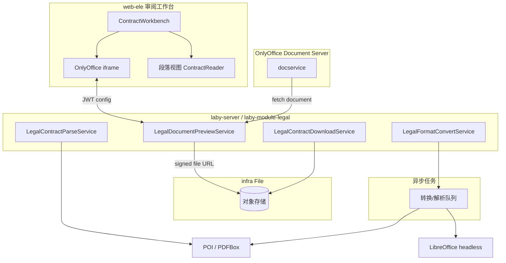
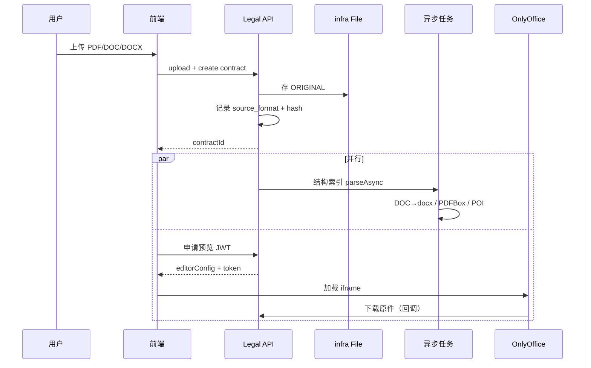

# 法务合同多格式文档平台 Spec（OnlyOffice）

| 属性 | 值 |
|------|-----|
| **文档编号** | Laby-Legal-DOC-001 |
| **版本** | v0.2 |
| **日期** | 2026-06-04 |
| **状态** | **Draft — 待评审** |
| **模块** | `laby-module-legal` + `laby-ui/web-ele` + `infra` + **OnlyOffice Document Server**（新容器） |
| **战略叙事** | **原件为真源 + 高保真预览 + 结构化索引并行** |
| **上游文档** | [平台演进 EVOL-001](./2026-06-04-legal-contract-platform-evolution-spec.md) · [架构设计](../delivery/2026-06-03-legal-contract-architecture-design.md) · [批注/导出设计](./2026-06-02-legal-contract-annotate-adopt-export-design.md) · [SRS](./2026-06-01-legal-contract-review-full-srs.md) |
| **关联 Epic** | 承接并扩展 EVOL **E1（工作台）**、**E6（Word 闭环）**、**E9（PDF/多格式）**；建议排期为 **E10** |

---

## 目录

1. [执行摘要](#1-执行摘要)
2. [背景与问题](#2-背景与问题)
3. [目标与非目标](#3-目标与非目标)
4. [术语与文件角色](#4-术语与文件角色)
5. [架构原则](#5-架构原则)
6. [总体架构](#6-总体架构)
7. [OnlyOffice 集成设计](#7-onlyoffice-集成设计)
8. [格式策略矩阵（PDF / DOC / DOCX）](#8-格式策略矩阵pdf--doc--docx)
9. [结构索引通道（与预览解耦）](#9-结构索引通道与预览解耦)
10. [审阅工作台](#10-审阅工作台)
11. [段落定位与意见联动](#11-段落定位与意见联动)
12. [下载与导出](#12-下载与导出)
13. [数据模型变更](#13-数据模型变更)
14. [API 清单（增量）](#14-api-清单增量)
15. [前端变更](#15-前端变更)
16. [部署与运维](#16-部署与运维)
17. [安全、租户与权限](#17-安全租户与权限)
18. [分阶段交付（Phase 1～3）](#18-分阶段交付phase-13)
19. [非功能需求](#19-非功能需求)
20. [风险、依赖与 ADR](#20-风险依赖与-adr)
21. [验收标准](#21-验收标准)
22. [附录 A：与现有代码映射](#22-附录-a与现有代码映射)
23. [附录 B：实施计划拆分（待写 Plan）](#23-附录-b实施计划拆分待写-plan)

---

## 1. 执行摘要

法务合同审阅要求 **文档视图与上传件版式一致**（含 logo、页眉页脚、表格版式），并支持 **PDF / DOC / DOCX** 上传，且 **下载保留原件样式**。当前 `docx-preview + POI` 路线无法满足该目标。

本 Spec 定义 **OnlyOffice Document Server** 作为统一高保真预览引擎，并坚持：

- **原件（ORIGINAL）** 为法律与样式真源，入库后不可被解析/导出覆盖；
- **预览** 走 OnlyOffice iframe，与 **结构索引**（POI / PDFBox / 转换任务）完全解耦；
- **下载** 分「原件」与「衍生件」（标注版、规范化 docx、预览用 PDF 等），产品文案明确区分。

**建议优先级：** P0（与 E1 工作台体验强绑定）。**预估周期：** Phase 1～2 约 **6～10 周**（含 Document Server 部署与联调），Phase 3（PDF 标注/OCR）按需。

---

## 2. 背景与问题

### 2.1 现状

| 能力 | 实现 | 局限 |
|------|------|------|
| 上传 | `create-form.vue` 仅 `.doc/.docx` | 不支持 PDF |
| 预览 | `ContractDocxPreview` + `docx-preview` | 版式近似，页眉页脚/logo 易失真 |
| 解析 | `LegalContractWordParser` / `LegalContractStructureParser` | 仅 docx；`.doc` 未支持 |
| 下载 | `downloadContractFile` 回传 infra 字节 | 原件可保留；标注版仅 docx POI |
| 定位 | `p-n` + 文本匹配 | docx-preview DOM 与 POI 段落易错位 |

### 2.2 业务诉求（本次 Spec 覆盖）

1. 上传 **PDF、DOC、DOCX** 作为主合同。
2. 审阅工作台 **文档视图** 与合同视觉一致。
3. **下载合同** 保留原始样式（含企业模板元素）。
4. AI 审核、Playbook、意见处置 **继续基于段落/条款结构化数据**，不依赖预览 DOM。

---

## 3. 目标与非目标

### 3.1 目标

| # | 目标 |
|---|------|
| G1 | 支持 PDF / DOC / DOCX 上传，入库记录格式与原件哈希 |
| G2 | 工作台文档视图通过 OnlyOffice 高保真渲染（只读为主） |
| G3 | 「下载原件」100% 回传上传字节，Content-Type / 文件名正确 |
| G4 | 结构索引异步生成：docx 原生 POI；doc 转 docx 后 POI；pdf 文字层 PDFBox |
| G5 | 意见「定位」：docx 优先 Bookmark + OnlyOffice search；pdf 用 viewer 文本搜索 |
| G6 | 与现有 BPM、意见、版本链、SkillPack、Trace **无破坏性兼容** |

### 3.2 非目标（本 Spec 不做或 Phase 3+）

| # | 非目标 |
|---|--------|
| NG1 | 浏览器内自研 Word 排版引擎 |
| NG2 | 在线协同编辑、多人实时改合同（OnlyOffice 先 **view** 模式） |
| NG3 | 扫描版 PDF 高准确率 OCR 结构还原（单独 OCR Epic，Phase 3） |
| NG4 | PDF 原生批注层导出与 Word 修订完全等价 |
| NG5 | WPS 开放平台 / 智书（可作为 ADR 备选，本 Spec 默认 OnlyOffice 自建） |
| NG6 | 用 MCP 做主链路解析（与 EVOL E9 原则一致） |

---

## 4. 术语与文件角色

### 4.1 术语

| 术语 | 含义 |
|------|------|
| **原件** | 用户上传的原始文件字节，SHA-256 存证，永不就地覆盖 |
| **结构索引** | `legal_contract_paragraph` / `legal_contract_clause` 等，供 AI 与定位逻辑使用 |
| **预览会话** | OnlyOffice 打开文档的一次 JWT 授权上下文 |
| **规范化 docx** | 由 `.doc` 或部分 PDF 工作流生成的可编辑/可批注 docx 衍生件 |

### 4.2 文件角色枚举 `legal_contract_file.role`

| role | 说明 | 来源 | 下载入口 |
|------|------|------|----------|
| `ORIGINAL` | 用户上传原件 | 上传直存 | **下载合同原件**（默认） |
| `NORMALIZED_DOCX` | DOC→DOCX 或统一规范化 | LibreOffice/OnlyOffice 转换任务 | 内部/可选「下载可编辑版」 |
| `PREVIEW_PDF` | 可选：为加速 OnlyOffice 生成的预览副本 | 转换任务 | 一般不暴露给用户 |
| `WORKING` | 现有版本链工作版 | 版本服务 | 沿用 E6 |
| `ANNOTATED` / `TRACKED` / `CLEAN` / `ADOPTED_*` | 现有标注/采纳链 | POI 渲染 | 沿用 E6，**docx/doc 主格式** |
| `ANNOTATED_PDF` | PDF 标准批注层（见 §12.4） | PDFBox/iText 写入 Annotation | Acrobat/福昕可打开 |

**规则：** 每种 `role` 在同一 `contract_id` + `audit_round`（如适用）下至多一个活跃记录；`ORIGINAL` 与 `main_flag` 对齐。

### 4.3 主文件格式 `source_format`

| 值 | 扩展名 | 预览 | 结构索引主路径 |
|----|--------|------|----------------|
| `DOCX` | .docx | OnlyOffice | POI 直接 |
| `DOC` | .doc | OnlyOffice | 转 docx → POI |
| `PDF` | .pdf | OnlyOffice | PDFBox 文字层；扫描件降级 |

写入 `legal_contract.source_format`（或 `legal_contract_file.format`）。

---

## 5. 架构原则

| # | 原则 | 说明 |
|---|------|------|
| P1 | **原件即真源** | 样式、法律效力以 ORIGINAL 为准；任何转换不得替换 ORIGINAL |
| P2 | **预览 ≠ 解析** | OnlyOffice 不参与段落入库；解析失败不应阻断预览 |
| P3 | **解析可降级** | PDF 扫描件、复杂 doc 解析失败 → `parse_status=PARTIAL`，仍可审阅原件 |
| P4 | **单一预览引擎** | 前端文档视图只嵌入 OnlyOffice；`docx-preview` 降级为离线/无 DS 时备用 |
| P5 | **定位双通道** | 结构化 `paragraphId` + 运行时 `searchText`（oldText/段落全文） |
| P6 | **租户隔离** | JWT、文件 URL、转换任务均带 `tenant_id` 校验 |

---

## 6. 总体架构

### 6.1 容器图



### 6.2 上传后时序（逻辑）



---

## 7. OnlyOffice 集成设计

### 7.1 组件选型

| 组件 | 选型 | 说明 |
|------|------|------|
| Document Server | **ONLYOFFICE Docs**（Community 或 Enterprise） | 支持 doc/docx/pdf **查看**；Enterprise 功能按 license |
| 集成方式 | **Docs API + JWT** | 官方推荐；禁止匿名拉文件 |
| 与 laby 集成 | 新建 `LegalDocumentPreviewService` | 签发 JWT、提供文件 Download Handler |

### 7.2 配置文件（应用侧）

```yaml
# application-legal.yaml（示例）
laby:
  legal:
    onlyoffice:
      enabled: true
      document-server-url: https://onlyoffice.${internal-domain}/
      jwt-secret: ${ONLYOFFICE_JWT_SECRET}
      jwt-header: Authorization
      callback-base-url: https://api.${domain}/admin-api/legal/document/onlyoffice
      # 查看模式；后续若需批注在线编辑再开 edit
      default-mode: view
```

### 7.3 JWT 载荷（查看模式）

签发字段遵循 OnlyOffice 文档，核心包括：

| 字段 | 值 |
|------|-----|
| `document.key` | `{tenantId}_{fileId}_{fileVersionOrHashPrefix}`，文件变更则 key 变 |
| `document.url` | laby 回调地址 `GET .../file/{fileId}?token=一次性` |
| `document.fileType` | `docx` / `doc` / `pdf` |
| `document.title` | 原始文件名 |
| `editorConfig.mode` | `view` |
| `editorConfig.lang` | `zh-CN` |
| `permissions.download` | `true`（允许 OnlyOffice 内置下载时与产品策略一致） |
| `permissions.edit` | `false`（Phase 1） |

### 7.4 文件回调接口

| 方法 | 路径 | 说明 |
|------|------|------|
| `GET` | `/legal/document/onlyoffice/file/{fileId}` | OnlyOffice 拉取文件流；校验 **一次性 token** 或 **JWT 内嵌签名** |
| `POST` | `/legal/document/onlyoffice/callback` | 保存回调（Phase 1 仅记录日志；Phase 2+ 若开 edit 再处理 status） |
| `GET` | `/legal/document/preview-config` | 前端获取 `documentServerUrl` + 已签名 `config` |

**安全：** 回调必须校验 `contract` 归属、`tenant_id`、用户是否有 `legal:contract:query`（或更细 preview 权限）。

### 7.5 前端嵌入

- 新建 `ContractOnlyOfficeViewer.vue`：加载 `https://{DS}/web-apps/apps/api/documents/api.js`，`new DocsAPI.DocEditor(placeholderId, config)`。
- `ContractWorkbench`：文档视图 **默认 OnlyOffice**；`docx-preview` 仅在 `onlyoffice.enabled=false` 时 fallback。
- iframe 高度自适应工作台中间栏；加载失败显示「预览服务不可用」+ 段落视图入口。

### 7.6 Document Server 部署（概要）

| 项 | 要求 |
|----|------|
| 部署 | Docker Compose 或 K8s；与 `laby-server` **内网互通** |
| 存储 | DS 临时缓存；**权威文件仍在 laby infra** |
| 资源 | 建议 ≥4C8G/实例；并发预览 ≤20 需水平扩展 |
| HTTPS | 必须；避免混合内容 blocked |
| 字体 | 挂载中文字体目录（否则部分合同样式替换字体） |

---

## 8. 格式策略矩阵（PDF / DOC / DOCX）

| 格式 | 原件存储 | OnlyOffice 预览 | 结构索引 | 规范化衍生件 | AI 审核 |
|------|----------|-----------------|----------|--------------|---------|
| **DOCX** | ✅ ORIGINAL | ✅ 直接打开 | POI `bodyElements` + clause | 可选 WORKING + Bookmark | ✅ 全功能 |
| **DOC** | ✅ ORIGINAL | ✅ 原生 doc | 异步 **DOC→DOCX** 后 POI | `NORMALIZED_DOCX` | ✅ 转完后全功能 |
| **PDF 文字层** | ✅ ORIGINAL | ✅ pdf | PDFBox 抽文本 → 启发式段落 | 无或可选转 docx（Phase 3） | ✅ 段落级 |
| **PDF 扫描件** | ✅ ORIGINAL | ✅ pdf 图像 | OCR 队列（Phase 3）或 `PARTIAL` | 无 | ⚠️ 降级：仅全文/人工 |

### 8.1 格式探测

上传后根据扩展名 + 魔数 +（PDF）是否含可提取文字：

```
detectFormat(file) → DOCX | DOC | PDF_TEXT | PDF_SCAN
```

`PDF_SCAN`：抽文本少于阈值（如 50 字/页）→ 标记 `parse_status=PARTIAL`，UI 提示「建议上传 Word 或 searchable PDF」。

### 8.2 DOC 转换

| 项 | 说明 |
|----|------|
| 工具 | LibreOffice `soffice --headless --convert-to docx`（容器侧） |
| 触发 | `LegalFormatConvertService.convertDocToDocxAsync` |
| 产物 | 写入 `NORMALIZED_DOCX`，供 POI / 标注导出 |
| 失败 | 预览仍可用 OnlyOffice 打开 **ORIGINAL.doc**；解析标记失败 |

---

## 9. 结构索引通道（与预览解耦）

### 9.1 解析流水线（扩展现有 `LegalContractParseService`）

```text
parseAsync(contractId):
  load ORIGINAL + source_format
  switch format:
    DOCX → LegalContractStructureParser.parse(bytes)
    DOC  → wait/normalized docx bytes → parse
    PDF_TEXT → LegalContractPdfParser.parse(bytes)  // 新建
    PDF_SCAN → optional OCR or empty paragraphs + warning
  persist paragraphs + clauses
  update parse_status SUCCESS | PARTIAL | FAILED
  trigger embedding + audit pipeline (existing)
```

### 9.2 PDF 解析（`LegalContractPdfParser`）

| 步骤 | 说明 |
|------|------|
| 提取 | Apache PDFBox `PDFTextStripper` 按页拼接 |
| 分段 | 空行 / 标题启发式（与 `LegalContractWordParser` 输出同构 `ParagraphItem`） |
| 限制 | 不保证与 PDF 视觉块一一对应；**定位依赖 searchText** |
| 测试 |  golden PDF 集 ≥10 份，段落召回率指标见 §21 |

### 9.3 与 POI Bookmark 的关系

- **仅 docx 规范化路径** 写入 `laby_p_{paragraphId}`（延续 `LegalContractDocxRenderUtil`）。
- PDF/DOC 原件 **不写 Bookmark**；避免污染原件。

### 9.4 解析状态扩展

| parse_status | 含义 |
|--------------|------|
| `SUCCESS` | 段落 ≥1，可 AI 审核 |
| `PARTIAL` | 预览可用；段落不全或 OCR 待完成 |
| `FAILED` | 完全无法索引；仅人工 + 预览 |

---

## 10. 审阅工作台

### 10.1 视图策略

| 视图 | 技术 | 用途 |
|------|------|------|
| **文档视图（默认）** | OnlyOffice | 高保真阅读，与合同一致 |
| **段落视图** | `ContractReader` | 结构化核对、解析失败降级、快速定位 p-n |

### 10.2 UI 行为

- 新建合同：上传区接受 `.pdf,.doc,.docx`；展示检测到的 `source_format`。
- 解析中：文档视图可立即打开原件；段落列表显示 skeleton + `parse_status`。
- 解析失败：Banner「结构化解析失败，AI 审核不可用」；文档视图仍可用。

### 10.3 移除/降级

- `docx-preview`：**非主路径**；配置关闭 OnlyOffice 时使用，并显示「版式仅供参考」。

---

## 11. 段落定位与意见联动

### 11.1 定位策略

| 格式 | 主策略 | 备策略 |
|------|--------|--------|
| DOCX | OnlyOffice `search` API（或插件命令）+ Bookmark 版本 | 段落视图滚动 |
| DOC | 同 DOCX（预览用原件 doc；search 用段落 text） | 段落视图 |
| PDF | OnlyOffice 内 **文本查找** `oldText` / 段落全文 | 段落视图 |

### 11.2 前端接口（抽象）

```typescript
// ContractOnlyOfficeViewer.vue expose
locateParagraph(options: {
  paragraphId?: string;
  searchText?: string;  // oldText 优先
}): void;
```

`review.vue` 意见卡 `@locate` 传入 `paragraphId` + `oldText`（已实现传参，改为驱动 OnlyOffice）。

### 11.3 禁止事项

- **禁止**用 OnlyOffice DOM 块下标映射 `p-n`（与 EVOL 当前 docx-preview 教训相同）。

---

## 12. 下载与导出

### 12.1 下载类型

| 类型 | 行为 | 样式 |
|------|------|------|
| **下载原件** | `role=ORIGINAL` 字节流 | **与上传 100% 一致** |
| 下载标注版/采纳版 | 现有 export API（docx）+ §12.4（pdf） | docx：POI 批注；pdf：**标准 PDF 批注** |
| 审核报告 | 现有 docx/md | 与格式无关，**三格式共用** |

### 12.2 API 增量

| 方法 | 路径 | 说明 |
|------|------|------|
| `GET` | `/legal/contract/download-original` | 显式原件下载（或复用 `download` + `role` 参数） |
| `GET` | `/legal/contract/download` | 增加 `?role=ORIGINAL\|ANNOTATED\|...` |

### 12.3 产品规则（与业内交付包一致）

**交付 ZIP / 下载菜单统一为「三件套」**（Ironclad、CompareX、国内法务台常见做法）：

| 文件 | 说明 |
|------|------|
| ① 合同原件 | `ORIGINAL`，永不改写 |
| ② 带批注的合同 | docx 系 → POI Comment；**pdf → `ANNOTATED_PDF`** |
| ③ 审核报告 | 现有 Markdown→docx 报告（可另导出 PDF） |

工作台内意见仍存 MySQL；导出时将已采纳/全部待导出意见 **物化** 到②③。

### 12.4 PDF 标注 — 业内做法与本系统对齐（ADR-003 已定）

#### 业内主流（法务 / CLM）

| 做法 | 谁在用 | 说明 |
|------|--------|------|
| **A. PDF 标准批注（ISO 32000）** | Adobe Acrobat、福昕、蓝湖法务、多数 CLM 导出 | 在 PDF 上写 Comment / Highlight / Text，**不改正文流**；用 Acrobat Reader 打开即可见 |
| **B. 原件 + 独立审查意见表** | 企业法务部、部分 GRC | 合同 PDF 不动；另附 Word/PDF《审查意见汇总》 |
| **C. 转 Word 再修订** | LexCheck 等谈判向产品 | 适合**对外谈判**；不是 PDF 主路径的默认交付 |
| **D. 仅 SaaS 内虚拟批注** | 部分 AI 审阅工具 | 导出时生成 A 或 B，否则法务不愿离线归档 |

**行业共识：**

- PDF **没有** Word 那种原生「修订模式 / Track Changes」；所谓 PDF 红線多是 **批注、高亮、删除线注释** 或 **烧录图层**，打开方式仍是 PDF 注释。
- **不改原件**：对外归档、电子签章前，原件 hash 不变；批注进 **新文件** `ANNOTATED_PDF`。
- AI 审阅层（CompareX、Ironclad Smart Import 等）强调 **clause/opinion 结构化 + 导出审查包**，而非在 PDF 里硬改正文。

#### 本系统采用（与 A + B + 现有 docx 链对齐）

```text
source_format = PDF 且用户导出「标注版」:
  1. 读取 ORIGINAL.pdf 字节（不修改）
  2. LegalContractPdfAnnotateService 基于 PDFBox 3.x 写入标准 Annotation：
     - 每条意见 → Popup/Text 注释（Title=意见标题，Contents=内容+建议+风险等级）
     - 若能 text match oldText/paragraph.text → 增加 Highlight 四边形（QuadPoints）
     - 无法锚定 → 落在对应 page 侧边 + 意见编号，与业内「无法定位则侧边批注」一致
  3. 输出 role=ANNOTATED_PDF，文件名 {title}-ANNOTATED.pdf
  4. 并行保留 exportReportDocx（③ 审核报告）

source_format = DOCX/DOC:
  沿用 LegalContractDocxRenderUtil（Comment / TRACKED），不强行转 PDF 批注
```

**可选增强（Phase 3，非默认）：**

- 「烧录版」Flatten：将注释打印到页面（部分政府归档要求）；与 Acrobat「打印注释到页面」同类。
- 对外谈判包：用户勾选「生成 Word 标注版」→ DOC/PDF 先 NORMALIZED_DOCX 再走 POI（**C 路径，按需**）。

**明确不做：**

- 在 ORIGINAL.pdf 上直接覆盖正文（破坏签章与 hash）。
- 默认把 PDF 转 docx 再当唯一标注交付（与国内「PDF 合同」习惯不一致）。

#### 技术实现要点

| 项 | 选型 |
|----|------|
| 库 | Apache **PDFBox 3.x**（与解析同栈）或 iText 7（商用需注意 license） |
| 注释类型 | `PDAnnotationText` / `PDAnnotationHighlight` / `PDAnnotationPopup` |
| 兼容 | 导出后用 Acrobat Reader、福昕阅读器抽检 |
| 与 OnlyOffice | OnlyOffice **view** PDF；批注 **导出时服务端生成**，不在 DS 内在线改 PDF（Phase 1） |

---

## 13. 数据模型变更

### 13.1 `legal_contract` 增量字段

| 字段 | 类型 | 说明 |
|------|------|------|
| `source_format` | `VARCHAR(16)` | `DOCX` / `DOC` / `PDF` |
| `parse_detail` | `VARCHAR(255)` | 可选：失败原因码 |

已有 `original_hash`、`original_file_name` 继续用于原件存证。

### 13.2 `legal_contract_file` 增量字段

| 字段 | 类型 | 说明 |
|------|------|------|
| `role` | `VARCHAR(32)` | §4.2 枚举，默认 `ORIGINAL` |
| `format` | `VARCHAR(16)` | 冗余便于查询 |
| `source_file_id` | `BIGINT` | 衍生件指向 ORIGINAL 的 file_id |
| `convert_status` | `TINYINT` | 转换任务状态 |

**迁移：** 历史数据 `role=ORIGINAL`，`format=DOCX`（按扩展名推断）。

### 13.3 字典

| dict_type | 值 |
|-----------|-----|
| `legal_contract_source_format` | DOCX, DOC, PDF |
| `legal_contract_file_role` | ORIGINAL, NORMALIZED_DOCX, ... |
| `legal_convert_status` | WAITING, SUCCESS, FAILED |

SQL 脚本建议名：`sql/mysql/laby-legal-evol-e10-onlyoffice.sql`。

---

## 14. API 清单（增量）

| 方法 | 路径 | 说明 |
|------|------|------|
| `POST` | `/legal/contract/upload` | 扩展 MIME/扩展名校验 |
| `GET` | `/legal/document/preview-config` | Query: `contractId` 或 `fileId`；返回 OnlyOffice config |
| `GET` | `/legal/document/onlyoffice/file/{fileId}` | DS 拉流 |
| `POST` | `/legal/document/onlyoffice/callback` | DS 回调 |
| `GET` | `/legal/contract/download` | 增加 `role` |
| `POST` | `/legal/contract/reparse` | 可选：手动触发解析（管理员） |

权限建议：

- `legal:contract:preview` — 预览 JWT
- `legal:contract:download` — 下载原件/衍生件

---

## 15. 前端变更

| 文件 | 变更 |
|------|------|
| `create-form.vue` | accept `.pdf,.doc,.docx`；校验与提示 |
| `ContractOnlyOfficeViewer.vue` | **新建** |
| `ContractWorkbench.vue` | 文档视图切 OnlyOffice；保留段落视图 |
| `ContractDocxPreview.vue` | 降级备用 |
| `review.vue` | 下载菜单「原件 / 标注版」；定位调 OO |
| `api/legal/contract/index.ts` | `getPreviewConfig`、`downloadOriginal` |
| `dict-enum.ts` | 新字典 |

---

## 16. 部署与运维

| 项 | 说明 |
|----|------|
| 新服务 | `onlyoffice-documentserver` Compose profile `legal` |
| 配置中心 | JWT secret、DS URL 分环境 |
| 健康检查 | `laby-server` 启动可选探测 DS `/healthcheck`；失败则 `onlyoffice.enabled=false` |
| 监控 | 预览 JWT 签发数、DS 拉流 4xx/5xx、转换队列堆积 |
| 日志 | 禁止打印 JWT secret；file 回调记录 contractId/fileId |

---

## 17. 安全、租户与权限

1. **文件 URL 不得永久公开**：OnlyOffice 拉流用短时令牌或 signed URL（≤15min）。
2. **document.key** 含租户与 hash，防止跨租户缓存串文。
3. **回调 POST** 校验 JWT + status 白名单。
4. **转换任务** 在租户上下文执行，输出文件带 `tenant_id`。
5. **合规**：原件存证 hash 已有；新增转换件可选记入 `legal_contract_version`。

---

## 18. 分阶段交付（Phase 1～3）

### Phase 1 — 原件 + OnlyOffice 预览（MVP）

| 交付项 | 说明 |
|--------|------|
| 上传 doc/docx/pdf | 前端 + 后端校验 |
| ORIGINAL 存证 + 下载原件 | `role` 字段 |
| OnlyOffice view 集成 | JWT + iframe |
| DOCX 解析 | 现有 POI，与预览并行 |
| 工作台默认文档视图 | 替换 docx-preview 主路径 |

**验收：** docx 合同样式与 Word 肉眼一致；pdf/doc 能打开预览；原件下载字节一致。

### Phase 2 — 多格式索引 + 定位

| 交付项 | 说明 |
|--------|------|
| DOC→DOCX 转换 + POI | `NORMALIZED_DOCX` |
| PDFBox 段落 | `PDF_TEXT` |
| OnlyOffice search 定位 | 意见联动 |
| 解析状态 PARTIAL/FAILED UI | |
| 降级 docx-preview | 配置开关 |

**验收：** 三格式均可预览；docx/doc 段落 AI 审核可用；pdf 文字层段落≥可用下限。

### Phase 3 — 增强（可选）

| 交付项 | 说明 |
|--------|------|
| 扫描 PDF OCR | 云 OCR / Paddle |
| PDF 标注导出策略 | ADR-003 落地 |
| OnlyOffice edit + 回调落库 | 谨慎评估 |
| 评测集扩展 pdf/doc | E7 门禁 |

---

## 19. 非功能需求

| 指标 | 目标 |
|------|------|
| 预览首屏 | DS 已热启动 ≤3s；冷启动 ≤8s |
| JWT 签发 API | P95 ≤200ms |
| 原件下载 | 流式，不整文件进内存（大文件） |
| 转换任务 | DOC 10MB P95 ≤60s |
| 并发预览 | 单 DS 实例 ≥30 并发 view（压测校准） |
| 可用性 | DS 不可用时自动 fallback 段落视图 + 提示 |

---

## 20. 风险、依赖与 ADR

### 20.1 风险

| 风险 | 缓解 |
|------|------|
| DS 运维成本 | Compose 模板 + 健康检查 + 降级 |
| 中文字体缺失 | 字体卷挂载文档化 |
| PDF 段落与视觉不对应 | 产品文案 + search 定位；不承诺 pdf 序号定位 |
| DOC 转换失真 | 保留 ORIGINAL；标注用 NORMALIZED_DOCX |
| License | Community 功能边界提前核对（pdf 查看、api 限制） |

### 20.2 依赖

- 运维：Docker/K8s 部署 OnlyOffice
- 可选：LibreOffice sidecar 转 doc
- 现有：`infra` File、`LegalContractParseService`、审阅工作台 E1

### 20.3 ADR

| ID | 决策 | 理由 |
|----|------|------|
| **ADR-001** | 预览采用 OnlyOffice DS，而非 docx-preview/WPS | 三格式统一、版式 fidelity、社区成熟 |
| **ADR-002** | 原件与结构索引分离 | 避免解析破坏样式真源 |
| **ADR-003** | PDF 标注 = **标准 PDF 批注文件（ANNOTATED_PDF）+ 原件 + 审核报告**；与 Acrobat/福昕及主流 CLM 交付包一致；Word 路径仍用 POI | 已定；可选谈判场景再提供转 docx（C 路径） |
| **ADR-004** | Phase 1 OnlyOffice 只读 `view` | 降低回调与冲突复杂度 |
| **ADR-005** | MCP 不参与主解析 | 与 EVOL E9 一致 |

---

## 21. 验收标准

### 21.1 Phase 1

- [ ] 可上传 `.doc/.docx/.pdf` 并创建合同
- [ ] `legal_contract_file.role=ORIGINAL` 且 `original_hash` 正确
- [ ] 工作台 OnlyOffice 打开三格式样本，页眉页脚/logo 与本地 Word/Acrobat 对照 **无明显缺失**
- [ ] 「下载原件」MD5 与上传一致
- [ ] OnlyOffice 不可用时，工作台不白屏（段落视图 + 提示）
- [ ] 租户 A 无法通过 fileId 拉取租户 B 文件

### 21.2 Phase 2

- [ ] DOC 合同 10 分钟内完成 NORMALIZED_DOCX + 段落入库（或失败可见）
- [ ] PDF 文字层样本集段落召回率 ≥85%（评测脚本）
- [ ] 意见「定位」在 docx 样本上 90% 可找到对应段落（人工抽测 20 条）
- [ ] PDF 意见定位通过 search 命中原文片段 ≥80%

### 21.3 Phase 3（若做）

- [ ] 扫描 PDF OCR 完成后 `parse_status` 从 PARTIAL→SUCCESS
- [ ] E7 eval 新增 `pdf-text` / `doc-convert` case 类型

---

## 22. 附录 A：与现有代码映射

| Spec 能力 | 现有实现 | 变更类型 |
|-----------|----------|----------|
| 原件存储 | `LegalContractServiceImpl.uploadContractFile` | 扩展校验 |
| 下载 | `downloadContractFile` | 增加 role |
| docx 解析 | `LegalContractWordParser` / `StructureParser` | 保留 |
| pdf 解析 | 无 | **新建** `LegalContractPdfParser` |
| doc 转换 | 无 | **新建** `LegalFormatConvertService` |
| 预览 | `ContractDocxPreview` | 降级 |
| 标注导出 docx | `LegalContractDocxRenderUtil` | docx/doc 系 |
| 标注导出 pdf | 无 | **新建** `LegalContractPdfAnnotateService`（§12.4） |
| 版本链 | `LegalContractVersionServiceImpl` | `source_format` 判断 |
| E9 规划 | EVOL §15 | 由本 Spec **具体化** |

---

## 23. 附录 B：实施计划拆分（待写 Plan）

评审通过后，按 Phase 拆分为独立 Plan（`docs/superpowers/plans/`）：

| Plan 文件 | 范围 | 状态 |
|-----------|------|------|
| [2026-06-04-legal-e10-onlyoffice-phase1.md](../plans/2026-06-04-legal-e10-onlyoffice-phase1.md) | 上传 + DS 部署 + JWT + iframe + 原件下载 | **已写** |
| [2026-06-04-legal-e10-onlyoffice-phase2.md](../plans/2026-06-04-legal-e10-onlyoffice-phase2.md) | DOC/PDF 解析 + PDF 标准批注 + 定位 | **已写** |
| `2026-06-XX-legal-e10-onlyoffice-phase3.md` | OCR + Flatten + eval | 待 Spec 评审后 |

**实施顺序：** Phase 1 → 联调验收 → Phase 2，避免三格式同时开工。

---

## 修订记录

| 版本 | 日期 | 说明 |
|------|------|------|
| v0.1 | 2026-06-04 | 初稿：OnlyOffice + 原件真源 + 预览/解析分离 |
| v0.2 | 2026-06-04 | ADR-003：PDF 标注对齐业内标准批注 + 三件套交付 |
