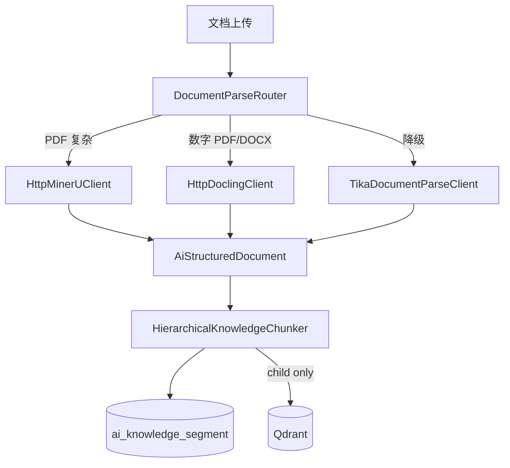

# Spec：知识库 PDF 结构化 RAG（高质量）

| 属性 | 值 |
|------|-----|
| 版本 | v1.0 |
| 日期 | 2026-06-05 |
| 状态 | **Phase 0 已落地 — 待执行 SQL + 启用 MinerU** |
| 范围 | `laby-module-ai` 知识库文档解析 / 分片 / 向量 |
| 前置 | 现有 Qdrant + DashScope Rerank + 向量健康检查 + RAG Eval |

---

## 1. 背景

当前知识库 PDF 走 **Apache Tika 纯文本** + **Semantic/Token 切分**，对表格、图表、多栏排版、扫描件效果差。法务审核 RAG（`LegalAuditContextServiceImpl`）与通用知识库共用向量管线，PDF 质量瓶颈直接影响审核引用准确度。

**目标**：引入 **Layout-aware 解析 + 层级 Parent-Child 分片 + 元素类型路由**，达到生产级 PDF RAG 质量。

---

## 2. 目标（Must / Should / Won't）

### P0 — Phase 0（本轮）

| ID | 目标 | 验收 |
|----|------|------|
| P0-1 | **统一解析接口** `DocumentParseService`，支持 MinerU / Docling / Tika 路由 | 单测覆盖路由与降级 |
| P0-2 | **结构化领域模型** `AiStructuredDocument` + 元素类型枚举 | JSON 反序列化稳定 |
| P0-3 | **层级分片器** `HierarchicalKnowledgeChunker`（表格独立、heading breadcrumb） | 单测：表格不混切、parent/child 关联 |
| P0-4 | **DB 扩展** `ai_knowledge_segment` 增加 blockType/chunkLevel/parentId 等 | SQL 可重复执行 |
| P0-5 | **向量 metadata 扩展** blockType、chunkLevel、parentSegmentId、page、headingPath | Qdrant payload 可查 |
| P0-6 | **配置** `laby.ai.document-parse.*` 可开关各引擎 | 默认 Tika，MinerU/Docling 按需启用 |
| P0-7 | **向后兼容** 未启用结构化时行为与现网一致 | 回归现有知识库入库 |

### P1 — Phase 1

| ID | 目标 |
|----|------|
| P1-1 | MinerU Docker 服务 + HTTP 适配层 |
| P1-2 | 表格三索引（WHOLE / ROW / SUMMARY） |
| P1-3 | 检索 Parent 回填（hit child → 注入 parent content） |
| P1-4 | RAG Eval PDF 黄金集 20+ case |

### P2 — Phase 2

| ID | 目标 |
|----|------|
| P2-1 | Hybrid 检索（Dense + MySQL FULLTEXT / Qdrant sparse） |
| P2-2 | VLM 图片描述（DashScope 多模态） |
| P2-3 | 与法务合同解析共用 Document Parse Service |

### Won't（本轮不做）

- 不替换 Qdrant / Embedding 模型
- 不对接 LlamaParse 等境外 SaaS 作为主路径
- 不改动知识库 REST 路径与权限模型

---

## 3. 架构



---

## 4. 枚举与常量（代码规范）

### 4.1 解析引擎 `AiDocumentParseEngineEnum`

| code | 说明 |
|------|------|
| `mineru` | MinerU 布局解析 |
| `docling` | Docling 结构化解析 |
| `tika` | Apache Tika 纯文本降级 |

### 4.2 解析质量 `AiDocumentParseQualityEnum`

| code | 说明 |
|------|------|
| `high` | 布局 + 表格结构 |
| `standard` | 有结构但无 OCR |
| `low` | 纯文本降级 |

### 4.3 块类型 `AiKnowledgeSegmentBlockTypeEnum`

| code | embed | 说明 |
|------|-------|------|
| `text` | ✓ | 正文 |
| `title` | ✓ | 标题（作 breadcrumb 或独立块） |
| `table_whole` | ✓ | 整表 Markdown |
| `table_row` | ✓ | 表格行级 JSON |
| `table_summary` | ✓ | 表格 LLM 摘要（P1） |
| `image` | ✓ | 图注 + 描述文本 |
| `formula` | ✓ | LaTeX 公式 |

### 4.4 层级 `AiKnowledgeSegmentChunkLevelEnum`

| level | 说明 |
|-------|------|
| `0` CHILD | 检索用小块，**写入向量库** |
| `1` PARENT | 章节上下文，**仅存 DB，默认不 embed** |

### 4.5 分片策略扩展 `AiDocumentSplitStrategyEnum`

新增 `structured_hierarchy`（`STRUCTURED_HIERARCHY`）：有结构化元素时优先使用。

### 4.6 向量 Metadata 键（`AiVectorStoreMetadataKeys` 扩展）

- `blockType`、`chunkLevel`、`parentSegmentId`
- `pageStart`、`headingPath`
- `parseEngine`、`parseQuality`

### 4.7 配置 `laby.ai.document-parse`

```yaml
laby.ai.document-parse:
  enabled: true
  default-engine: auto          # auto | mineru | docling | tika
  mineru:
    enabled: false
    base-url: http://127.0.0.1:8000
    parse-path: /api/v1/parse
    timeout-ms: 300000
  docling:
    enabled: false
    base-url: http://127.0.0.1:8001
    parse-path: /api/v1/parse
    timeout-ms: 120000
  structured-chunk:
    child-max-tokens: 512
    child-overlap-tokens: 80
    parent-max-tokens: 2000
    embed-parent: false
```

---

## 5. 数据模型

### 5.1 `ai_knowledge_document` 扩展

| 列 | 类型 | 说明 |
|----|------|------|
| `parse_engine` | varchar(32) | 实际使用的解析引擎 code |
| `parse_quality` | varchar(32) | 解析质量 code |

### 5.2 `ai_knowledge_segment` 扩展

| 列 | 类型 | 说明 |
|----|------|------|
| `parent_id` | bigint | 父分段 ID |
| `chunk_level` | tinyint | 0=child 1=parent |
| `block_type` | varchar(32) | 块类型 code |
| `heading_path` | varchar(512) | 章节路径 |
| `page_start` | int | 起始页 |
| `page_end` | int | 结束页 |
| `embed_text` | text | 实际送入 embedding 的文本 |

---

## 6. 解析结果 JSON（归一化协议）

Parser HTTP 服务与 Java 侧约定：

```json
{
  "engine": "mineru",
  "quality": "high",
  "markdown": "# 第一章\n正文...",
  "elements": [
    {"type": "title", "text": "付款条款", "page": 3, "level": 2},
    {"type": "text", "text": "买方应在...", "page": 3},
    {"type": "table", "markdown": "|期次|比例|\n|---|---|\n|签约|30%|", "caption": "付款表", "page": 4},
    {"type": "image", "caption": "图1", "description": "付款流程图", "page": 5}
  ]
}
```

Tika 降级时 `elements` 为空，`quality=low`，`markdown` 为纯文本。

---

## 7. 分片规则

1. **Title**：更新 `headingPath` 栈；可选生成 PARENT 段（章节聚合）。
2. **Text**：`SemanticTextSplitter` 在章节内切 CHILD；`embedText = headingPath + content`。
3. **Table**：整表一个 `table_whole` CHILD，不与前后 text 合并。
4. **Table rows**（P1）：从 markdown 解析行 → `table_row`。
5. **Image**：`caption + description` 单块 `image`。
6. **Parent**：按章节聚合，默认 **不 embed**（`embed-parent: false`）。

---

## 8. 错误码

| 码段 | 说明 |
|------|------|
| `1_040_009_108` | 文档解析失败 |
| `1_040_009_109` | 解析引擎不可用（非 Tika） |

---

## 9. 验收标准

- [x] `mvn -pl laby-module-ai -am test` 通过（Phase 0 单测 6/6）
- [x] `HierarchicalKnowledgeChunkerTest`：表格独立、parent-child、breadcrumb
- [x] `DocumentParseRouterTest`：引擎路由与 Tika 降级
- [ ] SQL migration 在目标库执行验证
- [x] 关闭 `document-parse.enabled` 时走 Tika 降级（Router 逻辑）
