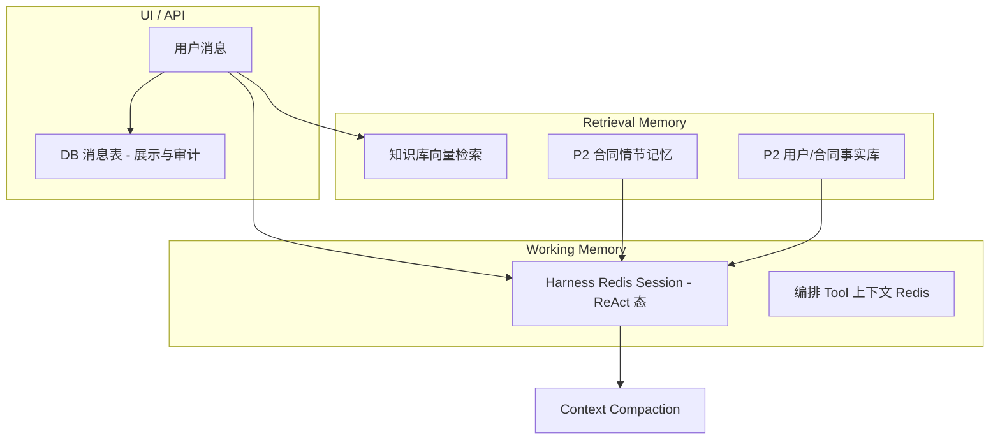

# Spec：Agent 记忆架构深化（P0～P2）

| 属性 | 值 |
|------|-----|
| 版本 | v1.0 |
| 日期 | 2026-06-09 |
| 状态 | **P0～P3 已实现 — 待联调验收** |
| 前置 | [`2026-06-05-agentscope-p0-p2-deepening-spec.md`](./2026-06-05-agentscope-p0-p2-deepening-spec.md)（Harness Session / Permission 已落地） |
| 范围 | `laby-module-ai` 通用 Chat + `laby-module-legal` 合同问答 / 编排 |

---

## 1. 背景

当前记忆分层合理（Harness Session + DB  transcript + RAG + 编排 DB），但存在以下生产风险：

| 问题 | 影响 |
|------|------|
| **双轨记忆** | 带 Tool 的 AI Chat / 法务 Agent 同时喂 DB history + Redis Session，token 膨胀、工具轨迹重复 |
| **Compaction 关闭** | `compaction-token-threshold: 0`，长 ReAct 链易超窗 |
| **法务 history 未按 sessionId** | 多 Tab 共享同一 contract 时上下文串线 |
| **轮次裁剪非 token** | `MAX_HISTORY_TURNS=8` + 字符截断，与模型实际上下文不匹配 |
| **Redis Session 全量 flush** | 每次 save 遍历整个 session 目录写 Redis |
| **编排 Tool 上下文 JVM 缓存** | 多实例下 `LegalOrchestrationToolContextHolder` 不可见 |

本 Spec 按 **P0（生产必做）→ P1（能力补齐）→ P2（架构演进）** 分档实施。

---

## 2. 记忆模型（目标态）



**原则**

1. **Harness 路径 Session 优先**：Agent / Tool 循环只接收「本轮增量 +  ephemeral 上下文（RAG/搜索/附件）」；历史 ReAct 态由 Session 承担。
2. **纯 LLM 路径 DB 优先**：无 Tool 时从 DB 重建窗口，按 **token 预算** 裁剪。
3. **法务多 Tab**：`sessionId` 贯穿写入、查询、列表 API；Agent SessionKey 含 `contractId + sessionId`。
4. **DB 是 transcript，不是 Agent 工作记忆**：Compaction 摘要可选落库（P1），但不替代 Session。

---

## 3. 目标（Must / Should）

### P0 — 生产必做

| ID | 目标 | 验收 |
|----|------|------|
| P0-1 | 启用 Harness **Context Compaction**（默认 120k tokens） | `compaction-token-threshold > 0`；长对话不 OOM |
| P0-2 | **消除双轨记忆**：AI Chat 带 Tool 时不再把 DB history 注入 `agent.call/streamEvents` | 同 conversation 第 N 轮请求体 token 不随 N 线性翻倍 |
| P0-3 | 法务 Agent 模式 **Session 优先**：`buildAgentMessages` 仅当前 user 消息 | Agent 路径不 `appendAgentScopeHistory` |
| P0-4 | 法务 `listHistoryBefore` / 消息列表 **按 sessionId 过滤** | 两 Tab 不同 sessionId 互不可见对方 history |
| P0-5 | History 裁剪改为 **token 预算**（jtokkit `AiTokenCounter`）+ 轮次上限兜底 | 超长单轮/多轮均在预算内 |
| P0-6 | 前端加载消息列表携带 **sessionId** | 刷新页面后仍只展示当前 Tab 会话 |

### P1 — 能力补齐

| ID | 目标 | 验收 |
|----|------|------|
| P1-1 | 统一 **`AgentMemoryPolicy`** 接口（AI + Legal 共用 trim 逻辑） | 单测覆盖 token 裁剪 |
| P1-2 | **`LegalChatMemoryProperties`** / `history-token-budget` 可配置 | yaml 可调，默认 32k |
| P1-3 | 编排 Tool 上下文 **Redis 存储**（替代 JVM `ConcurrentHashMap`） | 多实例同 conversationId 可 resolve |
| P1-4 | `RedisBackedJsonSession` **增量 flush**（dirty 文件） | save 单次只写变更 json |
| P1-5 | Compaction 摘要 **可选**写入 `ai_chat_message`（type=summary） | 配置开启后 DB 可查摘要行 |

### P2 — 架构演进

| ID | 目标 | 验收 |
|----|------|------|
| P2-1 | **合同情节记忆**表 `legal_contract_memory`（里程碑/决策/风险） | CRUD + 注入 Agent system 附录 |
| P2-2 | **Mem0 风格事实提取**（异步从 transcript 抽 fact） | 后台 job + 去重 merge |
| P2-3 | 编排 **Checkpoint**（LangGraph 思路：阶段快照可恢复） | interrupt/resume 编排可续 |

P2 可在 P0/P1 稳定后分迭代交付；本阶段仅预留接口与表结构草案。

---

## 4. 非目标（Won't）

| # | 说明 |
|---|------|
| N1 | 不替换 Qdrant / 现有 RAG 管线 |
| N2 | 不改动 REST 路径；SSE 事件格式不变 |
| N3 | P2 Mem0 不对接外部 SaaS，先自建表 |
| N4 | 不在 P0 改 AI Chat 的 conversationId ↔ SessionKey 映射规则 |

---

## 5. 详细设计

### 5.1 P0-2 / P0-3 Session 优先

**AI Chat（`AiChatMessageServiceImpl`）**

```java
// roleHasTools == true
AiLlmRequest request = buildAiLlmRequest(..., includeHistory = false);
List<Msg> agentMessages = convertAiMessagesToAgentScopeMsgs(request.getMessages());
agent.streamEvents(agentMessages, runtimeContext);
```

`includeHistory=false` 时消息仅含：当前 user、知识库 Reference、联网搜索、附件。

**法务 Agent（`LegalContractAgentServiceImpl`）**

```java
private List<Msg> buildAgentMessages(LegalContractChatReqVO reqVO, ...) {
    return List.of(new UserMessage(reqVO.getMessage().trim()));
}
```

**法务纯 LLM 路径**仍调用 `LegalContractChatHistoryHelper.appendAiHistory`，history 来自 `listHistoryBefore(contractId, userId, beforeId, sessionId)`。

### 5.2 P0-4 sessionId 过滤

Mapper 新增：

```java
selectListBeforeId(contractId, userId, sessionId, beforeId)
selectListByContractIdAndUserIdAndSessionId(contractId, userId, sessionId)
```

Service / Controller：

- `listHistoryBefore(..., String sessionId)`
- `listMessages(contractId, userId, sessionId)` — `sessionId` 可选；缺省返回全部（兼容旧客户端）

### 5.3 P0-5 Token 裁剪

`TokenBudgetAgentMemoryPolicy`：

- 从最新消息对（user+assistant）向前累加 token，直到 `historyTokenBudget`
- 保留 `maxHistoryTurns` 硬上限
- 单条 content 超过 `maxTurnChars` 仍截断

法务与 AI Chat 分别配置：

```yaml
laby:
  ai:
    agentscope:
      history-token-budget: 32000
  legal:
    chat:
      max-history-turns: 8
      history-token-budget: 32000
      max-turn-chars: 4000
```

### 5.4 P1-3 编排上下文 Redis

Key：`laby:legal:orch-tool-ctx:{conversationId}`，JSON 序列化 `LegalOrchestrationToolRuntimeContext`，TTL 24h。

`LegalOrchestrationToolContextHolder` 保留 ThreadLocal；conversation 级读写委托 `LegalOrchestrationToolContextStore`（memory / redis 实现）。

### 5.5 P1-4 增量 Session flush

`RedisBackedJsonSession` 维护 `Set<Path> dirtyFiles`：

- `save/delete` 标记 dirty
- `flushToRedis()` 仅同步 dirty 集合
- `close()` 仍全量兜底

### 5.6 P2 预留

**表草案 `legal_contract_memory`**

| 列 | 类型 | 说明 |
|----|------|------|
| id | bigint | PK |
| contract_id | bigint | 合同 |
| session_id | varchar | 可选 |
| memory_type | varchar | milestone / risk / decision / fact |
| content | text | 摘要 |
| source_message_id | bigint | 来源消息 |
| tenant_id | bigint | 租户 |

接口：`LegalContractEpisodicMemoryService`（P2 实现）。

---

## 6. 配置汇总

```yaml
laby:
  ai:
    agentscope:
      session-store: redis
      session-ttl-hours: 24
      compaction-token-threshold: 120000   # P0-1，0=关闭
      history-token-budget: 32000          # P1 纯 LLM 窗口
  legal:
    chat:
      max-history-turns: 8
      history-token-budget: 32000
      max-turn-chars: 4000
    orchestration:
      tool-context-ttl-hours: 24         # P1-3
```

---

## 7. 文件清单

| 优先级 | 新建 | 修改 |
|--------|------|------|
| P0 | `TokenBudgetAgentMemoryPolicy.java` | `AiChatMessageServiceImpl`, `LegalContractChatMessageMapper`, `LegalContractChatMessageServiceImpl`, `LegalContractChatServiceImpl`, `LegalContractAgentServiceImpl`, `LegalContractChatHistoryHelper`, `application.yaml`, `contract-chat-panel.vue`, `api/legal/contract/index.ts` |
| P1 | `AgentMemoryPolicy.java`, `LegalChatMemoryProperties.java`, `LegalOrchestrationToolContextStore`, `RedisLegalOrchestrationToolContextStore`, `LegalOrchestrationToolContextConfiguration` | `RedisBackedJsonSession`, `AgentScopeProperties`, `LegalOrchestrationToolContextHolder`, `LegalOrchestrationAiChatHarnessSupport` |
| P2 | `LegalContractMemoryDO`, `LegalContractEpisodicMemoryService`（接口） | SQL 迁移脚本（后续） |

---

## 8. 测试策略

| 层级 | 内容 |
|------|------|
| 单元 | `TokenBudgetAgentMemoryPolicyTest`；`LegalContractChatHistoryHelperTest` sessionId + token |
| 集成 | 法务两 sessionId 写入后 history 互不交叉 |
| 手工 | 同合同开两 Tab，互发消息，确认列表与 Agent 回复不串线 |
| 门禁 | `mvn -pl laby-module-ai,laby-module-legal -am test` |

---

## 9. 风险与回退

| 风险 | 缓解 |
|------|------|
| Session 过期后 Agent「失忆」 | 预期行为；UI transcript 仍在；用户可新开 session |
| 关闭 Compaction | `compaction-token-threshold: 0` |
| Redis 编排上下文失败 | 自动降级 InMemory store |
| 旧前端不传 sessionId | 列表 API sessionId 可选，全量返回 |

---

## 10. 验收标准

### P0 Done

- [x] Compaction 阈值 120k 生效
- [x] Tool Chat / 法务 Agent 不再双喂 DB history
- [x] 法务 history / 列表按 sessionId 隔离
- [x] Token 预算裁剪有单测
- [x] 前端按 sessionId 拉消息

### P1 Done

- [x] `AgentMemoryPolicy` 统一裁剪
- [x] Compaction 摘要可选落库 + 前端展示
- [x] 编排 Tool 上下文 Redis 化
- [x] Session 增量 flush

### P2 Done

- [x] 情节记忆表 + 服务 + 列表 API
- [x] 编排 Checkpoint 落库 + 会话 API 暴露 savedAt
- [x] 编排 Checkpoint 查询 / 恢复 API + 前端「恢复进度」
- [x] 合同情节记忆列表/删除 API + 审阅页聊天面板展示
- [x] 法务 Agent Compaction 摘要落库 + 审阅页展示（复用 `compaction-summary-persist`）
- [x] 情节记忆 LLM 抽取可选开关（`fact-extraction-use-llm`）
- [x] 情节记忆手动新增/编辑 API + 审阅页对话框
- [x] 编排 Checkpoint 页面加载时自动恢复（Checkpoint 阶段领先当前阶段）

### P3 Done

- [x] `legal_user_fact` 用户事实库（Mem0 风格，按 userId 去重）
- [x] 事实抽取分流：`fact` → `legal_user_fact`，其它类型 → `legal_contract_memory`
- [x] Agent Prompt 注入 `<UserFacts>` 附录
- [x] 情节记忆 / 用户事实分页管理 API + `legal:contract-memory:query` 菜单（`laby-legal-agent-memory-p3.sql`）
- [x] 前端管理页 `legal/contract-memory/index`（双 Tab）
- [x] 定时补抽 `LegalContractMemoryExtractionScheduler`（每小时）
- [x] 审核编排 Compaction 摘要中间件 + RuntimeContext 注入

---

## 11. 参考

- [`2026-06-05-agentscope-p0-p2-deepening-spec.md`](./2026-06-05-agentscope-p0-p2-deepening-spec.md)
- AgentScope Harness `CompactionConfig`
- 现有 `RedisBackedJsonSession` / `AgentScopeSessionKeyBuilder`
