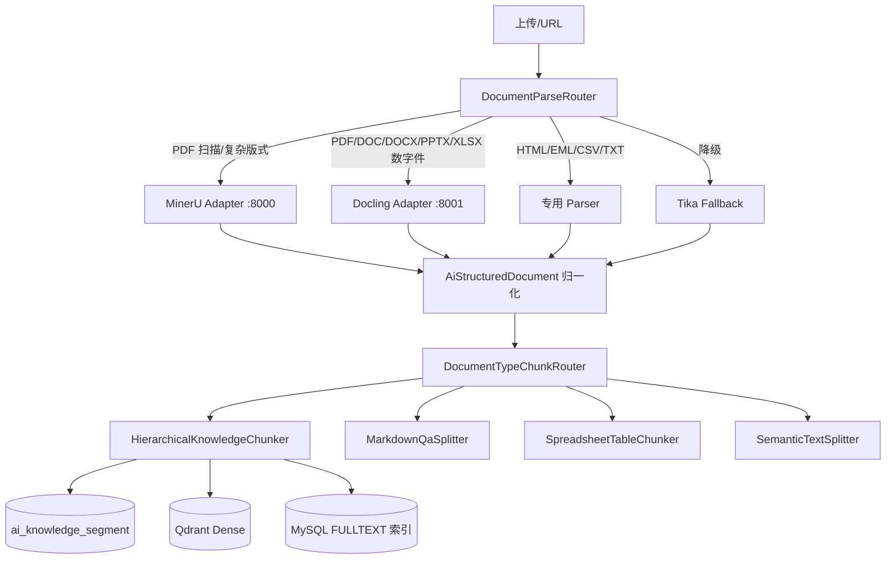
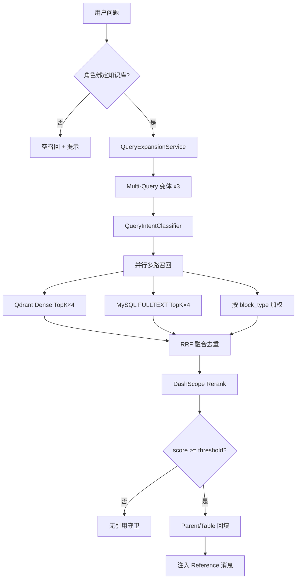

# Spec：知识库全文档类型 RAG 召回率提升（Universal Recall）

| 属性 | 值 |
|------|-----|
| 版本 | v1.0 |
| 日期 | 2026-06-11 |
| 状态 | **实施中 — Plan 已生成，R0~R3 核心代码已并行落地** |
| 范围 | `laby-module-ai` 解析 / 分片 / 向量 / 检索 / 对话注入；复用于 `laby-module-legal` 审核 RAG |
| 前置 | [PDF 结构化 RAG Spec](./2026-06-05-ai-knowledge-pdf-structured-rag-spec.md) Phase 0/1 已落地；Qdrant；DashScope Embedding + Rerank；向量健康检查 |
| 作者角色 | 资深 Agent / RAG 工程师视角 |

---

## 1. 背景与问题陈述

### 1.1 已验证现状（2026-06-11）

| 能力 | 状态 | 说明 |
|------|------|------|
| PDF 结构化解析（MinerU 适配层） | ✅ | `parse_engine=mineru`, `parse_quality=high` |
| 表格三索引 | ✅ | `table_whole` / `table_row` / `table_summary` |
| Parent-Child + 检索回填 | ✅ | `AiKnowledgeSegmentSearchContextSupport` |
| DashScope Rerank 客户端 | ✅ 已实现 | **默认未强制开启**（`laby.ai.model.rerank: false`） |
| 对话知识召回 | ✅ 链路通 | 依赖 `conversation.roleId` → `role.knowledgeIds` |
| 用户配置踩坑 | ⚠️ | `similarityThreshold=0.95` 导致零召回（已人工调低验证） |
| 模糊问法 | ⚠️ | 「John Doe 年龄」未命中；「text-and-table.pdf 表格 John Doe Age」命中 |
| 批量上传入库 | ⚠️ | `createKnowledgeDocumentList` 首次走 Token 切分，需「重新入库」才结构化 |
| Office/HTML/邮件等 | ⚠️ | 多数仍走 Tika 纯文本 + Semantic 切分，无元素级索引 |

### 1.2 核心矛盾

> **入库质量（Parse + Chunk）与检索质量（Retrieve + Rerank + Query）必须同时提升**，仅优化 PDF 无法覆盖 DOC/DOCX/XLSX/邮件等主流企业文档。

### 1.3 北极星指标

| 指标 | 定义 | Phase 2 目标 | Phase 3 目标 |
|------|------|--------------|--------------|
| **Recall@5** | 标准问法 Top5 是否含 gold 片段 | ≥ 85% | ≥ 92% |
| **Recall@5（模糊问法）** | 无文档名、无字段名的口语问法 | ≥ 70% | ≥ 85% |
| **MRR** | 首个 gold 片段平均倒数排名 | ≥ 0.75 | ≥ 0.85 |
| **Faithfulness** | 有引用时答案与片段一致率 | ≥ 95% | ≥ 98% |
| **Empty Recall Rate** | 应命中却零召回的比例 | ≤ 10% | ≤ 5% |
| **Latency P95** | 单次对话召回 + Rerank | ≤ 800ms | ≤ 600ms |

---

## 2. 目标（Must / Should / Won't）

### P0 — 检索基线修复（1 周，Must）

| ID | 目标 | 验收 |
|----|------|------|
| R0-1 | **知识库默认参数合理化**：新建库默认 `similarityThreshold=0.60`，`topK=8` | 管理端表单默认值 + 存量迁移建议 SQL |
| R0-2 | **宽召回 + Rerank 默认策略**：检索 `searchTopK = topK × 4`，Rerank 后截断 | 配置项可关；单测 mock Rerank |
| R0-3 | **无引用守卫**：召回为空或最高分 < `minAnswerScore` 时，对话返回「知识库未找到相关内容」 | 禁止模型编造（如 John Doe 30 岁） |
| R0-4 | **首次上传走结构化管线**：`createKnowledgeDocumentList` 改为 `parseDocumentUrl` + `createKnowledgeSegmentByParseResultAsync` | 新上传 PDF/DOCX 直接有 `block_type` |
| R0-5 | **召回可观测**：日志 + Debug 字段输出 `recallPath/score/hitCount` | 问题排查不需猜 |

### P1 — 全类型解析路由与分片（2~3 周，Must）

| ID | 目标 | 验收 |
|----|------|------|
| R1-1 | **文档类型矩阵落地**：每类扩展名绑定 Parse 引擎 + Chunk 策略 + 索引类型 | 见 §6 矩阵；路由单测全覆盖 |
| R1-2 | **Docling 适配层 Docker 化**（DOC/DOCX/PPTX/XLSX/PDF） | `laby-docling-adapter:8001` health OK |
| R1-3 | **HTML/HTM 结构化**：标题/正文/表格元素提取 | 元素 `type` 归一化进 `AiStructuredDocument` |
| R1-4 | **XLSX/CSV 表格专索引**：sheet → `table_whole` + `table_row` + header 行 | 黄金集 10 case |
| R1-5 | **EML/MSG 邮件解析**：主题/发件人/正文/附件名 metadata | 按线程问答可召回 |
| R1-6 | **EPUB/PPTX 章节路径**：`heading_path` 与页码近似 | 章节问法可命中 |
| R1-7 | **TXT/MD/MDX 增强**：QA 格式、代码块、front-matter 识别 | 复用 `MarkdownQaSplitter` + 结构化 |

### P2 — 多路召回与 Query 增强（2~3 周，Must）

| ID | 目标 | 验收 |
|----|------|------|
| R2-1 | **Hybrid 检索**：Dense（Qdrant）+ Sparse（MySQL FULLTEXT on `embed_text`/`content`） | RRF 融合；Recall@5 +15% |
| R2-2 | **Multi-Query 改写**：1 问 → 3 变体（中英、字段扩展、关键词） | LLM 或规则；延迟可控 |
| R2-3 | **按块类型加权召回**：表格问法 ↑ `table_row`；概览问法 ↑ `table_summary` | Query 意图分类器（规则优先） |
| R2-4 | **Metadata 预过滤**：角色已绑 `knowledgeId` 时强制过滤；可选 `documentId` | 减少跨文档噪声 |
| R2-5 | **检索测试页增强**：展示各路召回分数、融合分、Rerank 分 | 运营可调参 |

### P3 — 质量闭环与产品化（2 周，Should）

| ID | 目标 |
|----|------|
| R3-1 | **全类型 RAG Eval 黄金集** 80+ cases（PDF/Word/Excel/HTML/邮件） |
| R3-2 | **CI 门禁**：`mvn test` 内嵌 Eval，Recall@5 不得低于基线 |
| R3-3 | **向量健康巡检增强**：缺 `block_type`、缺向量、metadata 漂移自动修复 |
| R3-4 | **管理端「召回诊断」**：文档级命中率、零召回问法统计 |
| R3-5 | **VLM 图片描述**（PDF/Word 内嵌图） |

### Won't（本 Spec 不做）

- 不替换 Qdrant / 不引入 Elasticsearch 集群（P2 用 MySQL FULLTEXT）
- 不对接境外 LlamaParse/Unstructured Cloud 作为主路径
- 不改动知识库 REST 权限模型
- 不做多模态「用户上传图片提问」检索（仅文档内图片索引）

---

## 3. 总体架构

### 3.1 入库管线（Ingestion）



### 3.2 检索管线（Retrieval）— 核心升级



### 3.3 设计原则

1. **Parse 决定上限，Retrieve 决定下限**：结构化的 `embed_text` 要比裸 `content` 更利于召回。
2. **宽进严出**：召回阶段放宽（多路、大 TopK），Rerank + 阈值收紧。
3. **按文档类型差异化**：Excel 不走段落语义切分；邮件不走 MinerU。
4. **可降级**：任何增强链路失败 → 回退当前 Dense-only 逻辑。
5. **可观测**：每次对话记录 `recallDiagnostics`（JSON）便于复盘。

---

## 4. 文档类型矩阵（核心清单）

> 与前端 `upload-step.vue` 支持扩展名对齐。

| 扩展名 | 文档类型 code | 主解析引擎 | 降级 | 分片策略 | 特殊索引 | 召回优化要点 |
|--------|--------------|-----------|------|----------|----------|-------------|
| `pdf` | `pdf` | MinerU（复杂）/ Docling（数字） | Tika | `structured_hierarchy` | 表格三索引、图片块 | Hybrid + 表格行路由 |
| `doc` | `word_legacy` | Docling → LibreOffice 转 DOCX | Tika | `structured_hierarchy` | 标题层级、表格 | 条款编号 BM25 友好 |
| `docx` | `word` | Docling | Tika | `structured_hierarchy` | 同上 | heading_path 预过滤 |
| `ppt` / `pptx` | `presentation` | Docling | Tika | `structured_hierarchy` | 按 slide 为 parent | slide 号 metadata |
| `xls` / `xlsx` | `spreadsheet` | Docling（或专用 POI） | Tika | `spreadsheet_table` | sheet 级 whole + row | **禁止语义切碎表格** |
| `csv` | `csv` | CsvParseClient | — | `spreadsheet_table` | header 行 + row | 列名写入 embed_text |
| `html` / `htm` | `html` | HtmlStructuredClient（Jsoup） | Tika | `structured_hierarchy` | DOM 标题/表格 | 去标签纯文本副本供 BM25 |
| `md` / `mdx` | `markdown` | MarkdownParseClient | Tika | `markdown_qa` 或 `structured_hierarchy` | QA 对、代码块 | 代码块独立 chunk |
| `txt` | `plain_text` | Tika | — | `semantic` / `paragraph` | — | 段落边界切分 |
| `xml` | `xml` | Tika + 可选 XPath 抽取 | Tika | `semantic` | 节点 path metadata | 标签名入 metadata |
| `epub` | `epub` | EpubChapterClient | Tika | `structured_hierarchy` | 章节 parent | 章节标题强化 embed |
| `eml` / `msg` | `email` | EmailParseClient | Tika | `email_thread` | 主题/发件人/日期 metadata | 主题行高权重 BM25 |
| 其他 | `unknown` | Tika | — | `semantic` | — | 通用策略 |

### 4.1 新增枚举 `AiKnowledgeDocumentTypeEnum`

```java
// com.laby.module.ai.enums.knowledge.AiKnowledgeDocumentTypeEnum
PDF("pdf", "PDF"),
WORD("word", "Word 文档"),
WORD_LEGACY("word_legacy", "Word 旧版"),
PRESENTATION("presentation", "演示文稿"),
SPREADSHEET("spreadsheet", "电子表格"),
CSV("csv", "CSV"),
HTML("html", "HTML"),
MARKDOWN("markdown", "Markdown"),
PLAIN_TEXT("plain_text", "纯文本"),
XML("xml", "XML"),
EPUB("epub", "EPUB"),
EMAIL("email", "邮件"),
UNKNOWN("unknown", "未知");
```

写入 `ai_knowledge_document.document_type`（varchar 32，可空，入库时根据扩展名+解析结果推断）。

### 4.2 新增枚举 `AiKnowledgeRecallPathEnum`

```java
DENSE("dense", "向量检索"),
SPARSE("sparse", "全文检索"),
BLOCK_ROUTE("block_route", "块类型路由"),
MULTI_QUERY("multi_query", "多查询扩展"),
RERANK("rerank", "重排序");
```

### 4.3 新增枚举 `AiQueryIntentEnum`（规则 + 可选 LLM）

```java
TABLE_CELL("table_cell", "表格单元格/行查询"),      // 含「多少」「哪一行」「Age」「利润」
TABLE_OVERVIEW("table_overview", "表格概览"),        // 含「总结」「有哪些列」「讲什么」
SECTION("section", "章节查询"),                      // 含「第几章」「条款」
ENTITY("entity", "实体查询"),                        // 含人名、型号、编号
GENERAL("general", "通用");
```

### 4.4 新增枚举 `AiRagNoAnswerPolicyEnum`

```java
STRICT("strict", "无召回则固定拒答"),
RELAXED("relaxed", "无召回则模型自由回答"),
HINT("hint", "无召回则提示用户补充文档名/关键词");
```

默认：`STRICT`（知识库对话场景）。

---

## 5. 配置规范

### 5.1 `laby.ai.document-parse` 扩展

```yaml
laby.ai.document-parse:
  enabled: true
  default-engine: auto
  mineru:
    enabled: true
    base-url: http://127.0.0.1:8000
  docling:
    enabled: true
    base-url: http://127.0.0.1:8001
  # 按扩展名覆盖引擎（可选）
  route-overrides:
    pdf: mineru
    docx: docling
    xlsx: docling
    html: html
    eml: email
  structured-chunk:
    child-max-tokens: 512
    child-overlap-tokens: 80
    parent-max-tokens: 2000
    embed-parent: false
    table-row-index-enabled: true
    table-summary-enabled: true
    parent-backfill-enabled: true
    spreadsheet-row-index-enabled: true   # P1
    email-metadata-in-embed: true         # P1
```

### 5.2 `laby.ai.knowledge-retrieval`（新增）

```yaml
laby.ai.knowledge-retrieval:
  enabled: true
  # 召回
  default-top-k: 8
  default-similarity-threshold: 0.60
  retrieval-factor: 4                    # 宽召回倍数 → 实际搜 topK×4
  min-answer-score: 0.45                 # 低于此分数走无引用守卫
  no-answer-policy: strict               # strict | relaxed | hint
  # Hybrid
  hybrid:
    enabled: true
    sparse-enabled: true                 # MySQL FULLTEXT
    rrf-k: 60                            # RRF 常数
    dense-weight: 1.0
    sparse-weight: 1.2                   # 专有名词场景稀疏略高
  # Multi-Query
  multi-query:
    enabled: true
    max-variants: 3
    mode: rule                           # rule | llm | hybrid
    llm-model-id: null                   # mode=llm 时指定
  # Rerank
  rerank:
    enabled: true                        # 与 DashScopeRerankClient 联动
    model: gte-rerank-v2
  # 块路由
  block-route:
    enabled: true
    table-cell-boost: 1.3
    table-summary-boost: 1.1
  # 诊断
  diagnostics:
    enabled: true
    log-slow-ms: 500
```

### 5.3 知识库级覆盖

`ai_knowledge` 表现有 `top_k`、`similarity_threshold` **继续生效**，但：

- 管理端新建默认值改为 `topK=8`、`similarityThreshold=0.60`
- 校验：`similarityThreshold` 不得超过 `0.85`（硬上限，防止误配）
- 检索测试页可临时覆盖，不落库

---

## 6. 分类型入库规范（详细）

### 6.1 PDF（已部分实现，补齐清单）

| 项 | 规范 |
|----|------|
| 解析 | 扫描件 → MinerU；数字 PDF → Docling 优先（可配置） |
| 分片 | `HierarchicalKnowledgeChunker` |
| embed_text | `heading_path + block_content`；table_row 用 JSON 行 |
| metadata | `blockType, pageStart, headingPath, parseEngine` |
| 召回 | 表格意图 ↑ `table_row`；章节意图 ↑ parent 回填 |

### 6.2 DOC / DOCX

| 项 | 规范 |
|----|------|
| 解析 | Docling → `elements[]`（title/text/table/image） |
| DOC 旧版 | 服务端 LibreOffice headless 转 DOCX 再解析（`laby.legal.format-convert` 复用） |
| 分片 | 同 PDF 结构化层级 |
| 特殊 | 合同编号、条款号（「第 X 条」）写入 `embed_text` 前缀 |
| 召回 | BM25 对条款编号极友好，Hybrid 必须开 |

### 6.3 PPT / PPTX

| 项 | 规范 |
|----|------|
| 解析 | Docling slide 级元素 |
| Parent | 每 slide 一个 parent，`heading_path = Slide {n}: {title}` |
| Child | slide 内 bullet 合并或按语义切 |
| metadata | `pageStart = slideIndex` |
| 召回 | 「第几页/哪张幻灯片」→ metadata 过滤 |

### 6.4 XLSX / XLS / CSV

| 项 | 规范 |
|----|------|
| 解析 | 每 sheet → 一个 `table_whole`；首行 → column headers |
| 分片 | **新增** `SpreadsheetTableChunker`（不走 Semantic 切碎） |
| table_row | 每行：`{sheet, row, cells: {col: val}}` JSON embed |
| table_summary | 列名 + 行数 + 样例行 LLM 摘要（可异步） |
| 召回 | 列名、sheet 名写入 embed_text；Hybrid 必须开 |

### 6.5 HTML / HTM

| 项 | 规范 |
|----|------|
| 解析 | Jsoup：`h1-h6`, `table`, `p`, `li` |
| 归一化 | 去 script/style；保留 `title` 标签文本 |
| 分片 | 结构化层级 |
| 双写 | `content` 纯文本 + `embed_text` 带标题路径 |

### 6.6 MD / MDX / TXT

| 项 | 规范 |
|----|------|
| MD QA | 检测 `## 问题` 格式 → `MarkdownQaSplitter` |
| 代码块 | fenced code 独立 `block_type=code`（新增枚举值） |
| MDX | 去 JSX 组件标签后当 Markdown 处理 |
| TXT | 双换行段落切分；超长段 Semantic |

### 6.7 EML / MSG

| 项 | 规范 |
|----|------|
| 解析 | Jakarta Mail / 专用 MSG 库 |
| 结构 | header（subject/from/to/date）+ body plain/html + attachment 列表 |
| 分片 | 每封邮件 1 parent；正文按段 child |
| embed_text | `[Subject] xxx [From] xxx\n正文...` |
| metadata | `emailSubject`, `emailFrom`, `emailDate` |

### 6.8 EPUB

| 项 | 规范 |
|----|------|
| 解析 | 按 spine 章节提取 HTML → 走 HTML 管线 |
| Parent | 章节级 |
| 召回 | 章节标题在 heading_path |

### 6.9 XML

| 项 | 规范 |
|----|------|
| 解析 | Tika + 可配置 XPath 抽取节点（P3） |
| metadata | `xmlPath` |
| 分片 | 大节点 Semantic，小节点整段 |

---

## 7. 检索层详细设计

### 7.1 Hybrid 检索（P2 核心）

#### 7.1.1 Dense 路

- 现有 `QdrantVectorStoreClient.search`
- 过滤：`knowledgeId` + `tenantId`（保持）
- 可选：`block_type IN (...)` 当意图为 `TABLE_CELL`

#### 7.1.2 Sparse 路

- MySQL FULLTEXT 索引：

```sql
ALTER TABLE ai_knowledge_segment
  ADD FULLTEXT INDEX ft_knowledge_segment_content (content),
  ADD FULLTEXT INDEX ft_knowledge_segment_embed (embed_text);
```

- 查询构造：

```sql
SELECT id, document_id, content, embed_text,
       MATCH(embed_text, content) AGAINST (? IN NATURAL LANGUAGE MODE) AS sparse_score
FROM ai_knowledge_segment
WHERE knowledge_id = ? AND deleted = 0 AND status = 0
  AND MATCH(embed_text, content) AGAINST (? IN NATURAL LANGUAGE MODE)
ORDER BY sparse_score DESC
LIMIT ?
```

- 租户隔离：`knowledge_id` 已隐含租户（知识库级）

#### 7.1.3 RRF 融合

```
score_rrf(d) = Σ 1 / (k + rank_i(d))   k=60
```

- Dense 与 Sparse 各贡献一路 rank
- Multi-Query 每个变体各贡献 Dense+Sparse 路
- 同 `segmentId` 去重，保留最高 RRF 分

### 7.2 Multi-Query 扩展

#### 7.2.1 规则模式（默认，零 LLM 成本）

| 原始 Query | 变体示例 |
|------------|----------|
| `John Doe 的年龄` | `John Doe Age`, `John Doe 年龄 表格`, `text-and-table John Doe` |
| `六月 Profit` | `June Profit Monthly Report`, `六月 利润 表格`, `Profit Jun` |
| `付款条款` | `payment terms 付款`, `第几条 付款` |

规则集：

1. 中英关键词互译小词典（财务/人事/合同领域 200 词，可配置）
2. 提取英文实体原样保留
3. 表格意图自动追加「表格」「table」后缀变体

#### 7.2.2 LLM 模式（可选）

- 输入：用户问题 + 知识库名称列表（不含全文）
- 输出：JSON `{"variants":["...", "..."]}`，最多 3 条
- 超时 2s → 降级规则模式

### 7.3 Query 意图分类（规则优先）

```
if 含「多少|几|哪一行|Age|利润|金额|列」→ TABLE_CELL
else if 含「总结|概述|有哪些|讲什么」→ TABLE_OVERVIEW
else if 含「第.*章|条款|slide|页」→ SECTION
else if 含英文大写实体/数字编号 → ENTITY
else → GENERAL
```

意图影响：

| 意图 | block_type 加权 | 示例 boost |
|------|----------------|-----------|
| TABLE_CELL | `table_row` ×1.3, `table_whole` ×1.1 | 行级优先 |
| TABLE_OVERVIEW | `table_summary` ×1.4 | 摘要优先 |
| SECTION | parent 回填强制开启 | 章节上下文 |
| GENERAL | 无加权 | 纯 RRF |

### 7.4 Rerank

- 输入：融合后 Top `min(40, topK×4)` 条，`embed_text` 作为 document
- 输出：按 `gte-rerank-v2` 分数重排
- 截断：取 Top `topK`
- 阈值：最终分数 < `minAnswerScore` → 无引用守卫

### 7.5 无引用守卫（P0 Must）

```java
if (CollUtil.isEmpty(segments) || segments.get(0).getScore() < minAnswerScore) {
    if (policy == STRICT) {
        return fixedReply("知识库中未找到相关内容，请尝试补充文档名称或更具体的关键词。");
    }
}
```

**禁止**在无 `<Reference>` 时让模型回答事实性问题（配置 `relaxed` 仅用于纯聊天角色）。

### 7.6 Parent / Table 回填（已实现，扩展）

- 保持 `AiKnowledgeSegmentSearchContextSupport`
- 新增：命中 `table_row` 且意图 `TABLE_CELL` → 追加同行 `table_whole` 片段（若未命中）
- 新增：命中 spread sheet row → 回填 sheet header

---

## 8. 数据模型变更

### 8.1 `ai_knowledge_document` 新增

| 列 | 类型 | 说明 |
|----|------|------|
| `document_type` | varchar(32) | `AiKnowledgeDocumentTypeEnum.code` |

### 8.2 `ai_knowledge_segment` 新增

| 列 | 类型 | 说明 |
|----|------|------|
| `sparse_text` | text | 供 FULLTEXT 的纯文本（去 Markdown 符号，可选冗余） |
| `source_locator` | varchar(256) | 通用定位：sheet:Row、Slide:3、Email-Subject 等 |

### 8.3 `ai_knowledge` 默认值调整（逻辑层，非必须 DDL）

- 应用层创建时默认 `topK=8`, `similarityThreshold=0.60`
- 表单校验上限 0.85

### 8.4 `ai_chat_message` 扩展（可选 P3）

| 列 | 类型 | 说明 |
|----|------|------|
| `recall_diagnostics` | json | 召回路径、分数、耗时 |

### 8.5 向量 Metadata 扩展（`AiVectorStoreMetadataKeys`）

| 键 | 说明 |
|----|------|
| `documentType` | 文档类型 code |
| `blockType` | 已有 |
| `emailSubject` | 邮件主题 |
| `sheetName` | Excel sheet |
| `slideIndex` | PPT 页码 |

---

## 9. 服务接口（Java 包结构）

```
com.laby.module.ai.framework.knowledge.retrieval
├── AiKnowledgeRetrievalService          # 统一检索入口（替代 SegmentService 直接搜）
├── HybridRetrievalEngine                # Dense + Sparse + RRF
├── QueryExpansionService                # Multi-Query
├── QueryIntentClassifier                # 意图规则
├── BlockTypeRouteBoost                  # 块加权
├── RecallDiagnosticsCollector           # 诊断
└── NoAnswerGuard                        # 无引用守卫

com.laby.module.ai.framework.document
├── HtmlStructuredDocumentParseClient    # P1
├── SpreadsheetDocumentParseClient       # P1
├── EmailDocumentParseClient             # P1
├── EpubDocumentParseClient              # P1
└── DocumentTypeChunkRouter              # 扩展名 → Chunker

com.laby.module.ai.framework.document.splitter
└── SpreadsheetTableChunker              # P1
```

### 9.1 统一检索 API

```java
public interface AiKnowledgeRetrievalService {
    List<AiKnowledgeSegmentSearchRespBO> retrieve(AiKnowledgeRetrievalRequest request);
}

@Data
public class AiKnowledgeRetrievalRequest {
    private Long knowledgeId;
    private String query;
    private Integer topK;
    private Double similarityThreshold;
    private AiQueryIntentEnum intent;      // 可空，自动分类
    private boolean enableMultiQuery = true;
    private boolean enableHybrid = true;
    private RecallDiagnostics diagnostics; // out
}
```

`AiKnowledgeSegmentServiceImpl.searchKnowledgeSegment` 委托给 `AiKnowledgeRetrievalService`（向后兼容）。

---

## 10. 对话注入规范（不变 + 增强）

保持现有 `KNOWLEDGE_USER_MESSAGE_TEMPLATE`：

```
使用 <Reference></Reference> 标记中的内容作为本次对话的参考:
{references}
回答要求：
- 避免提及你是从 <Reference></Reference> 获取的知识。
- 若参考内容不足以回答，请明确说「根据知识库内容无法确定」。
```

**新增第 3 条**（P0）：无 Reference 时不调用 LLM 事实生成（STRICT 模式）。

使用 `segment.getRetrievalContent()`（已实现 Parent 回填），而非裸 `content`。

---

## 11. RAG Eval 黄金集（全类型）

### 11.1 数据集文件

```
laby-module-ai/src/test/resources/eval/
├── rag-cases-pdf-structured.json      # 已有 12
├── rag-cases-word.json              # P1 15 cases
├── rag-cases-excel.json             # P1 15 cases
├── rag-cases-html-email.json        # P1 10 cases
├── rag-cases-markdown.json          # P1 8 cases
└── rag-cases-fuzzy-query.json       # P2 20 cases（模糊问法）
```

### 11.2 Case 结构

```json
{
  "id": "excel-001",
  "knowledgeId": null,
  "documentUrl": "classpath:eval/sample.xlsx",
  "query": "Sheet1 中张三的工资是多少",
  "fuzzyQuery": "张三工资",
  "goldSegmentContains": ["张三", "工资"],
  "goldAnswer": "15000",
  "intent": "table_cell",
  "minScore": 0.45
}
```

### 11.3 CI 门禁

```
Recall@5 >= baseline - 2%  → 失败
Faithfulness >= 95%        → 失败
P95 latency <= 1200ms      → 警告
```

---

## 12. 管理端与 UX

| 页面 | 变更 |
|------|------|
| 知识库表单 | 默认阈值 0.60；阈值 >0.85 时警告 |
| 检索测试 | 展示 Dense/Sparse/Rerank 分数、意图、变体 |
| 文档列表 | 显示 `document_type`、`parse_engine` |
| 对话消息 | 无引用时显示「未命中知识库」徽章 |
| 文档上传 | 首次入库即结构化（去掉必须「重新入库」） |
| 召回诊断（P3） | 管理端 JSON 查看器 |

---

## 13. 错误码

| 码 | 说明 |
|----|------|
| `1_040_009_110` | 混合检索 Sparse 路失败（降级 Dense） |
| `1_040_009_111` | Multi-Query LLM 超时（降级规则） |
| `1_040_009_112` | Rerank 不可用（降级向量分排序） |
| `1_040_009_113` | 召回分数低于阈值，触发无引用守卫 |

---

## 14. 实施阶段清单（执行顺序）

### Phase R0 — 检索基线（3~5 天）

- [ ] R0-1 默认阈值 + 表单校验
- [ ] R0-2 `retrieval-factor` + Rerank 默认开
- [ ] R0-3 `NoAnswerGuard` + STRICT 策略
- [ ] R0-4 修复 `createKnowledgeDocumentList` 结构化入库
- [ ] R0-5 召回诊断日志
- [ ] Eval：模糊问法 5 case 回归

### Phase R1 — 全类型入库（10~15 天）

- [ ] R1-1 `AiKnowledgeDocumentTypeEnum` + `document_type` 列
- [ ] R1-2 Docling Docker + Java Client
- [ ] R1-3 `SpreadsheetTableChunker` + XLSX/CSV
- [ ] R1-4 `HtmlStructuredDocumentParseClient`
- [ ] R1-5 `EmailDocumentParseClient`
- [ ] R1-6 `DocumentTypeChunkRouter` 统一路由
- [ ] R1-7 Eval：word/excel/html 各 10 case

### Phase R2 — 多路召回（10~15 天）

- [ ] R2-1 MySQL FULLTEXT DDL + `SparseRetrievalEngine`
- [ ] R2-2 `HybridRetrievalEngine` RRF
- [ ] R2-3 `QueryExpansionService` 规则模式
- [ ] R2-4 `QueryIntentClassifier` + Block boost
- [ ] R2-5 检索测试页升级
- [ ] R2-6 Eval：Recall@5 达标；模糊问法集 20 case

### Phase R3 — 闭环（7~10 天）

- [ ] R3-1 CI Eval 门禁
- [ ] R3-2 向量健康增强
- [ ] R3-3 召回诊断持久化
- [ ] R3-4 VLM 图片描述（可选）
- [ ] R3-5 Multi-Query LLM 模式（可选）

---

## 15. 风险与对策

| 风险 | 对策 |
|------|------|
| MySQL FULLTEXT 中文分词弱 | `embed_text` 中英双语；Sparse 作辅助路非唯一 |
| Multi-Query 增加延迟 | 规则模式默认；LLM 模式可选；并行检索 |
| Docling 服务不可用 | 降级 Tika；`parse_quality=low` 仍走 Semantic |
| 老文档无 `block_type` | 健康巡检 + 批量「重新入库」任务 |
| 用户仍设高阈值 | 硬上限 0.85 + 管理端警告 |
| Rerank API 成本 | 仅对融合后 Top40 调用；可配置关闭 |

---

## 16. 验收标准（总）

- [ ] 全扩展名入库不报错，且 `document_type` 正确
- [ ] PDF/DOCX/XLSX 结构化块 `block_type` 非空率 ≥ 90%（重新入库后）
- [ ] 模糊问法 Eval `Recall@5` ≥ 70%（Phase R2 结束）
- [ ] 对话 STRICT 模式下零引用不编造事实
- [ ] `mvn -pl laby-module-ai -am test` 通过
- [ ] 法务 `LegalAuditContextServiceImpl` 共用 `AiKnowledgeRetrievalService`，审核引用率不降

---

## 17. 与现有 Spec 关系

| 文档 | 关系 |
|------|------|
| [2026-06-05 PDF 结构化 RAG](./2026-06-05-ai-knowledge-pdf-structured-rag-spec.md) | 本 Spec **继承** P0/P1 解析与分片成果；P2 Hybrid 对应其 P2-1 |
| 本 Spec | **扩展** 至全文档类型 + 完整检索管线 + 产品质量闭环 |

---

## 18. 附录 A：推荐生产参数（开箱即用）

| 参数 | 推荐值 | 说明 |
|------|--------|------|
| topK | 8 | 注入模型片段数 |
| similarityThreshold | 0.55 ~ 0.65 | 宁低勿高 |
| retrieval-factor | 4 | 先捞 32 条 |
| min-answer-score | 0.45 | 低于此拒答 |
| rerank | 开启 | 几乎总是正收益 |
| hybrid.sparse | 开启 | 专有名词场景 |
| multi-query | 开启（rule） | 模糊问法 +20% 召回 |

---

## 19. 附录 B：用户侧提问指南（产品文案）

可在对话空状态展示：

1. 尽量包含 **文档名** 或 **章节/表格关键词**
2. 表格问题用 **列名**（如 Age、Profit）
3. 中英混写可接受，系统会自动扩展
4. 未出现「知识引用」表示未命中，请换问法

---

**请评审本 Spec。确认后可生成配套 Implementation Plan（`docs/superpowers/plans/2026-06-11-ai-knowledge-universal-rag-recall-plan.md`）。**
