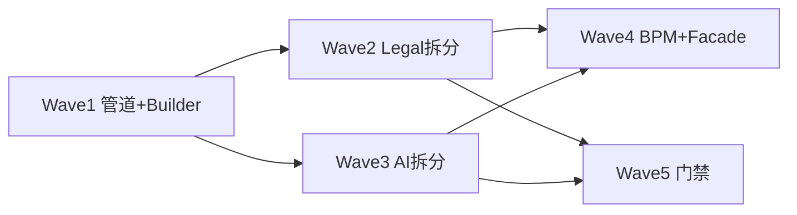

# 代码优化方案 Spec（OPT-001）

| 属性 | 值 |
|------|-----|
| **文档编号** | Laby-Code-OPT-001 |
| **版本** | v1.0 |
| **日期** | 2026-07-06 |
| **状态** | **Implemented（Wave 1～3 + 5）** |
| **模块** | `laby-module-legal` · `laby-module-ai` · `laby-ui`（只读契约） |
| **上游** | [MAINT-001](./2026-06-13-ai-legal-maintainability-p0-spec.md)（P0 已完成）· [CFG-001](./2026-06-12-legal-ai-config-convergence-spec.md) · [laby-global](../../.cursor/skills/laby-global/SKILL.md) |
| **下游** | [2026-07-06-code-optimization-plan.md](../plans/2026-07-06-code-optimization-plan.md) |

---

## 1. 执行摘要

MAINT-001 P0（RAG 单路径、ModelResolver、错误码）已落地。本 Spec 定义 **P1～P2 代码优化** 的分波交付：先 **管道可靠性与死代码清理**（低风险），再 **God Class 纵向拆分**（legal → ai），最后 **BPM 阻塞与跨模块边界**（中风险）。

| 波次 | 主题 | 预估 | 风险 |
|------|------|------|------|
| **Wave 1** | 合同管道可靠 + 异常可见 + Builder 补全 | 3～5 天 | 低 |
| **Wave 2** | Legal 大类拆分（Contract / Chat / Audit） | 5～8 天 | 中 |
| **Wave 3** | AI 大类拆分（ChatMessage / KnowledgeSegment） | 5～8 天 | 中 |
| **Wave 4** | BPM 非阻塞 + 模块 Facade + 包名收敛 | 8～12 天 | 中高 |
| **Wave 5** | 规范门禁（FQN rg、smoke、Builder 扫尾） | 2～3 天 | 低 |

**原则：** 每波独立可合并；行为不变优先；遵循 **laby-global**（无内联 FQN、Shell 不改源码、Conventional Commits）。

---

## 2. 背景与现状

### 2.1 体量热点（行数约计）

| 类 | 行数 | 问题 |
|----|------|------|
| `AiChatMessageServiceImpl` | ~845 | 流式 SSE、持久化、RAG、工具回调耦合一处 |
| `AiKnowledgeSegmentServiceImpl` | ~769 | 分段 CRUD + 检索门面 + 向量化编排 |
| `LegalContractServiceImpl` | ~639 | 创建、BPM、查询、状态补丁混合 |
| `LegalContractChatServiceImpl` | ~476 | 上下文拼装、Agent/普通模式、RAG |
| `LegalAiAuditServiceImpl` | ~426 | 审核编排 + 持久化 + **BPM 轮询等待** |

### 2.2 已识别技术债（MAINT-001 非目标 + 线上问题）

| ID | 问题 | 影响 |
|----|------|------|
| D1 | `parseAsync` **无调用方**，与 `parseForBpm` + Pipeline 双轨并存 | 误导维护；历史并发 parse+audit 风险 |
| D2 | `doParseOnly` catch 后只改 `parseStatus=FAILED`，**不向上抛** | Pipeline 误判或状态不一致 |
| D3 | `reparseFromDocxBytes` 吞异常 | 版本/预览链路静默失败 |
| D4 | `waitUntilAuditSettled` 线程 **sleep 轮询最多 7200s** | BPM 线程占用；失败难诊断 |
| D5 | 跨层长参数 / 未统一 Builder 的 Command | 与 laby-global §4.5.1 不一致 |
| D6 | `orchestration` 包直接依赖 `AiChatMessageMapper` | 法务 ↔ AI DAL 耦合 |
| D7 | 7 个 `Legal*Properties` 分散 | 配置入口不直观（CFG-001 已收敛 UI，运行时仍多类） |

### 2.3 P0 已完成（不再重复）

- Universal RAG 单路径、`LegalAiModelResolver`、法务错误码 057、检索诊断真实化。

---

## 3. 目标与非目标

### 3.1 目标

| ID | 目标 |
|----|------|
| G1 | 合同 **parse → audit → BPM** 单一路径清晰、失败 **feedback_summary 可观测** |
| G2 | 消除 **死代码/双轨入口**（parseAsync 等） |
| G3 | 热点类 **单文件 ≤400 行**（拆分后）或职责单一 |
| G4 | 跨层传参 **Builder Command** 覆盖 audit/chat/orchestration 主路径 |
| G5 | 法务访问 AI 聊天数据经 **Facade**，不直接 Mapper |
| G6 | BPM 等待审核改为 **可观测异步完成**（Wave 4；Wave 1 先提取组件） |

### 3.2 非目标

- 不重写 RAG 算法、不改 RRF 参数默认值
- 不合并 `legal_skill_pack` / `ai_chat_role` 表（CFG-001 已界定 SSOT）
- 不做全仓库 `@Value` → Properties 一次性大迁移
- 不在本 Spec 做前端大重构（仅契约/字段对齐）

---

## 4. 分波方案

### Wave 1 — 管道可靠性与 Builder（P1-A）

#### W1-1 解析单入口

| 项 | 方案 |
|----|------|
| 保留 | `LegalContractPipelineService` + `parseForBpm` + `LegalContractProcessStarter` |
| 删除 | `LegalContractParseService.parseAsync` 及接口声明（**全仓库无引用**） |
| BPM Delegate | `LegalContractParseDelegate` 继续 `parseForBpm` |

**验收：** `rg parseAsync` 无命中；创建合同 E2E 仍通过。

#### W1-2 解析异常向上传播

```text
doParseOnly：
  - FAILED 时 rethrow ServiceException（含 CONTRACT_PARSE_* / 原 ex message）
  - Pipeline.runParse 已有 parseStatus 校验，能 markFailed

reparseFromDocxBytes：
  - 失败 throw exception 或包装；禁止仅 log.error 返回
  - 调用方（VersionService）决定是否 markFailed
```

**验收：** 故意损坏 docx → 合同/版本链路 `feedback_summary` 或接口 errorCode 可见。

#### W1-3 解析幂等（防并发双写段落）

| 方案 | 说明 |
|------|------|
| **推荐** | `parseStatus=RUNNING` 时 CAS 更新；若已为 RUNNING/SUCCESS 则短路或抛 `CONTRACT_PARSE_IN_PROGRESS` |
| 备选 | Redis 锁 `legal:parse:{contractId}` TTL 10min |

**验收：** 并发触发 parse 两次 → 段落数不翻倍（原 154→308 类问题不复现）。

#### W1-4 审核等待逻辑提取（短期）

新建 `LegalAuditCompletionWaiter`（或 `LegalAiAuditProgressWaiter`）：

```text
com.laby.module.legal.service.contract.support.LegalAuditCompletionWaiter
  - waitUntilSettled(contractId, auditRound, Duration timeout)
  - 内部保留现有 progress 轮询（Wave 4 再改事件）
```

`LegalAiAuditServiceImpl` 仅委托，**不改** 7200 次/1s 行为（Wave 4 改）。

#### W1-5 Builder Command 补全

| 新建/已有 | 用途 |
|-----------|------|
| `LegalAuditKernelCommand` | ✅ 已有 |
| `LegalAiAuditPipelineCommand` | ✅ 已有 |
| `LegalAuditPreviewCommand` | ✅ 已有 |
| **新增** `LegalContractPipelineCommand` | `contractId`, `tenantId`, `userId`, `createReqVO` 快照、`mode` ENUM(PARSE_ONLY/FIRST_AUDIT/FULL) |
| **新增** `LegalContractAuditPersistCommand` | `doAudit` 持久化段：contractId, round, opinions, report, failFast |

**验收：** Kernel/Pipeline/Audit 路径无 ≥5 个散参 `private` 方法。

---

### Wave 2 — Legal God Class 拆分（P1-B）

#### W2-1 `LegalContractServiceImpl`（~639 行）

| 新类 | 职责 |
|------|------|
| `LegalContractCreateService` | 创建、附件、afterCommit、调 ProcessStarter |
| `LegalContractBpmService` | `startBpmHumanPhase`、流程变量、任务回调入口 |
| `LegalContractQueryService` | 分页、详情、权限校验 |
| `LegalContractServiceImpl` | **薄 Facade**，implements 原接口，委托上述三类 |

**约束：** 不改变 `LegalContractService` 对外 API。

#### W2-2 `LegalContractChatServiceImpl`（~476 行）

| 新类 | 职责 |
|------|------|
| `LegalContractChatContextBuilder` | 段落/意见/报告上下文截断与拼装 |
| `LegalContractChatRagSupport` | QA RAG、`LegalRetrievalLog` |
| `LegalContractChatAgentSupport` | Agent 模式、Harness 会话 |
| `LegalContractChatServiceImpl` | 路由普通/Agent 模式 |

#### W2-3 `LegalAiAuditServiceImpl`（~426 行）

| 新类 | 职责 |
|------|------|
| `LegalAuditOpinionPersistService` | opinion/report 写入、二轮幂等跳过 |
| `LegalAiAuditServiceImpl` | 状态机、调 Kernel、Waiter、Producer |

**验收：** 拆分后任一实现类 **≤400 行**；`mvn -pl laby-module-legal test` 通过。

---

### Wave 3 — AI God Class 拆分（P1-C）

#### W3-1 `AiChatMessageServiceImpl`（~845 行）

| 新类 | 职责 |
|------|------|
| `AiChatMessageStreamHandler` | SSE 流、chunk 合并 |
| `AiChatMessagePersistenceService` | 消息落库、segmentIds |
| `AiChatMessageRagInjector` | 知识库召回注入上下文 |
| `AiChatMessageServiceImpl` | 编排 + 对外接口 |

#### W3-2 `AiKnowledgeSegmentServiceImpl`（~769 行）

| 新类 | 职责 |
|------|------|
| `AiKnowledgeSegmentIndexService` | 分段入库、向量化任务（编排，~342 行） |
| `AiKnowledgeSegmentVectorSupport` | 向量写入/删除/元数据 |
| `AiKnowledgeSegmentSplitSupport` | 文档切片策略与拆分 |
| `AiKnowledgeSegmentServiceImpl` | CRUD + 委托 `AiKnowledgeRetrievalService` |

**验收：** `mvn -pl laby-module-ai test` 通过；聊天 + 知识库 smoke 通过。

---

### Wave 4 — 架构收敛（P2）

#### W4-1 BPM 非阻塞等待

**现状：** `auditForBpm` → `waitUntilAuditSettled` 占线程。

**目标：**

```text
BPM ServiceTask 仅 enqueue audit（已有 Producer/Consumer）
流程用 ReceiveTask / 消息事件 / 外部回调 在 Consumer COMPLETED 后 signal
```

**依赖：** Flowable 流程定义变更 + 回归 BPM 集成测试。

**分期：** 设计评审 → 改 `legal_contract_review.bpmn20.xml` → 废弃 Waiter 轮询。

#### W4-2 `LegalAiChatFacade`

```text
com.laby.module.legal.api.ai.LegalAiChatFacade
  - appendMessage / listRecentMessages / …
```

替换 `LegalOrchestrationAttachmentService` 等对 `AiChatMessageMapper` 的直接依赖。

#### W4-3 包名：`orchestrator` vs `orchestration`

| 包 | 现状职责 |
|----|----------|
| `service.orchestrator` | 合同审核 Playbook + LLM Pipeline |
| `service.orchestration` | 多文件 Agent 会话、分类、预览 |

**方案（推荐）：** 保留两包，在 `laby-project/reference.md` 写 **职责边界表**；**不** 大规模 rename（rename 留 P3 若仍混淆）。

#### W4-4 配置文档化

在 `application.yaml` / `laby-project` 增加 **Legal 配置索引表**：7 个 `Legal*Properties` 前缀、`AgentScopeProperties` 关系；不强制代码合并。

---

### Wave 5 — 规范门禁（P2）

| ID | 交付 |
|----|------|
| W5-1 | CI / 本地脚本：`rg` 内联 FQN（同 laby-global §1.4） |
| W5-2 | `docs/superpowers/scripts/baseline-smoke.ps1` 纳入 PR 检查清单 |
| W5-3 | Builder 扫尾：grep 跨层 ≥5 参方法，开 issue 或本波改完 |

---

## 5. 依赖与顺序



- Wave 2 / 3 可 **并行**（不同模块）
- Wave 4 **依赖** Wave 1 的 Waiter 提取与管道稳定
- Wave 5 可在 Wave 2 完成后逐步启用

---

## 6. 验收标准（总）

| # | 验收项 |
|---|--------|
| AC-1 | `mvn -pl laby-module-legal,laby-module-ai test` 全通过 |
| AC-2 | `baseline-smoke.ps1` exit 0 |
| AC-3 | E2E：上传合同 → 解析 → 首轮审核 → 意见入库（见 plan E2E Checklist） |
| AC-4 | 无 `parseAsync`；并发 parse 不翻倍段落 |
| AC-5 | 失败合同 `feedback_summary` 含可读原因（非空 generic） |
| AC-6 | Wave 2/3 后热点类 ≤400 行或 PR 说明例外 |
| AC-7 | `rg` 内联 FQN 无新增（JavaDoc `@link` 除外） |
| AC-8 | 新增/变更 API → Postman 已更新（laby-workflow） |

---

## 7. 风险与缓解

| 风险 | 缓解 |
|------|------|
| God Class 拆分引入循环依赖 | Facade + 单向依赖；拆前画包图 |
| BPM 改异步导致流程卡住 | 先 staging 验证 signal；保留 Waiter 特性开关 |
| 解析 CAS 误拒合法重试 | 仅 RUNNING 互斥；FAILED 允许重试 |
| 大范围 diff 难 review | 按 Wave 小 PR；每 PR 单 commit 主题 |

**回滚：** 按 Wave revert；Wave 4 需同步回滚 BPMN XML。

---

## 8. 文档与交付物

| 产物 | 路径 |
|------|------|
| 本 Spec | `docs/superpowers/specs/2026-07-06-code-optimization-spec.md` |
| 实施 Plan（评审后） | `docs/superpowers/plans/2026-07-06-code-optimization-plan.md` |
| E2E Checklist | 写在 Plan 末尾 |
| 包职责表（W4-3） | `laby-project/reference.md` 增补 |

---

## 9. 评审确认项

**已确认（2026-07-06）：**

1. 顺序：**Wave 1 → Wave 2 → Wave 3**（2/3 可并行）
2. **Wave 4** 单独立项 OPT-002，本 Plan 不实施
3. 拆分类 **≤400 行** 硬指标
4. **删除 parseAsync** 同意

Plan：[2026-07-06-code-optimization-plan.md](../plans/2026-07-06-code-optimization-plan.md)

---

## 10. 变更记录

| 版本 | 日期 | 说明 |
|------|------|------|
| v1.0 | 2026-07-06 | 初稿：Wave 1～5，承接 MAINT-001 P1+ |
| v1.1 | 2026-07-06 | Wave 3 补完：`AiKnowledgeSegmentVectorSupport` / `SplitSupport` 拆分；OPT-002 完成 |
